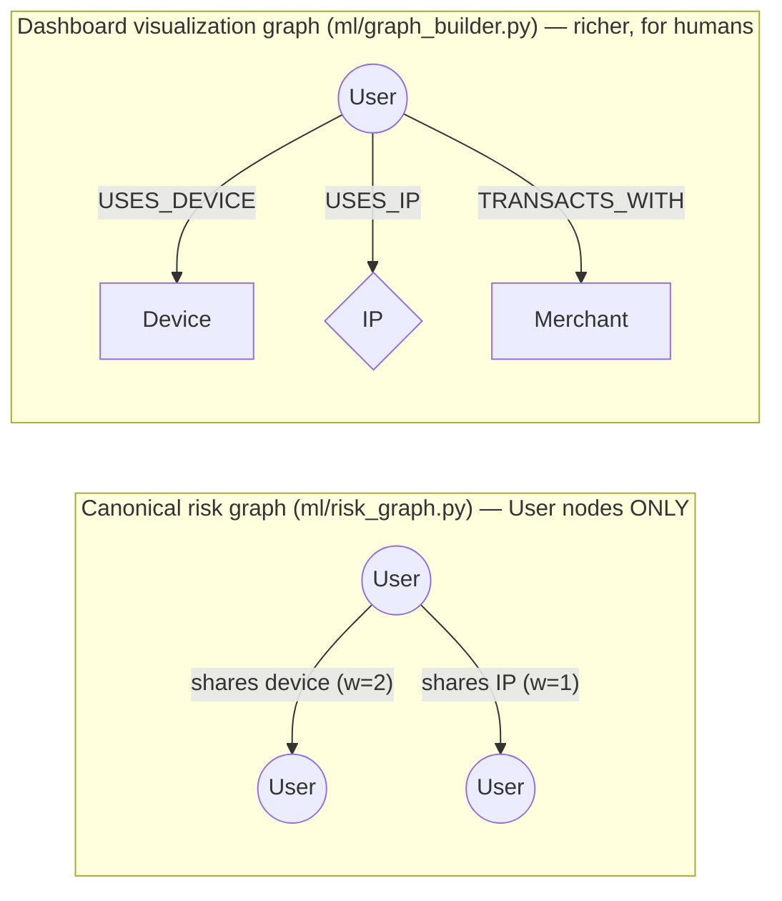
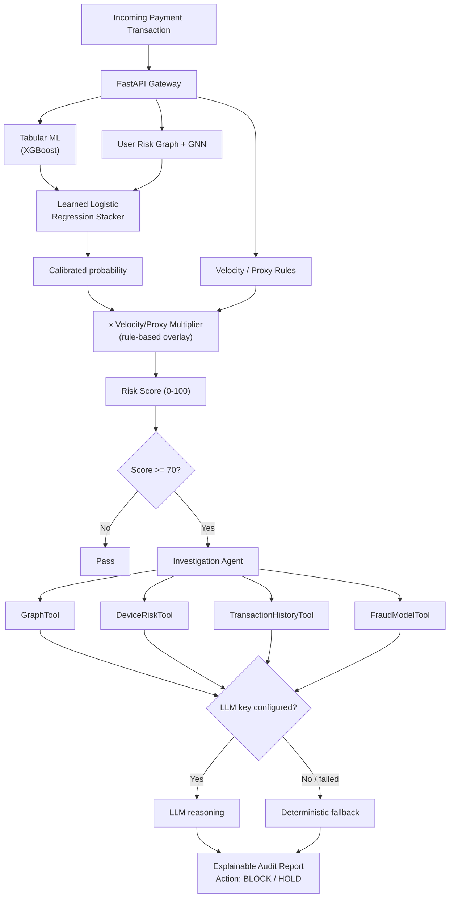
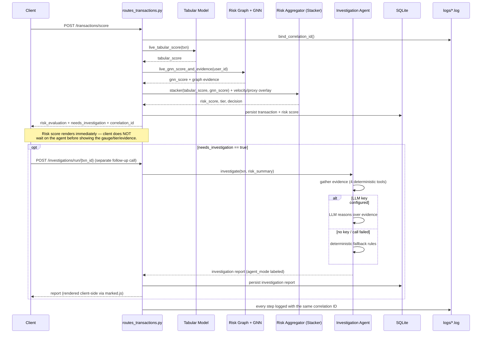

# 🗺️ RazorRisk — Complete Project Architecture & Codebase Workflow Guide

This document is a comprehensive, step-by-step technical guide to understanding the **RazorRisk** codebase from
scratch: how every component works, how data flows through the system, how models are trained leak-free and
combined by a learned stacker, and how the investigation agent produces an audit-ready report whether or not an
LLM is configured.

---

## 1. Mental Model & Core Architecture Shift

There are **two graphs** in this codebase, deliberately kept separate:


The risk graph drives GNN training + Louvain community detection — a fraud ring is a dense User-only cluster.
The visualization graph is only ever read by the Graph Topology tab, never fed into any model.

These used to be the same graph, which caused a real bug: 2-hop traversal through a popular Merchant node (used
by hundreds of unrelated users) made a 7-person fraud ring balloon into a 692-node unreadable subgraph. A
Merchant used by thousands of unrelated users was never real *fraud* signal - it just happened to be reachable
in 2 hops - so the graph that actually trains the model never includes Merchant/heavy-fanout nodes as hops at
all. The dashboard's separate graph keeps its own traversal cap for its own different job (human-readable
exploration).

Traditional payment fraud engines evaluate each transaction independently: Transaction -> Features -> Tabular
ML Model -> Fraud Probability.

**RazorRisk** combines that with a graph-aware model and lets a *learned* stacker decide how much to trust each:



---

## 2. Recommended Reading Order (Where to Start in Code)

```text
1. System Configuration & Logger
   - config.py
   - utils/logger.py             8 subsystem channels + correlation IDs

2. Database Schema & Data Models
   - db/schema.sql
   - db/database.py             raw sqlite3 only — see §4 bug #12 for why the earlier SQLAlchemy path is gone

3. Synthetic Data & Fraud Scenarios
   - data/generate_synthetic_data.py    each user has ONE dedicated device/IP + benign co-location noise
   - data/ingest_real_kaggle_dataset.py alternative: real fraud labels + amounts

4. Shared ML utilities & canonical risk graph
   - ml/common.py                user-level train/test split, shared by both models
   - ml/risk_graph.py            User-only weighted graph + Louvain communities

5. The two independently-trained models
   - ml/train_tabular_model.py   XGBoost (sklearn fallback), leak-free SQL window features
   - ml/train_gnn.py             hand-rolled NumPy GraphSAGE, inductive inference

6. The learned combination
   - ml/risk_aggregator.py       train_stacker() (offline) + calculate_composite_risk_score() (live)

7. Investigation agent
   - agent/tools.py              4 deterministic evidence tools, identical for both modes
   - agent/llm_investigator.py   real LLM path (Anthropic/Groq/OpenAI), only if a key is set
   - agent/deterministic_agent.py  honestly-labeled rule-based fallback
   - agent/prompts.py
   - agent/graph_agent.py        dispatcher between the two

8. FastAPI REST API Gateway & Logging API
   - api/main.py
   - api/routes_transactions.py  binds a correlation ID per scored transaction
   - api/routes_graph.py
   - api/routes_agent.py
   - api/routes_logs.py          includes POST /logs/client for frontend error capture
   - api/routes_admin.py         reseed/ingest + full retrain, one call

9. Frontend Dashboard & Vis.js Visualizer
   - static/index.html
   - static/css/styles.css       tier-driven risk color, not "everything is red"
   - static/js/app.js
   - static/js/graph_vis.js

10. Tests
    - tests/test_risk_engine.py  full pipeline integration test, runs offline
```

---

## 3. End-to-End Execution Sequence (Step-by-Step Flow)



### Step 1: Request Ingestion (`api/routes_transactions.py`)
`POST /api/v1/transactions/score` receives a transaction payload and immediately calls
`bind_correlation_id()` — every log line emitted anywhere in the next 4 steps carries this same ID.

### Step 2: Tabular ML Fraud Scoring (`ml/risk_aggregator.py::live_tabular_score`)
- Computes the exact same 6 features used at training time (`amount_log`, `hour_of_day`, `day_of_week`,
  `velocity_1h`, `amount_zscore_prior`, `merchant_fraud_rate`) from live DB queries — `amount_zscore_prior` and
  `merchant_fraud_rate` both use ONLY information available before this transaction (prior transactions' mean/
  std, and merchant rates fit only on the training split).
- Calls `ml/train_tabular_model.py::predict_tabular_fraud_prob()`, which loads the trained XGBoost (or sklearn
  fallback) model.

### Step 3: Graph & GNN Node Scoring (`ml/risk_aggregator.py::live_gnn_score_and_evidence`)
- Rebuilds the canonical User-only risk graph (`ml/risk_graph.py::build_user_graph`) from current DB contents —
  cheap at this dataset's scale (a few thousand nodes, pure NumPy/SQL), flagged in the code as the piece a real
  production system would move to a scheduled/cached job instead of recomputing synchronously per request.
- Runs one **inductive** forward pass (`GraphSAGEInference.score_all`) with the already-trained weights over
  whatever the current graph looks like — any user present gets a real score, including ones added after
  training, no cache and no fallback heuristic needed.
- Also returns graph evidence (shared device/IP account counts, community size) for the dashboard's "Instant
  Graph Evidence" panel and the agent's `GraphTool`.

### Step 4: Composite Risk Scoring (`ml/risk_aggregator.py::calculate_composite_risk_score`)
- Combines `tabular_score` and `gnn_score` via the **learned logistic-regression stacker**
  (`coef[0]*tabular + coef[1]*gnn + intercept`, sigmoid) — coefficients are fit offline by `train_stacker()` on
  held-out data, not hand-picked.
- Applies the velocity/VPN-proxy multiplier **after** that calibrated probability, as an explicit rule-based
  overlay — logged and returned separately (`velocity_multiplier`), never folded into the "learned" score.
- Classifies Risk Tier & Decision:
  - `0 – 39.9`: `LOW` → `APPROVE`
  - `40.0 – 69.9`: `MEDIUM` → `MONITOR`
  - `70.0 – 89.9`: `HIGH` → `HOLD_FOR_INVESTIGATION`
  - `90.0 – 100.0`: `CRITICAL` → `BLOCK_AND_INVESTIGATE`

### Step 5: Automatic Agent Dispatch, as a Separate Follow-Up Call (`agent/graph_agent.py`)
- If Risk Score ≥ 70.0, `/api/v1/transactions/score` returns `needs_investigation: true` **without** running the
  investigation itself — the risk score, tier, and evidence render in the dashboard immediately. The frontend
  (`static/js/app.js`) then fires a separate `POST /api/v1/investigations/run/{transaction_id}` and fills in the
  report panel once that resolves. This split exists because the investigation step is materially slower than
  the risk scoring step (an LLM call can take several seconds; risk scoring is sub-second) — an earlier version
  ran both synchronously inside `/score`, so the whole UI waited on the slowest part even when nothing about the
  fast part had anything left to compute.
- **Evidence gathering is identical regardless of mode** — 4 deterministic tools (`agent/tools.py`):
  `GraphTool`, `TransactionHistoryTool`, `DeviceRiskTool`, `FraudModelTool`.
- **Hypothesis generation** then tries `agent/llm_investigator.py` if `ANTHROPIC_API_KEY` / `GROQ_API_KEY` /
  `OPENAI_API_KEY` is set; on any failure (or no key at all) falls back to `agent/deterministic_agent.py`'s
  rule-based pattern matching. The resulting report's `agent_mode` field states which one actually ran.
- Which path runs can also be forced from the dashboard's **Agent mode** selector — `GET /agent-status` /
  `POST /agent-mode` in `api/routes_agent.py`, backed by `agent/mode_state.py`'s process-local in-memory
  override (`auto` / a specific provider / `deterministic`). Useful for demoing "this is what the LLM path
  looks like" vs. "this is the fallback" on demand, without needing different API keys configured.

### Step 6: Database Persistence & Log Streaming (`db/database.py` & `utils/logger.py`)
- Saves transaction, risk score, and investigation report to SQLite (`db/database.py` — see §4's bug #12 for why an earlier parallel Postgres-via-`DATABASE_URL` path was removed rather than kept half-wired).
- Logs route to 8 subsystem channels: `app`, `risk_engine`, `agent`, `ml_training`, `graph`, `database`,
  `pipeline`, `frontend_client` — every line for this request carries the correlation ID from Step 1.
- The live in-memory dashboard graph gets this one transaction folded in incrementally
  (`graph_builder.add_transaction`) — no full rebuild needed for a single live score.

### Step 7: Dashboard UI Update (`static/js/app.js` & `static/js/graph_vis.js`)
- Updates the risk gauge (color driven by actual tier, not hardcoded red) and the three model-breakdown bars —
  the third bar shows the stacker's calibrated score, not a fabricated "topology risk" number. This happens the
  instant `/score` responds, independent of whether an investigation is still running.
- Vis.js renders a capped, fraud-signal-focused 2-hop network around the user (Device/IP hops only — Merchant
  fan-out is excluded, see §1).
- Displays the agent report once its separate follow-up call resolves (states its own mode), parsed from
  Markdown to HTML via `marked.js` rather than dumped as raw text, and streams log lines into the audit console.
- Any uncaught frontend JS error gets POSTed to `/api/v1/logs/client` automatically.
- All fetch calls go through an `API_BASE` constant (`window.RAZORRISK_API_BASE`, set in `index.html`) instead
  of hardcoded relative paths — empty by default (same-origin), overridable when the dashboard is deployed
  standalone against a different backend origin. See §4 below.

---

## 4. Deployment & Ops

**Two platforms, deliberately split — not a preference, a size constraint.** The backend's dependency stack —
XGBoost, SciPy, scikit-learn, pandas, plus the LangChain provider packages — installs to roughly 2GB. Vercel's
serverless Python functions cap out around 250MB unzipped, so the backend cannot run there as a function
regardless of configuration. The working split:

- **Render** runs the actual backend — a real, persistent process, so `razor_risk.db` and `logs/*.log` behave
  exactly like they do locally. `render.yaml` drives the build: install deps, generate the synthetic dataset,
  train the tabular model, the GNN, and the stacker, so the very first request after deploy is already warm.
- **Vercel** (optional) serves *only* `static/` as a plain static site (`vercel.json`: `{"outputDirectory":
  "static"}` — no Python function involved at all), calling the Render backend cross-origin via
  `window.RAZORRISK_API_BASE`. CORS is wide open on the API (`api/main.py`) specifically to support this.

**What had to change in the code for this to even be possible**, beyond the platform configs themselves:
- `config.py` added `IS_SERVERLESS` (keyed off Vercel's own `VERCEL=1` env var, present nowhere else) and a
  single `SQLITE_DB_PATH` / `LOG_DIR` that redirect to `/tmp` when serverless — Vercel's deployment filesystem is
  read-only outside `/tmp`, so any write against the project directory itself would throw and take the request
  down. This only matters if the backend itself is ever run in a serverless context; Render is unaffected since
  `IS_SERVERLESS` stays `False` there.
- `db/database.py`'s `get_raw_sqlite_connection()` was hardcoded to `BASE_DIR`, silently ignoring `DATABASE_URL`
  — invisible locally and on Render (both paths coincidentally agreed), but would have been a hard crash the
  moment `DATABASE_URL` and the hardcoded path ever diverged. Fixed to read the same `SQLITE_DB_PATH`.
- `api/main.py`'s startup hook auto-seeds a small synthetic dataset if it finds an empty DB on a serverless cold
  start, so the fraud-ring demo presets (which reference specific graph relationships) still have something to
  show even though `/tmp` doesn't persist between invocations.
- `static/index.html`'s asset paths changed from absolute `/dashboard/...` to relative, so the identical HTML
  file works whether it's mounted under FastAPI's `StaticFiles` (Render, local) or served standalone at the
  domain root (Vercel).

**What Antideploy specifically surfaced, after Render/Vercel/HF Spaces were already handled:**
- **Bug #11 — bare domain root 404'd.** Antideploy (and any host that serves the app at its actual domain root
  rather than a subpath) hit `GET /` and got FastAPI's default `{"detail":"Not Found"}`, since the app never
  defined a route there — only `/health`, `/dashboard/`, `/docs`, and the `/api/v1/...` routes existed. Fixed
  with a `GET /` → `RedirectResponse("/dashboard/")` in `api/main.py`.
- **Bug #12 — an auto-detector caught a real architectural leftover.** Antideploy reads `requirements.txt` to
  infer what infrastructure an app needs, saw `asyncpg`/`psycopg2-binary`, and offered to provision a Postgres
  database. That correctly reflected what the dependency list *implied* — a parallel SQLAlchemy engine +
  `db/models.py` ORM models existed specifically to support Postgres via `DATABASE_URL` — but it was dead code:
  every actual query in the entire app (`api/`, `ml/`, `data/`, `agent/`) went through
  `get_raw_sqlite_connection()`, a raw `sqlite3` connection that doesn't even speak Postgres. The auto-detector
  wasn't wrong about the dependency; the dependency was the bug. Removed `db/models.py`, the SQLAlchemy engine
  code in `db/database.py`, and the `sqlalchemy`/`asyncpg`/`psycopg2-binary` packages from `requirements.txt`
  entirely, rather than leave a second, decorative data layer that nothing used.
- **Bug #13 — the `/tmp` redirect (bug #10) didn't recognize Cloud Run.** Antideploy runs on Google Cloud Run,
  which has the same ephemeral-filesystem characteristics as Vercel (wiped on redeploy) but wasn't in the
  original serverless-detection check — only `VERCEL` and (later) `SPACE_ID` were. `IS_RESTRICTED_FS` now also
  checks `K_SERVICE`, an env var Cloud Run sets on every service unconditionally, regardless of which platform
  is fronting it.

Full step-by-step deploy instructions for all platforms are in `README.md`'s **Deployment** section.

---

## 5. Deep-Dive Component Map

### A. Database Layer (`db/`)
- `schema.sql` — `users`, `devices`, `ip_addresses`, `merchants`, `transactions`, `risk_scores`,
  `investigation_reports`, `system_logs`.
- `database.py` — raw `sqlite3` connection helper + schema init. An earlier SQLAlchemy/Postgres-via-`DATABASE_URL` path existed here but was dead code (nothing ever queried through it) and got removed — see §4's bug #12.

### B. Synthetic Data & Fraud Ring Generator (`data/generate_synthetic_data.py`)
Generates ~12,000 transactions. Each normal user gets **their own dedicated device + IP** (a person doesn't
switch phones between purchases) plus ~60 benign IP co-locations (pairs of unrelated users who happen to share
one IP — roommates, office wifi — with no elevated fraud behavior) so "any shared IP" isn't a perfect signal by
construction. Injects 4 explicit fraud scenarios: device-sharing ring, IP/proxy botnet, carding micro-
transactions, and merchant collusion.

### C. Machine Learning Engine (`ml/`)
- `common.py` — `user_level_split()`, shared by both models so a fraud-ring member's transactions never appear
  on both sides of train/test.
- `risk_graph.py` — canonical User-only weighted graph + Louvain communities + node feature extraction +
  row-normalized adjacency for the GNN.
- `train_tabular_model.py` — XGBoost (sklearn `HistGradientBoostingClassifier` fallback), leak-free SQL window-
  function features, merchant target-encoding fit only on train, real held-out `classification_report_dict`.
- `train_gnn.py` — 2-layer GraphSAGE mean-aggregation network, implemented from scratch in NumPy: each layer
  concatenates a node's own features with the mean of its neighbors' features, then applies a linear layer and
  ReLU. Trains with manual backprop, saves weights to `ml/models/gnn_model.npz`. `GraphSAGEInference`
  re-implements just the forward pass for live, inductive scoring.
- `risk_aggregator.py` — `train_stacker()` (offline logistic regression fit) + `calculate_composite_risk_score()`
  (live scoring entrypoint, the API's hot path).
- `graph_builder.py` — the separate dashboard visualization graph (User/Device/IP/Merchant), untouched by
  training.

### D. Investigation Agent (`agent/`)
- `tools.py` — `GraphTool`, `TransactionHistoryTool`, `DeviceRiskTool`, `FraudModelTool`: deterministic,
  identical for both agent modes.
- `llm_investigator.py` — real LLM call (LangChain chat-model interface; Anthropic → Groq → OpenAI, first
  configured key wins), only reasons over evidence already gathered, never computes a number itself.
- `deterministic_agent.py` — rule-based hypothesis/action selection, the fallback path.
- `prompts.py` — the markdown report template, shared by both modes.
- `graph_agent.py` — `RiskInvestigationAgent.investigate()`: gathers evidence, tries LLM, falls back, renders
  the report, labels `agent_mode` honestly.

### E. FastAPI REST Gateway & Logs (`api/`)
- `main.py` — app init, builds the dashboard graph at startup (so live scoring has graph signal from process
  start, not only after some other code path happens to touch it).
- `routes_transactions.py` — `/api/v1/transactions/score`, `/api/v1/transactions/recent`; binds/clears the
  correlation ID per request.
- `routes_graph.py` — `/api/v1/graph/topology/{user_id}` (capped, Device/IP-only 2nd hop),
  `/api/v1/graph/communities`.
- `routes_agent.py` — `/api/v1/investigations/run/{txn_id}`, `/api/v1/investigations/{txn_id}`, plus
  `GET /agent-status` / `POST /agent-mode` for the dashboard's live agent-mode selector (backed by
  `agent/mode_state.py`'s in-memory override — resets to `auto` on restart, not persisted app config).
- `routes_logs.py` — `/api/v1/logs/stream` (all 8 channels), `/api/v1/logs/client` (frontend error capture).
- `routes_admin.py` — `/api/v1/admin/pipeline/synthetic`, `/api/v1/admin/pipeline/real`: reseed/ingest, rebuild
  the dashboard graph, run the full tabular → GNN → stacker retrain, return held-out eval metrics, and drop the
  live-scoring process's cached model weights (`_LiveModels.reset()`) so the next request picks up the fresh
  ones. `/api/v1/admin/rebuild-graph` refreshes just the dashboard graph without retraining.

---

## 6. How to Explain This Project in an Interview

1. **The Core Problem**:
   > *"Existing payment fraud models look at transactions in isolation. If 7 stolen credit cards are used on 7 new accounts, a row-level model evaluates 7 independent 'normal-looking' transactions. RazorRisk builds a User-only weighted graph from shared device/IP fingerprints and runs community detection on it, so 7 accounts sharing one device show up as a dense cluster regardless of how normal each individual transaction looks."*

2. **The Dual ML Architecture, Combined by a Learned Stacker — Not a Guess**:
   > *"I train two independent models on the same leak-free, user-level train/test split: an XGBoost model on transaction-level behavioral features, and a GraphSAGE GNN — implemented from scratch in NumPy, since at this scale a PyTorch dependency wasn't justified — on the user-risk graph. Rather than hand-picking how to weight them, I fit a small logistic regression stacker on their held-out scores, and I log both the learned coefficients and a tabular-only vs GNN-only vs stacked comparison every retrain, so I can show the combination is actually additive."*

3. **The Agentic Layer, Honestly Scoped**:
   > *"When a transaction scores ≥ 70, an investigation agent gathers evidence through four deterministic tools — shared-entity graph queries, transaction history, device risk, model scores. If an LLM API key is configured, a real model reasons over that evidence to write the hypothesis and recommended action; if not, a rule-based fallback does the same job. Either way, the agent can't fabricate a number — every figure in the report traces back to one of the four tools — and the report states plainly which mode produced it."*

4. **Production Readiness & Auditability**:
   > *"Every subsystem — API, risk engine, agent, ML training, graph, database, pipeline, frontend — logs to its own rotating file, and every scored transaction gets a correlation ID that ties its log lines together across all of them. I can hand someone a transaction ID and they can grep the exact decision trail across every model that touched it."*

5. **The Deployment Split — a Real Constraint, Not a Preference**:
   > *"XGBoost, SciPy, and the LangChain provider packages together install to about 2GB, and Vercel's serverless Python functions cap out around 250MB unzipped — so the backend was never going to run there as a function no matter how I configured it. I run the backend on Render, a real persistent process, and optionally mirror just the static dashboard on Vercel pointed at the Render URL over CORS. That decision also surfaced a real bug: the raw SQLite connection helper had a hardcoded path that happened to agree with the SQLAlchemy engine's path locally and on Render, but would have silently diverged — and crashed every write — the moment I tried running any part of this somewhere with a read-only filesystem. Now there's one source of truth for that path instead of two that happened to match."*
