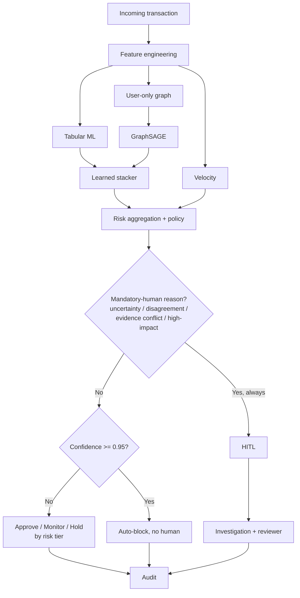
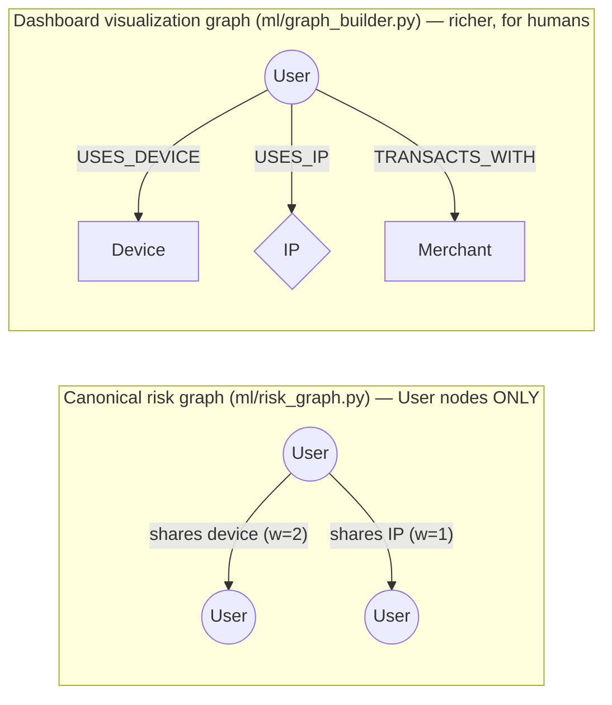
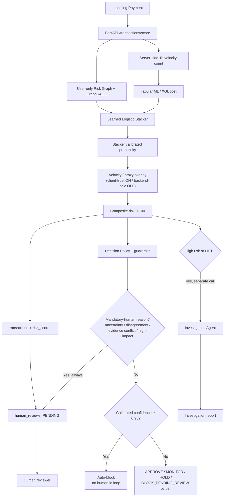
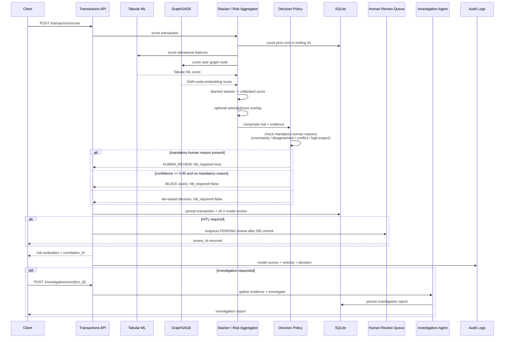

# 🗺️ RazorRisk — Complete Project Architecture & Codebase Workflow Guide

This document is a comprehensive, step-by-step technical guide to understanding the **RazorRisk** codebase from
scratch: how every component works, how data flows through the system, how models are trained leak-free and
combined by a learned stacker, and how the investigation agent produces an audit-ready report whether or not an
LLM is configured.

---

## Workflow Diagram



A confidence threshold on its own never bypasses the mandatory-human reasons — model disagreement, evidence conflict, model uncertainty, and high-dollar-amount (`HIGH_IMPACT`) transactions always route to `H[HITL]` regardless of how confident the stacker is. Only an unambiguous, high-confidence score with none of those reasons present takes the `AB[Auto-block]` path. See Bug #27 below and [`ml/decision_policy.py`](ml/decision_policy.py).

## 1. Mental Model & Core Architecture Shift

There are **two graphs** in this codebase, deliberately kept separate:


The risk graph drives GNN training + Louvain community detection — a fraud ring is a dense User-only cluster.
The visualization graph is only ever read by the Graph Topology tab, never fed into any model.

These used to be the same graph, which caused a real bug: 2-hop traversal through a popular Merchant node (used
by hundreds of unrelated users) made a 7-person fraud ring balloon into a 692-node unreadable subgraph. A
Merchant used by thousands of unrelated users was never real *fraud* signal - it just happened to be reachable
in 2 hops - so the graph that actually trains the model never includes Merchant/heavy-fanout nodes as hops at
all. The dashboard's separate graph keeps its own traversal cap for its own different job (human-readable
exploration).

Traditional payment fraud engines evaluate each transaction independently: Transaction -> Features -> Tabular
ML Model -> Fraud Probability.

**RazorRisk** combines that with a graph-aware model and lets a *learned* stacker decide how much to trust each:




---

## 2. Recommended Reading Order (Where to Start in Code)

```text
1. System Configuration & Logger
   - config.py
   - utils/logger.py             8 subsystem channels + correlation IDs

2. Database Schema & Data Models
   - db/schema.sql
   - db/database.py             raw sqlite3 only — see the Bugs & Regression History section for why the earlier SQLAlchemy path is gone

3. Synthetic Data & Fraud Scenarios
   - data/generate_synthetic_data.py    each user has ONE dedicated device/IP + benign co-location noise
   - data/ingest_real_kaggle_dataset.py alternative: real fraud labels + amounts

4. Shared ML utilities & canonical risk graph
   - ml/common.py                user-level train/test split, shared by both models
   - ml/risk_graph.py            User-only weighted graph + Louvain communities

5. The two independently-trained models
   - ml/train_tabular_model.py   XGBoost (sklearn fallback), leak-free SQL window features
   - ml/train_gnn.py             hand-rolled NumPy GraphSAGE, inductive inference

6. The learned combination
   - ml/risk_aggregator.py       train_stacker() (offline) + calculate_composite_risk_score() (live)

7. Investigation agent
   - agent/tools.py              4 deterministic evidence tools, identical for both modes
   - agent/llm_investigator.py   real LLM path (Anthropic/Groq/OpenAI), only if a key is set
   - agent/deterministic_agent.py  honestly-labeled rule-based fallback
   - agent/prompts.py
   - agent/graph_agent.py        dispatcher between the two

8. FastAPI REST API Gateway & Logging API
   - api/main.py
   - api/routes_transactions.py  binds a correlation ID per scored transaction
   - api/routes_graph.py
   - api/routes_agent.py
   - api/routes_logs.py          includes POST /logs/client for frontend error capture
   - api/routes_admin.py         reseed/ingest + full retrain, one call

9. Frontend Dashboard & Vis.js Visualizer
   - static/index.html
   - static/css/styles.css       tier-driven risk color, not "everything is red"
   - static/js/app.js
   - static/js/graph_vis.js

10. Tests
    - tests/test_risk_engine.py  full pipeline integration test, runs offline
```

---

## 3. End-to-End Execution Sequence (Step-by-Step Flow)




### Step 1: Request Ingestion (`api/routes_transactions.py`)
`POST /api/v1/transactions/score` receives a transaction payload and immediately calls
`bind_correlation_id()` — every log line emitted anywhere in the next 4 steps carries this same ID.

### Step 2: Velocity Source Selection and Tabular ML Fraud Scoring (`ml/risk_aggregator.py`)
- Selects hourly velocity from the explicit frontend source toggle: client-provided in trust mode, or server-computed from the trailing-1h transaction history in backend mode. The selected value then feeds the same model features used at training time (`amount_log`, `hour_of_day`, `day_of_week`,
  `velocity_1h`, `amount_zscore_prior`, `merchant_fraud_rate`) from live DB queries — `amount_zscore_prior` and
  `merchant_fraud_rate` both use ONLY information available before this transaction (prior transactions' mean/
  std, and merchant rates fit only on the training split).
- Calls `ml/train_tabular_model.py::predict_tabular_fraud_prob()`, which loads the trained XGBoost (or sklearn
  fallback) model.

### Step 3: Graph & GNN Node Scoring (`ml/risk_aggregator.py::live_gnn_score_and_evidence`)
- Rebuilds the canonical User-only risk graph (`ml/risk_graph.py::build_user_graph`) from current DB contents when the live snapshot is missing/invalidated or its TTL expires. The API invalidates the snapshot after every committed transaction so rapid repeated payments cannot score against stale device/IP/community topology.
- Runs one **inductive** forward pass (`GraphSAGEInference.score_all`) with the already-trained weights over
  whatever the current graph looks like — any user present gets a real score, including ones added after
  training, no cache and no fallback heuristic needed.
- Also returns graph evidence (shared device/IP account counts, community size) for the dashboard's "Instant
  Graph Evidence" panel and the agent's `GraphTool`.

### Step 4: Composite Risk Scoring (`ml/risk_aggregator.py::calculate_composite_risk_score`)
- Combines `tabular_score` and `gnn_score` via the **learned logistic-regression stacker**
  (`coef[0]*tabular + coef[1]*gnn + intercept`, sigmoid) — coefficients are fit offline by `train_stacker()` on
  held-out data, not hand-picked.
- Applies the velocity/VPN-proxy multiplier **after** that calibrated probability, as an explicit rule-based
  overlay — logged and returned separately (`velocity_multiplier`), never folded into the "learned" score.
- Classifies Risk Tier & Decision:
  - `0 – 39.9`: `LOW` → `APPROVE`
  - `40.0 – 69.9`: `MEDIUM` → `MONITOR`
  - `70.0 – 89.9`: `HIGH` → `HOLD_FOR_INVESTIGATION`
  - `90.0 – 100.0`: `CRITICAL` → `BLOCK_AND_INVESTIGATE`

### Step 5: Policy, HITL Queue, and Separate Investigation Dispatch (`agent/graph_agent.py`)
- If Risk Score ≥ 70.0 **or HITL policy requires review**, `/api/v1/transactions/score` returns `needs_investigation: true` **without** running the
  investigation itself — the risk score, tier, and evidence render in the dashboard immediately. The frontend
  (`static/js/app.js`) then fires a separate `POST /api/v1/investigations/run/{transaction_id}` and fills in the
  report panel once that resolves. This split exists because the investigation step is materially slower than
  the risk scoring step (an LLM call can take several seconds; risk scoring is sub-second) — an earlier version
  ran both synchronously inside `/score`, so the whole UI waited on the slowest part even when nothing about the
  fast part had anything left to compute.
- **Evidence gathering is identical regardless of mode** — 4 deterministic tools (`agent/tools.py`):
  `GraphTool`, `TransactionHistoryTool`, `DeviceRiskTool`, `FraudModelTool`.
- **Hypothesis generation** then tries `agent/llm_investigator.py` if `ANTHROPIC_API_KEY` / `GROQ_API_KEY` /
  `OPENAI_API_KEY` is set; on any failure (or no key at all) falls back to `agent/deterministic_agent.py`'s
  rule-based pattern matching. The resulting report's `agent_mode` field states which one actually ran.
- Which path runs can also be forced from the dashboard's **Agent mode** selector — `GET /agent-status` /
  `POST /agent-mode` in `api/routes_agent.py`, backed by `agent/mode_state.py`'s process-local in-memory
  override (`auto` / a specific provider / `deterministic`). Useful for demoing "this is what the LLM path
  looks like" vs. "this is the fallback" on demand, without needing different API keys configured.

### Step 6: Database Persistence & Log Streaming (`db/database.py` & `utils/logger.py`)
- Saves transaction, risk score, and investigation report to SQLite (`db/database.py`). The application uses one raw-SQLite data path.
- Logs route to 8 subsystem channels: `app`, `risk_engine`, `agent`, `ml_training`, `graph`, `database`,
  `pipeline`, `frontend_client` — every line for this request carries the correlation ID from Step 1.
- The live in-memory dashboard graph gets this one transaction folded in incrementally
  (`graph_builder.add_transaction`) — no full rebuild needed for a single live score.

### Step 6b: Human-in-the-Loop Queue (`api/routes_hitl.py`)
- `apply_decision_policy()` can trigger `MODEL_UNCERTAINTY`, `MODEL_DISAGREEMENT`, `HIGH_IMPACT`, `EVIDENCE_CONFLICT`, or `NOVEL_BEHAVIOR`.
- The API commits the transaction and risk record first, then creates an idempotent `PENDING` row in `human_reviews`.
- The dashboard refreshes the queue after every score and exposes `APPROVE`, `HOLD`, and `BLOCK` reviewer actions.
- A review is not an external email/task-system integration; it is an internal RazorRisk reviewer queue backed by SQLite.

### Step 7: Dashboard UI Update (`static/js/app.js` & `static/js/graph_vis.js`)
- Updates the risk gauge (color driven by actual tier, not hardcoded red) and the three model-breakdown bars —
  the third bar shows the stacker's calibrated score, not a fabricated "topology risk" number. This happens the
  instant `/score` responds, independent of whether an investigation is still running.
- Vis.js renders a capped, fraud-signal-focused 2-hop network around the user (Device/IP hops only — Merchant
  fan-out is excluded, see §1).
- Displays the agent report once its separate follow-up call resolves (states its own mode), parsed from
  Markdown to HTML via `marked.js` rather than dumped as raw text, and streams log lines into the audit console.
- Any uncaught frontend JS error gets POSTed to `/api/v1/logs/client` automatically.
- All fetch calls go through an `API_BASE` constant (`window.RAZORRISK_API_BASE`, set in `index.html`) instead
  of hardcoded relative paths — empty by default (same-origin), overridable when the dashboard is deployed
  standalone against a different backend origin. See §4 below.

---

## 4. Deployment & Ops

### Bugs #1–9 — foundational fixes, from the project's earliest working version

Referenced by number throughout this document (Bug #13 below refers back to Bug #10, for instance) but not
individually written up elsewhere, so listed here in full rather than left as dangling references:

| # | Problem | Fix |
|---|---|---|
| 1 | A 2-hop traversal through a high-degree shared Merchant node turned a 7-person fraud ring into a 692-node subgraph | Split the canonical User-only risk graph (GNN training, community detection) from the richer User/Device/IP/Merchant graph (dashboard visualization only) |
| 2 | Groq appeared configured (`GROQ_API_KEY` set) but investigations silently fell back to deterministic mode | Added the provider-specific LangChain package (`langchain-groq`) and corrected the model name; agent-status endpoint now exposes which provider is actually reachable |
| 3 | New-user GNN inference used a cached training-time lookup instead of computing anything for the new node | `GraphSAGEInference.score_all()` performs a real inductive forward pass over the current graph, so a user who wasn't in the training set still gets a genuine score |
| 4 | Tabular and GNN scores were combined with a hand-picked `0.35 / 0.45 / 0.20` formula | Replaced with a logistic-regression stacker trained on held-out model outputs (later extended to take graph evidence as a real input too — see Bug #18) |
| 5 | A naive random train/test split could put the same user's transactions on both sides, leaking information | Both the tabular model and the GNN share one user-level split |
| 6 | The public ULB/Kaggle fraud dataset has no identity/device/IP fields at all | Real transaction amounts and fraud labels are kept from Kaggle; graph relationships for the GNN benchmark come from the synthetic generator instead — the two are never presented as the same claim (see `README.md`'s Evaluation section) |
| 7 | A single transaction was hard to trace across the 8 separate log channels | Added a correlation ID threaded through every channel a given transaction/investigation touches |
| 8 | The dashboard's risk display waited on the (slower) investigation call before showing anything | `/api/v1/transactions/score` returns the risk evaluation immediately; investigation is a separate, later request |
| 9 | Investigation reports rendered literal `###` / `**` characters instead of formatted Markdown in the dashboard | Added client-side Markdown parsing (`marked.js`) for the report view |

**Two platforms, deliberately split — not a preference, a size constraint.** The backend's dependency stack —
XGBoost, SciPy, scikit-learn, pandas, plus the LangChain provider packages — installs to roughly 2GB. Vercel's
serverless Python functions cap out around 250MB unzipped, so the backend cannot run there as a function
regardless of configuration. The working split:

- **Render** runs the actual backend — a real, persistent process, so `razor_risk.db` and `logs/*.log` behave
  exactly like they do locally. `render.yaml` drives the build: install deps, generate the synthetic dataset,
  train the tabular model, the GNN, and the stacker, so the very first request after deploy is already warm.
- **Vercel** (optional) serves *only* `static/` as a plain static site (`vercel.json`: `{"outputDirectory":
  "static"}` — no Python function involved at all), calling the Render backend cross-origin via
  `window.RAZORRISK_API_BASE`. CORS is wide open on the API (`api/main.py`) specifically to support this.

**What had to change in the code for this to even be possible**, beyond the platform configs themselves:
- `config.py` added `IS_SERVERLESS` (keyed off Vercel's own `VERCEL=1` env var, present nowhere else) and a
  single `SQLITE_DB_PATH` / `LOG_DIR` that redirect to `/tmp` when serverless — Vercel's deployment filesystem is
  read-only outside `/tmp`, so any write against the project directory itself would throw and take the request
  down. This only matters if the backend itself is ever run in a serverless context; Render is unaffected since
  `IS_SERVERLESS` stays `False` there.
- `db/database.py`'s `get_raw_sqlite_connection()` was hardcoded to `BASE_DIR`, silently ignoring `DATABASE_URL`
  — invisible locally and on Render (both paths coincidentally agreed), but would have been a hard crash the
  moment `DATABASE_URL` and the hardcoded path ever diverged. Fixed to read the same `SQLITE_DB_PATH`.
  **(Bug #10.)**
- `api/main.py`'s startup hook auto-seeds a small synthetic dataset if it finds an empty DB on a serverless cold
  start, so the fraud-ring demo presets (which reference specific graph relationships) still have something to
  show even though `/tmp` doesn't persist between invocations.
- `static/index.html`'s asset paths changed from absolute `/dashboard/...` to relative, so the identical HTML
  file works whether it's mounted under FastAPI's `StaticFiles` (Render, local) or served standalone at the
  domain root (Vercel).

**What Antideploy specifically surfaced, after Render/Vercel/HF Spaces were already handled:**
- **Bug #11 — bare domain root 404'd.** Antideploy (and any host that serves the app at its actual domain root
  rather than a subpath) hit `GET /` and got FastAPI's default `{"detail":"Not Found"}`, since the app never
  defined a route there — only `/health`, `/dashboard/`, `/docs`, and the `/api/v1/...` routes existed. Fixed
  with a `GET /` → `RedirectResponse("/dashboard/")` in `api/main.py`.
- **Bug #12 — an auto-detector caught a real architectural leftover.** Antideploy reads `requirements.txt` to
  infer what infrastructure an app needs, saw `asyncpg`/`psycopg2-binary`, and offered to provision a Postgres
  database. That correctly reflected what the dependency list *implied* — a parallel SQLAlchemy engine +
  a historical `db/models.py` ORM path existed specifically to support Postgres via `DATABASE_URL` — but it was dead code:
  every actual query in the entire app (`api/`, `ml/`, `data/`, `agent/`) went through
  `get_raw_sqlite_connection()`, a raw `sqlite3` connection that doesn't even speak Postgres. The auto-detector
  wasn't wrong about the dependency; the application-owned ORM path was the bug. Removed `db/models.py` and the SQLAlchemy engine code, and removed the direct SQLAlchemy dependency from project requirements. LangChain may still install SQLAlchemy transitively, but RazorRisk itself does not use an ORM.
- **Bug #13 — the `/tmp` redirect (bug #10) didn't recognize Cloud Run.** Antideploy runs on Google Cloud Run,
  which has the same ephemeral-filesystem characteristics as Vercel (wiped on redeploy) but wasn't in the
  original serverless-detection check — only `VERCEL` and (later) `SPACE_ID` were. `IS_RESTRICTED_FS` now also
  checks `K_SERVICE`, an env var Cloud Run sets on every service unconditionally, regardless of which platform
  is fronting it.

Full step-by-step deploy instructions for all platforms are in `README.md`'s **Deployment** section.

---

## 4.5 Bugs & Regression History

These are the concrete problems found during manual and automated validation. Each is now either fixed in the implementation or explicitly represented as a disclosed GAP in the golden matrix.

### Bug #14 — Velocity test looked inverted
The dashboard sorts recent transactions newest-first. A manual test that displayed 15 repeated transactions therefore showed the latest transaction at row 1. In addition, reusing an identity from an earlier test meant its graph/history state was not clean. The apparent `100 → 0.1 → 0.1 ...` pattern was therefore not proof that the first transaction had risk 100 or that velocity was decreasing. Regression tests now verify the chronological backend count directly.

### Bug #15 — Velocity source semantics were ambiguous
The desired behavior is a frontend source toggle, not a hidden server override. **ON** intentionally trusts `velocity_1h` for simulation/testing; **OFF** ignores any client value and computes trailing-one-hour velocity from persisted transactions. The effective source and value are persisted and audited.

### Bug #16 — HUMAN_REVIEW was a decision without a guaranteed work item
A transaction could be labeled `HUMAN_REVIEW` while the queue was not yet guaranteed to contain a usable review record. The fixed sequence is: commit transaction → commit risk score → enqueue idempotent `PENDING` review → return `review_id`. Reviewer resolution changes the risk decision to `APPROVE`, `HOLD`, or `BLOCK`.

### Bug #17 — GNN topology could lag behind rapid transactions
Backend velocity was calculated from fresh database state while the GNN could still be using a short-lived cached graph snapshot. The snapshot is now invalidated after every committed transaction (fixing the stale GNN topology bug). The current transaction is deliberately scored against the pre-insert graph to avoid self-influence; the next transaction sees the updated topology.

### Bug #18 — Connectivity alone was scored as fraud
`ml/risk_aggregator.py` originally raised the risk tier whenever `shared_device_accounts >= 3` or `shared_ip_accounts >= 5`, with no requirement that the transaction also be behaviorally unusual. Run against a synthetic 7-person hostel (one shared Wi-Fi IP, ordinary independent spending) and a 40-person carrier-NAT IP, this produced the exact false positive the graph layer exists to avoid — identity overlap alone was being read as fraud. **Resolution:** graph evidence (`shared_device_norm`, `shared_ip_norm`) was made a real, continuous input to the learned stacker instead of a separate hand-picked threshold rule layered on top of the model's output — see `ml/risk_aggregator.py`'s module docstring for the full before/after reasoning. `tests/GOLDEN_TEST_MATRIX.md`'s N01/N02/N05/N06 rows and `tests/test_edge_case_matrix.py` assert this directly against the trained model, not just the rule logic.

### Bug #19 — The same false positive resurfaced one layer up, in the investigator
Fixing Bug #18 in the risk *scorer* did not fix `agent/deterministic_agent.py`, which independently branched on `shared_device_account_count >= 3` / `shared_ip_account_count >= 4` to decide its human-facing hypothesis and recommended action — found by actually running the hostel scenario through the investigation path, where it produced "High-confidence device sharing fraud ring detected" and `BLOCK_ACCOUNT_AND_HOLD_FUNDS` for a benign shared-Wi-Fi household. **Resolution:** the deterministic investigator now requires the same confluence the scorer does — strong fingerprint sharing (`shared_device>=3` or `shared_ip>=5`) **and** a behavioral anomaly (velocity, or amount far outside the user's own historical average) — before escalating; connectivity alone now produces an explicit "looks like a benign shared-fingerprint community" hypothesis with a light-touch `APPROVE_WITH_VERIFICATION` action instead. This is why the same fix has to be applied everywhere a signal is interpreted, not just where it's scored — see `tests/test_deterministic_agent.py`.

### Bug #20 — A performance optimization reopened a client-trust gap
An intermediate version of `ml/risk_aggregator.py` added a "fast path" that skipped the graph/GNN call entirely for transactions that looked small and unremarkable — amount low, velocity low, tabular score low. Eligibility was decided in part from `txn_payload.get("velocity_1h", ...)`, which was still client-suppliable at that point in the project: a caller could simply always claim a low `velocity_1h` and route itself onto the cheap path regardless of its actual transaction pattern. **Resolution:** removed the fast path entirely rather than patching around it. The graph-snapshot cache alone (rebuild at most once per `GRAPH_CACHE_TTL_SECONDS`, not once per request) already brings a warm-cache full-evaluation call down to milliseconds, so the second shortcut wasn't earning its added complexity or its security surface. Every transaction now gets real, current evidence.

### Bug #21 — Velocity was trusted from the client in several independent places
Related to, but broader than, Bug #20: `ml/decision_policy.py`, `agent/tools.py`'s `FraudModelTool`, and `agent/graph_agent.py` each independently read `velocity_1h` from the incoming transaction payload rather than from a single server-computed value — meaning a caller could suppress the exact signal meant to catch rapid repeated activity in three different places, not just one. **Resolution:** `velocity_1h` is now computed exactly once per request, server-side, from a `COUNT(*)` against transaction history in `ml/risk_aggregator.py::calculate_composite_risk_score`, and threaded explicitly through every downstream consumer instead of each one re-reading (or not reading) the client's claim independently. This predates and is a narrower precursor to Bug #15's client/backend velocity *toggle* — that toggle is an intentional, audited choice for simulation; this bug was an unintentional, unaudited one.

### Bug #22 — Real-data ingestion silently deleted the synthetic golden-matrix scenarios
`data/ingest_real_kaggle_dataset.py` originally opened with `DELETE FROM transactions; DELETE FROM users; DELETE FROM devices; ...` before loading the ULB/Kaggle CSV — wiping every synthetic entity, including every named benign-look-alike and fraud-ring scenario the golden test matrix checks against, and replacing them with one crude invented fraud cluster that every real fraud row was dumped into regardless of the real dataset's own structure. Running this after `generate_synthetic_data.py` would have made `tests/GOLDEN_TEST_MATRIX.md` silently stop meaning anything, since the specific identities it asserts against (`USER_HOSTEL_1`, `USER_CARRIER_2`, `USER_STRUCT_1`, ...) would no longer exist. **Resolution:** rewritten to be additive — it never deletes anything, generates the synthetic base first if missing, and layers real transactions onto the *existing* fraud-ring and baseline identities using each one's own already-established device/IP, so a real transaction lands on exactly the graph structure the golden matrix already validated. Verified by ingesting a stand-in CSV and confirming every golden-matrix scenario's transaction count was unchanged afterward, and that the matrix still passed after retraining on the merged data.

### Bug #23 — The investigation endpoint had no server-side necessity guard
`POST /api/v1/investigations/run/{id}` would run a full investigation — including a real LLM call, when one is configured — for *any* transaction ID passed to it, with no check of its own. The dashboard only ever called it for transactions that had already crossed the risk threshold, but that was a frontend convention, not an enforced one: a direct API call, a future frontend bug, or a misbehaving integration could trigger a full paid LLM investigation for every low-risk transaction. **Resolution:** the endpoint now recomputes the same risk/HITL condition the dashboard uses to decide whether to show its "Investigate" button, and refuses to run the agent unless that condition holds or the caller explicitly passes `?force=true`. This is the direct fix for "don't check every transaction this heavily" — the ML/graph scoring pipeline runs on every transaction (and is cheap, per Bug #20's resolution), but the LLM-capable investigation step now only runs when the transaction actually warrants it.

### Bug #24 — A "legitimate but unusual" synthetic scenario was statistically identical to fraud
The `family_unusual_spending_benign` scenario (a family member's genuinely large but legitimate one-off purchase — wedding, vacation, medical bill) originally used amounts producing a 3.0–5.0 z-score against the family's own spending baseline — the *same* z-score range used for the project's actual fraud scenarios (2.5–6.0). Run against the trained model, this scenario scored **HIGH**, not LOW or MEDIUM: `amount_zscore_prior` alone genuinely cannot separate "one big legitimate purchase" from "fraud" at that magnitude, because no other feature in the dataset (a life-event category, a recurring-annual-timing signal) would let it. This is not being reported as a bug that was hidden — it is the concrete, measured version of a general limitation: **at extreme deviation magnitudes, this system currently has no way to distinguish an outlier's cause.** The scenario's amounts were adjusted to a milder, more realistic deviation (~1.5–2.5 sigma) where the tabular model does have separation, and the original result is kept as a documented finding in `tests/GOLDEN_TEST_MATRIX.md`'s N16 note rather than deleted — closing this gap for real would require a genuine contextual feature, not a lower amount in the test fixture.

### Bug #25 — A test class placed after `if __name__ == "__main__"` silently never ran when the file was executed directly
`tests/test_regressions.py` had `TestGraphFreshnessContract` defined *after* its `if __name__ == "__main__": unittest.main()` block. `unittest discover` (used by CI and by `python -m unittest discover`) imports the module without triggering that block, so `discover` correctly picked up all 11 tests — but running the file directly with `python tests/test_regressions.py`, a completely normal habit, hit the `__main__` guard mid-file, called `unittest.main()` (which exits the process when done), and the class below it was never even defined, let alone run. Verified by actually running both invocation styles side by side: `discover` reported 61 tests project-wide; the direct invocation silently reported only 10 of this file's 11 tests, with no error, warning, or nonzero exit code. **Resolution:** moved the class above the `if __name__` guard. This is the kind of gap the project's own regression-testing philosophy exists to catch, so it's disclosed here rather than quietly fixed with no record — a false sense of "the tests pass" is exactly the failure mode this whole file is for.

### Bug #26 — A backend validation error on `velocity_1h` leaked its raw error body into the UI
`velocity_1h` is the *only* field on the scoring form with backend-side validation — Pydantic's `Field(..., ge=0)` on the model, plus an explicit `ValueError("velocity_1h is required when velocity_enabled=true")` in `risk_aggregator.py` for the conditional-required case. `handleTransactionScore()` in `static/js/app.js` called `res.json()` unconditionally with no `res.ok` check, so on a 400/422 response the *error* body — either a plain string or FastAPI/Pydantic's `[{type, loc, msg, input, ctx, url}, ...]` shape — was handed straight to `updateRiskDisplay(data.risk_evaluation)`. Since `data.risk_evaluation` doesn't exist on an error response, this threw immediately on the very first line (`evalRes.risk_score` on `undefined`), and the raw exception — carrying that unformatted backend structure — surfaced directly in the user-facing `alert()`. Reproduced directly (not just inspected) by feeding `extractErrorMessage()` FastAPI's real error shapes for both failure modes and confirming the fix produces `"velocity_1h: Input should be greater than or equal to 0"` and `"velocity_1h is required when velocity_enabled=true"` respectively, instead of the raw object. **Resolution:** the fetch chain now checks `res.ok` before touching the body, routes any failure through a dedicated `extractErrorMessage()` that handles both FastAPI error shapes explicitly, adds a client-side pre-flight check so an empty/negative/non-numeric client velocity is rejected before the request is even sent, resets the field to its default whenever a demo preset is loaded (it previously only reset the enable toggle, leaving a stale typed value to resurface later), and adds the same `?? 0` fallback the risk-display code already had to the recent-transactions table renderer. See `tests/test_regressions.py::TestVelocityFieldErrorHandlingContract`.

### Bug #27 — Every ambiguous-tier transaction was routed to a human, even maximally-confident fraud
`hitl_required` fired on *any* policy reason (`MODEL_UNCERTAINTY`, `MODEL_DISAGREEMENT`, `HIGH_IMPACT`, `EVIDENCE_CONFLICT`, `NOVEL_BEHAVIOR`) once the transaction was MEDIUM tier or above, with no distinction between "the models genuinely disagree" and "the score is maxed out and every signal agrees." In practice a transaction the stacker scored at 0.97 with only a `NOVEL_BEHAVIOR` (high-velocity) reason attached went to the human queue exactly like one sitting at 0.36 in the `MODEL_UNCERTAINTY` band — the review workload scaled with tier instead of with actual ambiguity, which is the opposite of what a human-in-the-loop system is supposed to do. **Resolution:** added an `AUTO_BLOCK_THRESHOLD = 0.95` gate on the **raw** `stacker_calibrated_score` (not the velocity-inflated `final_risk_score`/`risk_tier` — `velocity_mult` can cap a 0.70 calibrated probability at a CRITICAL tier, and auto-blocking on that inflated number would let speed alone trigger an irreversible action). A `MANDATORY_HUMAN_REASONS` set (`MODEL_UNCERTAINTY`, `MODEL_DISAGREEMENT`, `EVIDENCE_CONFLICT`, `HIGH_IMPACT`) is carved out and always still routes to `HUMAN_REVIEW` regardless of confidence — model disagreement means "confidence" isn't trustworthy, and dual control on large-dollar transactions is a standard payments/AML control independent of model score. `NOVEL_BEHAVIOR` (velocity alone) is deliberately excluded from that mandatory set, since it's a pattern already folded into the score rather than an ambiguity signal. When confidence clears the threshold with none of the mandatory reasons present, `hitl_required=False` and `decision="BLOCK"` — `enqueue_review()` already gates strictly on `hitl_required`, so the transaction never reaches the queue. All 69 existing tests passed unmodified against the change.

### Regression contract
`tests/test_regressions.py` turns the above findings into executable checks. `tests/test_risk_engine.py` covers the broader scoring pipeline, while `tests/GOLDEN_TEST_MATRIX.md` documents scenario-level PASS/PARTIAL/GAP expectations.

## 5. Deep-Dive Component Map

### A. Database Layer (`db/`)
- `schema.sql` — `users`, `devices`, `ip_addresses`, `merchants`, `transactions`, `risk_scores`,
  `investigation_reports`, `human_reviews`, `system_logs`.
- `database.py` — raw `sqlite3` connection helper + schema init. One application-owned SQLite data path.

### B. Synthetic Data & Fraud Ring Generator (`data/generate_synthetic_data.py`)
Generates ~12,000 transactions. Each normal user gets **their own dedicated device + IP** (a person doesn't
switch phones between purchases) plus ~60 benign IP co-locations (pairs of unrelated users who happen to share
one IP — roommates, office wifi — with no elevated fraud behavior) so "any shared IP" isn't a perfect signal by
construction. Injects 4 explicit fraud scenarios: device-sharing ring, IP/proxy botnet, carding micro-
transactions, and merchant collusion.

### C. Machine Learning Engine (`ml/`)
- `common.py` — `user_level_split()`, shared by both models so a fraud-ring member's transactions never appear
  on both sides of train/test.
- `risk_graph.py` — canonical User-only weighted graph + Louvain communities + node feature extraction +
  row-normalized adjacency for the GNN.
- `train_tabular_model.py` — XGBoost (sklearn `HistGradientBoostingClassifier` fallback), leak-free SQL window-
  function features, merchant target-encoding fit only on train, real held-out `classification_report_dict`.
- `train_gnn.py` — 2-layer GraphSAGE mean-aggregation network, implemented from scratch in NumPy: each layer
  concatenates a node's own features with the mean of its neighbors' features, then applies a linear layer and
  ReLU. Trains with manual backprop, saves weights to `ml/models/gnn_model.npz`. `GraphSAGEInference`
  re-implements just the forward pass for live, inductive scoring.
- `risk_aggregator.py` — `train_stacker()` (offline logistic regression fit) + `calculate_composite_risk_score()`
  (live scoring entrypoint, the API's hot path).
- `graph_builder.py` — the separate dashboard visualization graph (User/Device/IP/Merchant), untouched by
  training.

### D. Investigation Agent (`agent/`)
- `tools.py` — `GraphTool`, `TransactionHistoryTool`, `DeviceRiskTool`, `FraudModelTool`: deterministic,
  identical for both agent modes.
- `llm_investigator.py` — real LLM call (LangChain chat-model interface; Anthropic → Groq → OpenAI, first
  configured key wins), only reasons over evidence already gathered, never computes a number itself.
- `deterministic_agent.py` — rule-based hypothesis/action selection, the fallback path.
- `prompts.py` — the markdown report template, shared by both modes.
- `graph_agent.py` — `RiskInvestigationAgent.investigate()`: gathers evidence, tries LLM, falls back, renders
  the report, labels `agent_mode` honestly.

### E. FastAPI REST Gateway & Logs (`api/`)
- `main.py` — app init, builds the dashboard graph at startup (so live scoring has graph signal from process
  start, not only after some other code path happens to touch it).
- `routes_transactions.py` — `/api/v1/transactions/score`, `/api/v1/transactions/recent`; binds/clears the
  correlation ID per request.
- `routes_graph.py` — `/api/v1/graph/topology/{user_id}` (capped, Device/IP-only 2nd hop),
  `/api/v1/graph/communities`.
- `routes_agent.py` — `/api/v1/investigations/run/{txn_id}`, `/api/v1/investigations/{txn_id}`, plus
  `GET /agent-status` / `POST /agent-mode` for the dashboard's live agent-mode selector (backed by
  `agent/mode_state.py`'s in-memory override — resets to `auto` on restart, not persisted app config).
- `routes_logs.py` — `/api/v1/logs/stream` (all 8 channels), `/api/v1/logs/client` (frontend error capture).
- `routes_admin.py` — `/api/v1/admin/pipeline/synthetic`, `/api/v1/admin/pipeline/real`: reseed/ingest, rebuild
  the dashboard graph, run the full tabular → GNN → stacker retrain, return held-out eval metrics, and drop the
  live-scoring process's cached model weights (`_LiveModels.reset()`) so the next request picks up the fresh
  ones. `/api/v1/admin/rebuild-graph` refreshes just the dashboard graph without retraining.

---

## 6. How to Explain This Project in an Interview

1. **The Core Problem**:
   > *"Existing payment fraud models look at transactions in isolation. If 7 stolen credit cards are used on 7 new accounts, a row-level model evaluates 7 independent 'normal-looking' transactions. RazorRisk builds a User-only weighted graph from shared device/IP fingerprints and runs community detection on it, so 7 accounts sharing one device show up as a dense cluster regardless of how normal each individual transaction looks."*

2. **The Dual ML Architecture, Combined by a Learned Stacker — Not a Guess**:
   > *"I train two independent models on the same leak-free, user-level train/test split: an XGBoost model on transaction-level behavioral features, and a GraphSAGE GNN — implemented from scratch in NumPy, since at this scale a PyTorch dependency wasn't justified — on the user-risk graph. Rather than hand-picking how to weight them, I fit a small logistic regression stacker on their held-out scores, and I log both the learned coefficients and a tabular-only vs GNN-only vs stacked comparison every retrain, so I can show the combination is actually additive."*

3. **The Agentic Layer, Honestly Scoped**:
   > *"When a transaction scores ≥ 70, an investigation agent gathers evidence through four deterministic tools — shared-entity graph queries, transaction history, device risk, model scores. If an LLM API key is configured, a real model reasons over that evidence to write the hypothesis and recommended action; if not, a rule-based fallback does the same job. Either way, the agent can't fabricate a number — every figure in the report traces back to one of the four tools — and the report states plainly which mode produced it."*

4. **Production Readiness & Auditability**:
   > *"Every subsystem — API, risk engine, agent, ML training, graph, database, pipeline, frontend — logs to its own rotating file, and every scored transaction gets a correlation ID that ties its log lines together across all of them. I can hand someone a transaction ID and they can grep the exact decision trail across every model that touched it."*

5. **The Deployment Split — a Real Constraint, Not a Preference**:
   > *"XGBoost, SciPy, and the LangChain provider packages together install to about 2GB, and Vercel's serverless Python functions cap out around 250MB unzipped — so the backend was never going to run there as a function no matter how I configured it. I run the backend on Render, a real persistent process, and optionally mirror just the static dashboard on Vercel pointed at the Render URL over CORS. That decision also surfaced a real bug: the raw SQLite connection helper had a hardcoded path that happened to agree with the SQLAlchemy engine's path locally and on Render, but would have silently diverged — and crashed every write — the moment I tried running any part of this somewhere with a read-only filesystem. Now there's one source of truth for that path instead of two that happened to match."*

---

## Evaluation Reproduction Contract

The checked-in evaluation runner is the source of truth for README model metrics:

```bash
python tests/evaluate_models.py --dataset synthetic
python tests/evaluate_models.py --dataset synthetic --retrain
python tests/evaluate_models.py --dataset kaggle --csv data/creditcard.csv
```

Synthetic evaluation compares the tabular model, the user-level GraphSAGE score projected onto the same held-out transaction rows, and the learned stacker. The public ULB/Kaggle dataset is evaluated separately as a tabular benchmark because it contains no stable user/device/IP relationships. Graph claims are therefore restricted to the synthetic relational benchmark.
