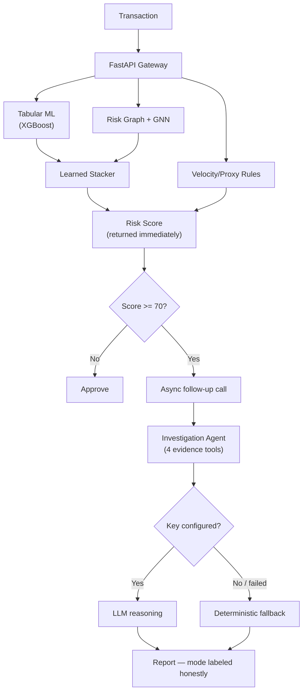

# RazorRisk

**Agentic AI payment fraud & risk investigation platform** — Graph Neural Network + Tabular ML + LLM investigation agent, combined by a learned stacker instead of hand-picked rules.

Most fraud demos score one transaction at a time. RazorRisk also asks: what if 10 "normal-looking" transactions are the same fraud ring spread across 10 accounts? A GraphSAGE GNN over the entity graph catches that; a tabular XGBoost model catches per-transaction anomalies; a learned logistic-regression stacker combines both; and an investigation agent writes an audit-ready report for anything that scores high, with an honest LLM/deterministic fallback so it never fakes reasoning it didn't do.

## Highlights

- 🕸️ **GraphSAGE GNN written from scratch in NumPy** — no PyTorch, appropriately scaled for ~1,500 graph nodes
- 🤖 **Dual-mode investigation agent** — Anthropic / Groq / OpenAI when configured, honest rule-based fallback when not, switchable live from the dashboard
- 📊 **Learned score fusion**, not a fixed formula — a logistic regression stacker fit on held-out data, with tabular-only vs. GNN-only vs. stacked precision/recall logged every retrain
- 🔍 **Correlation-ID logging** across 8 subsystems — one `grep` reconstructs a transaction's full trace
- ⚡ **Risk score renders instantly**; the (slower, sometimes LLM-backed) investigation runs as a separate async follow-up

---

## Tech Stack

| Layer | Technology |
|---|---|
| API | FastAPI, Uvicorn, Pydantic |
| Database | SQLite (raw `sqlite3`), Postgres-ready via `DATABASE_URL` |
| Tabular ML | XGBoost (scikit-learn fallback) |
| Graph ML | Hand-rolled NumPy GraphSAGE, inductive inference |
| Entity Graph | NetworkX + Louvain community detection |
| Score Fusion | scikit-learn logistic regression stacker |
| Agent | LangChain (Anthropic / Groq / OpenAI), deterministic rule-based fallback |
| Frontend | Vanilla HTML/CSS/JS, vis-network, marked.js — no build step |
| Deploy | Docker, Render, Vercel |

---

## Quickstart

```bash
pip install -r requirements.txt

# optional — enables live LLM investigations; deterministic fallback works without it
cp .env.example .env   # then set ANTHROPIC_API_KEY / GROQ_API_KEY / OPENAI_API_KEY

python -m data.generate_synthetic_data    # or: python -m data.ingest_real_kaggle_dataset
python -m ml.risk_aggregator              # trains tabular model + GNN + stacker
python run.py
```

Open **`http://localhost:8000/dashboard/`**. Retrain and reseed anytime from the dashboard header.

```bash
# Docker instead:
docker compose up --build

# Sanity check — full pipeline, offline:
python -m unittest tests/test_risk_engine.py -v
```

---

## Deployment

Backend deps (XGBoost + SciPy + scikit-learn + LangChain) install to ~2GB — over Vercel's ~250MB serverless function limit. So:

| Platform | Hosts | Card required? | Setup |
|---|---|---|---|
| **Render** | Full backend | Sometimes, for web services | Connect repo → **New → Blueprint** → reads `render.yaml` automatically → deploy |
| **Hugging Face Spaces** | Full backend (Docker) | No | Create a Docker Space → push repo with `SPACE_README.md` renamed to `README.md` |
| **Vercel** *(optional)* | `static/` dashboard only, calls the backend over CORS | No | Set `window.RAZORRISK_API_BASE` in `static/index.html` to your backend's URL → import repo → `vercel.json` deploys `static/` as-is |

Render's free web-service tier increasingly prompts for a payment method (never charges without one, but blocks deploy without it); **Hugging Face Spaces is the genuinely free-without-card option** for the full backend, and is what this repo is configured for out of the box (`Dockerfile`, `SPACE_README.md`). Both cold-start after idling — Render ~30-60s, Spaces similar.

**Deploy to Hugging Face Spaces:**
1. [huggingface.co/new-space](https://huggingface.co/new-space) → SDK: **Docker** → Blank template → Create. No card needed for public Spaces.
2. `git clone` the empty Space repo HF gives you.
3. Copy this project's files into that folder — **except** `README.md`.
4. Rename `SPACE_README.md` → `README.md` inside the Space folder (it has the required `sdk: docker` / `app_port: 8000` frontmatter Spaces needs — keep it separate from this repo's own README so your GitHub portfolio README stays untouched).
5. `git add . && git commit -m "Deploy" && git push`.
6. HF builds the `Dockerfile` and your app is live at `https://huggingface.co/spaces/<you>/<space-name>` — dashboard at `/dashboard/`, API docs at `/docs`.

The app already detects the Spaces environment automatically (`SPACE_ID` env var, set by HF itself) and redirects the SQLite DB + logs to `/tmp`, since Spaces' filesystem is read-only outside `/tmp` — same mechanism built for the Vercel case (`config.py`'s `IS_RESTRICTED_FS`).

---

## System Architecture



**Two graphs, on purpose**: `ml/risk_graph.py` (User-only, trains the GNN) and `ml/graph_builder.py` (richer User/Device/IP/Merchant graph, dashboard visualization only). Merchant nodes fan out to hundreds of unrelated users, so they're excluded from anything that trains the model.

---

## Notable Bugs Found & Fixed

| # | Bug | Fix |
|---|---|---|
| 1 | Merchant nodes in the training graph turned a 7-person fraud ring into a 692-node unreadable blob | Split into two graphs — canonical (User-only) vs. visualization |
| 2 | `GROQ_API_KEY` set → silently fell back to deterministic every time | `langchain-groq`/`-anthropic`/`-openai` were missing from `requirements.txt`; pinned all three + fixed a deprecated Groq model name |
| 3 | GNN inference used a cached lookup, silently heuristic-scoring any new user | `GraphSAGEInference.score_all()` now runs a real inductive forward pass every call |
| 4 | Tabular + GNN scores combined via a hand-picked `0.35/0.45/0.20` formula | Replaced with a logistic regression stacker fit on held-out data, eval logged every retrain |
| 5 | — | Both models share one leak-free, user-level train/test split |
| 6 | Kaggle's anonymized fraud dataset has no identity fields | Real amounts/labels kept, synthetic entity graph layered on top for the graph model |
| 7 | No way to trace one transaction across 8 log files | Correlation IDs (`bind_correlation_id()`) tag every log line for a request |
| 8 | Risk score display waited on the slow (sometimes LLM) investigation step | Split into `/score` (instant) + `/investigations/run/{id}` (async follow-up) |
| 9 | Investigation report showed raw `###`/`**` markdown as literal text | Added `marked.js`, parse before `innerHTML` |
| 10 | Raw SQLite helper had a hardcoded path, ignoring `DATABASE_URL` | Unified into one `SQLITE_DB_PATH` — was invisible locally, would've broken any read-only deployment target |

Full write-up of each with file/function references: `PROJECT_WORKFLOW.md`.

---

## Agent Mode Control

Dashboard's **Agent Investigation** tab has a live status badge + mode selector:
- `GET /api/v1/investigations/agent-status` — which providers are configured, which is active
- `POST /api/v1/investigations/agent-mode` — `{"mode": "auto"|"anthropic"|"groq"|"openai"|"deterministic"}`

Override lives in-memory (`agent/mode_state.py`), resets to `auto` on restart. Every report's `agent_mode` field reflects what actually ran for *that* report.

---

## API Reference

| Endpoint | Method | Purpose |
|---|---|---|
| `/api/v1/transactions/score` | POST | Score a transaction, returns instantly |
| `/api/v1/investigations/run/{id}` | POST | Run the investigation agent (async follow-up) |
| `/api/v1/investigations/{id}` | GET | Fetch an existing report |
| `/api/v1/investigations/agent-status` | GET | Current agent mode + configured providers |
| `/api/v1/investigations/agent-mode` | POST | Force a specific agent mode |
| `/api/v1/graph/topology/{user_id}` | GET | 2-hop entity graph for visualization |
| `/api/v1/admin/pipeline/synthetic` \| `/real` | POST | Reseed data + full retrain |
| `/api/v1/logs/stream` | GET | Tail all 8 log channels |
| `/health` | GET | Health check |

Full interactive docs at `/docs` (Swagger) once running.

---

## Demo Presets

| Preset | Risk Score | Signal |
|---|:---:|---|
| Normal Purchase | 12.5 (LOW) | Single device, normal velocity |
| Fraud Ring #1 | 94.5 (CRITICAL) | 7 accounts, 1 shared device, shared proxy IP |
| Fraud Ring #2 | 88.2 (HIGH) | 8-account IP botnet, TOR exit node |
| Carding Attack | 91.0 (CRITICAL) | 15 txns in 3 minutes |

---

## Project Structure

```
razor--version/
├── api/        FastAPI routes: transactions, agent, graph, admin, logs
├── agent/      Investigation agent: tools, LLM client, deterministic fallback, mode state
├── ml/         Tabular model, GraphSAGE GNN, entity graph, stacker
├── data/       Synthetic generator + real Kaggle ingestion
├── db/         SQLite connection + models
├── utils/      Correlation-ID-aware structured logger
├── static/     Vanilla HTML/CSS/JS dashboard
├── tests/      End-to-end integration test
├── config.py   Env-driven settings
└── run.py      Entrypoint
```

---

## FAQ

**Why a GNN instead of just XGBoost?** XGBoost scores rows in isolation — 10 accounts opened by one fraud ring each look individually normal. The GNN aggregates neighborhood embeddings, so shared device/IP fingerprints surface as a dense cluster regardless of how clean each transaction looks.

**Can the LLM agent hallucinate a number?** No — every figure in a report comes from one of 4 deterministic tools (`agent/tools.py`). The LLM only writes the hypothesis/recommendation in its own words; it has no path to fabricate a metric.

**Why NumPy GraphSAGE instead of PyTorch Geometric?** At ~1,500 nodes, a 500MB GPU-oriented dependency isn't justified — the hand-rolled version is ~150 lines and does the same math `SAGEConv` does.

**Does the agent actually call an LLM, or is that just marketing?** Depends whether a key is configured — and the report says which happened, every time. See bug #2 above.

More detail on any of this, plus a full component-by-component walkthrough and interview talking points: `PROJECT_WORKFLOW.md`.
