# RazorRisk — Agentic AI Payment Fraud & Risk Investigation Platform

> **A production-inspired AI risk prototype that combines transaction-level machine learning, graph-based fraud-community signals, calibrated score fusion, security guardrails, and human-in-the-loop investigation.**

RazorRisk treats payment fraud as more than a row-level classification problem. A transaction can look normal in isolation while its user is connected to other risky users through shared devices or IP addresses. The platform therefore combines **tabular transaction evidence** with **relational graph evidence**, then passes the result through an explicit risk-policy and investigation workflow.

The project is designed to demonstrate the engineering decisions behind an AI Risk Manager system: model decomposition, stateful features, graph reasoning, calibration, deterministic guardrails, HITL escalation, auditability, reproducible evaluation, and regression testing.

---

## Table of Contents

- [Highlights](#highlights)
- [Live Demo / Screenshots](#live-demo-screenshots)
- [Why RazorRisk?](#why-razorrisk)
- [What the project demonstrates](#what-the-project-demonstrates)
  - [1. Transaction-level fraud detection](#1-transaction-level-fraud-detection)
  - [2. Graph-based fraud-community detection](#2-graph-based-fraud-community-detection)
  - [3. Learned score fusion](#3-learned-score-fusion)
  - [4. Stateful hourly velocity](#4-stateful-hourly-velocity)
  - [5. Security guardrails](#5-security-guardrails)
  - [6. Real human-in-the-loop workflow](#6-real-human-in-the-loop-workflow)
  - [7. Evidence-grounded investigation](#7-evidence-grounded-investigation)
  - [8. Auditable model decomposition](#8-auditable-model-decomposition)
- [End-to-end workflow](#end-to-end-workflow)
  - [Transaction flow](#transaction-flow-data-moving-through-the-system)
  - [System structure](#system-structure-how-components-connect-and-complement-each-other)
  - [Causal graph update](#causal-graph-update)
- [Why the architecture is stronger than a single fraud model](#why-the-architecture-is-stronger-than-a-single-fraud-model)
- [Evaluation](#evaluation)
  - [Track A — Synthetic system benchmark](#track-a-synthetic-system-benchmark)
- [External benchmark — ULB / Kaggle Credit Card Fraud Detection](#external-benchmark-ulb-kaggle-credit-card-fraud-detection)
- [How to interpret the external result](#how-to-interpret-the-external-result)
- [What the evaluation proves — and what it does not](#what-the-evaluation-proves-and-what-it-does-not)
- [Engineering bugs discovered and fixed](#engineering-bugs-discovered-and-fixed)
  - [Bugs 1–6](#bug-1-fraud-ring-graph-explosion) · [Bugs 7–13](#bugs-713-earlier-architecture-and-deployment-fixes) · [Bugs 18–27](#bugs-1827-found-after-the-architecture-looked-done)
- [Testing](#testing)
- [Tech Stack](#tech-stack)
- [Deployment](#deployment)
- [Quick Start](#quick-start)
- [Suggested Demo Flow](#suggested-demo-flow)
- [Repository Structure](#repository-structure)
- [API Reference](#api-reference)
- [How RazorRisk Mitigates Those Limitations](#how-razorrisk-mitigates-those-limitations)
- [Limitations and Defensible Scope](#limitations-and-defensible-scope)
- [FAQ](#faq)
- [References / Further Reading](#references-further-reading)
- [Status](#status)

---

## Highlights

- **Learned score fusion with graph evidence as a real input** — a logistic-regression stacker combines the tabular score, the GNN score, *and* normalized shared-device/shared-IP counts, instead of a fixed `0.35/0.45/0.20` formula or a hand-picked connectivity rule bolted on afterward (see Bug 18 below for why the rule version was retired).
- **GraphSAGE GNN written from scratch in NumPy** — a 2-layer mean-aggregation implementation with manual forward/backward passes and a genuine inductive inference path for brand-new users, kept dependency-light at this project's ~1,500-node scale.
- **Two graphs, on purpose** — a canonical User-only risk graph feeds the GNN and community detection; a richer User/Device/IP/Merchant graph powers dashboard visualization only. They're split because merging them once turned a 7-person fraud ring into a 692-node subgraph through one popular merchant (Bug 1).
- **Real human-in-the-loop workflow** — `HUMAN_REVIEW` creates an actual persisted, idempotent queue record with a `review_id`, not just a UI label (Bug 16).
- **Explicit, audited velocity source** — a frontend toggle chooses between trusting client-supplied velocity (simulation) and backend-computed velocity from transaction history (production-oriented); the effective source is recorded on every transaction (Bugs 14, 15, 21).
- **Dual-mode investigation agent** — Anthropic / Groq / OpenAI when configured, with a complete deterministic rule-based fallback when no provider is available or a call fails. Every report records which mode actually ran.
- **Evidence-grounded investigation** — four deterministic tools (`GraphTool`, `TransactionHistoryTool`, `DeviceRiskTool`, `FraudModelTool`) compute the underlying evidence; an LLM, when available, interprets it rather than inventing it.
- **Two honest, separately-scoped evaluations** — a controlled synthetic benchmark for graph/fraud-ring behavior, and a real external ROC-AUC/PR-AUC/precision/recall/F1 run on the ULB/Kaggle Credit Card Fraud dataset for the tabular component, never conflated with each other.
- **A golden adversarial test matrix** — `tests/GOLDEN_TEST_MATRIX.md` checks the trained model against dozens of named fraud-ring and benign-look-alike scenarios (hostel Wi-Fi, carrier-NAT, festival sales, family devices) and discloses, by name, the cases that are still gaps rather than claiming full coverage.
- **A published bug history, not just a feature list** — 27 concrete, verified engineering bugs with what broke, how it was found, and why the fix is defensible — see the [Engineering bugs](#engineering-bugs-discovered-and-fixed) section and [PROJECT_WORKFLOW.md](PROJECT_WORKFLOW.md).
- **One honest data layer** — a single raw-`sqlite3` path; a decorative, never-queried SQLAlchemy/Postgres path from an earlier iteration was removed entirely rather than left half-wired (Bug 12).

---

## Live Demo / Screenshots

| | |
|---|---|
| **Dashboard** — live transaction feed with risk tiers (`LOW`/`HIGH`) and actions (`APPROVE`/`HOLD_FOR_INVESTIGATION`), a real-Kaggle-data row (`TXN_REAL_014054`) sitting alongside synthetic fraud-ring rows, and the "Load real Kaggle dataset" / "Reseed synthetic data" controls from the additive-ingestion fix (Bug 22) |  |
| **Graph topology explorer** — the interactive User↔Device↔IP↔Merchant visualization graph, showing a 7-user fraud ring converging on one shared device and one flagged merchant |  |
| **Live stream** — the recent-transactions table and the audit log view, correlation-ID-traceable, showing the actual learned stacker weights (`tabular_coef`, `gnn_coef`) from the last training run |   |
| **Evidence / Agent mode** — a live Groq-backed LangGraph investigation for `USER_RING1_1`: graph evidence (7 linked accounts, shared device, TOR proxy), a risk score of 89.2/100, and a `HOLD_FOR_INVESTIGATION` decision, next to the mode-selector showing `Auto (priority order)` and `Groq (Auto)` |   |
| **Audit system logs** — the risk-engine and agent-investigation log channels side by side, correlation-ID-traceable |  |

Screenshots reflect the actual seeded dataset and a live LLM call where noted — see [Suggested Demo Flow](#suggested-demo-flow) for what to expect if you reproduce them, and the [Evaluation](#evaluation) section for what the risk scores shown do and don't claim.

---

## Why RazorRisk?

A conventional fraud classifier looks like:

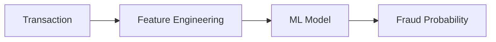

That is useful, but coordinated fraud can be relational:

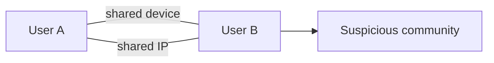

RazorRisk adds graph context without making the graph model the sole decision-maker.

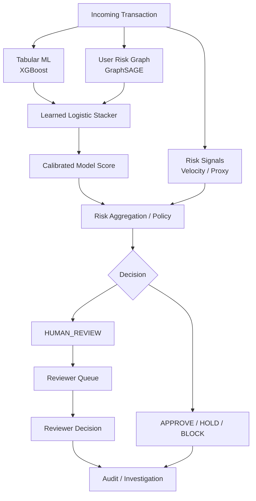

### Core design principle

**Models generate evidence; policy determines the operational action.**

This separation prevents a single model score from becoming an unexplained block/approve decision.

---

## What the project demonstrates

### 1. Transaction-level fraud detection

An XGBoost classifier handles structured transaction and behavioral features. XGBoost is used because gradient-boosted trees are a strong baseline for structured/tabular data and can model nonlinear feature interactions efficiently. See the [official XGBoost documentation](https://xgboost.readthedocs.io/en/stable/).

### 2. Graph-based fraud-community detection

RazorRisk maintains a **User-only risk graph** where users can be connected through shared infrastructure such as devices and IP addresses. A GraphSAGE-style message-passing model produces node embeddings and a graph risk score.

The important design choice is that the graph is kept separate from the richer multi-entity application graph. This prevents investigation-oriented traversal through merchants from accidentally turning a small fraud community into an enormous GNN neighborhood.

Reference: [GraphSAGE — Inductive Representation Learning on Large Graphs](https://arxiv.org/abs/1706.02216).

### 3. Learned score fusion

The system does not simply average model scores or use arbitrary hand-written weights.

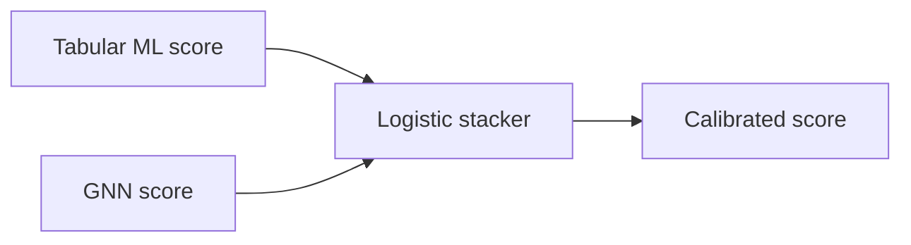

The stacker learns how the two model signals relate on the validation data. The resulting calibrated score remains separate from deterministic risk overlays such as velocity and proxy signals.

### 4. Stateful hourly velocity

Velocity is derived from transaction history when backend mode is selected.

The frontend exposes an explicit source toggle:

| Toggle | Behavior | Intended use |
|---|---|---|
| **ON — Trust client value** | Uses supplied `velocity_1h` | Controlled simulation/testing or trusted upstream integration |
| **OFF — Calculate backend value** | Ignores client value and counts transactions in the trailing hour | Trustworthy production-oriented mode |

The selected source is persisted and audited as `CLIENT` or `BACKEND`.

This distinction matters because a client-controlled velocity field is not a secure fraud signal by itself.

### 5. Security guardrails

Model output is not the only source of risk. Explicit policy rules can escalate high-impact transactions, suspicious infrastructure, or model disagreements.


A confidence threshold alone never overrides the mandatory-human reasons — model disagreement, evidence conflict, and high-dollar-amount transactions always keep a human in the loop regardless of how confident the score is (see [`ml/decision_policy.py`](ml/decision_policy.py)).

### 6. Real human-in-the-loop workflow

`HUMAN_REVIEW` is an actual persisted workflow, not merely a UI label.

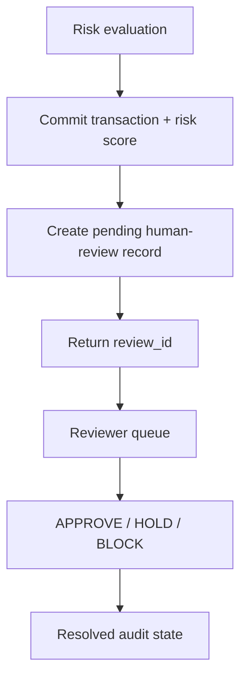

Queue creation is idempotent for already-pending transactions.

### 7. Evidence-grounded investigation

The investigation layer is separate from scoring. Deterministic tools collect structured evidence such as:

- graph relationships
- transaction history
- device risk
- model-score decomposition

An LLM, when configured, interprets this evidence instead of inventing the underlying risk measurements. A deterministic fallback is available when no external model provider is configured.

### 8. Auditable model decomposition

Transaction history and risk-engine logs expose:

- **Tabular ML score**
- **GNN node-embedding score**
- **Stacker calibrated score**
- final risk score
- velocity and its source
- policy decision
- HITL state
- correlation ID

This makes it possible to answer **why** a transaction received its final action rather than exposing only a single opaque number.

---

## End-to-end workflow

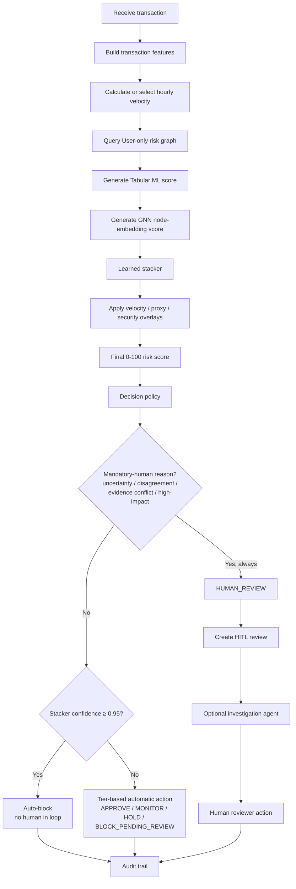

### Transaction flow — data moving through the system

The transaction path is intentionally shown as parallel signal branches that converge before policy evaluation. Each branch produces evidence; no single branch directly owns the final decision.

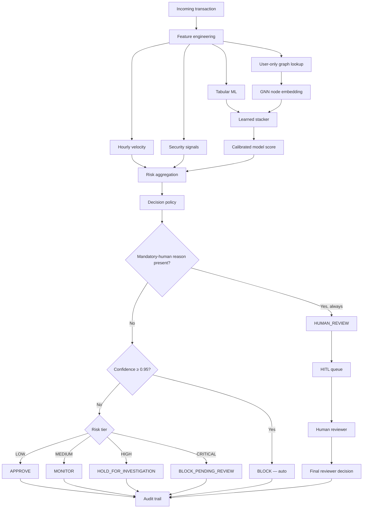

### System structure — how components connect and complement each other

This is the structural view: the frontend/API are the entry points, transaction state feeds stateful features, the graph supplies relational context, the ML models generate complementary evidence, policy combines those signals, and investigation/HITL handle cases that should not be decided by a model alone.

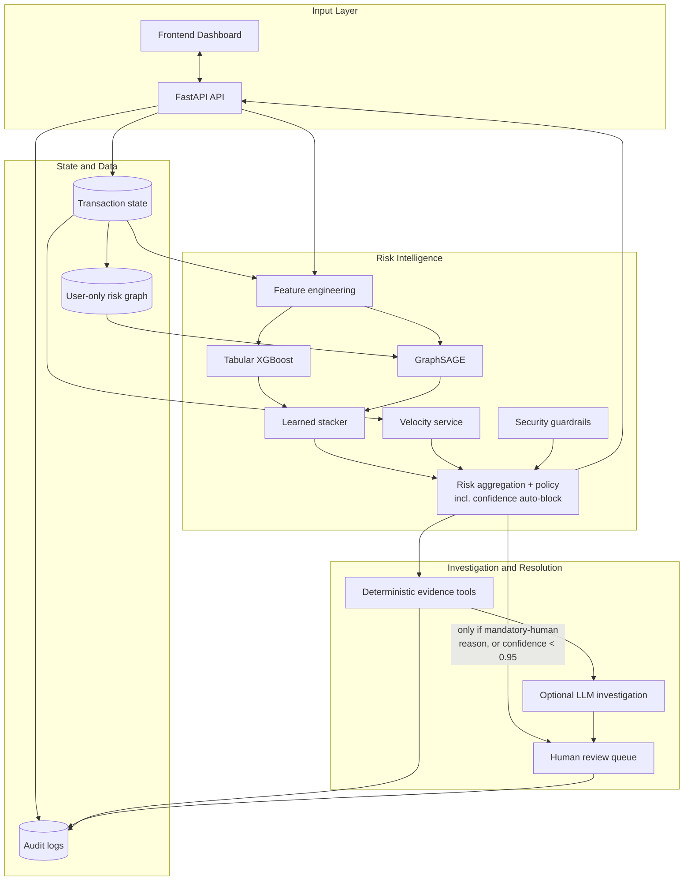

The editable Mermaid source for these diagrams is also stored under `docs/diagrams/`, including `transaction-flow.mmd` and `system-structure.mmd`.

### Causal graph update

The current transaction is deliberately **not allowed to influence its own GNN score**.

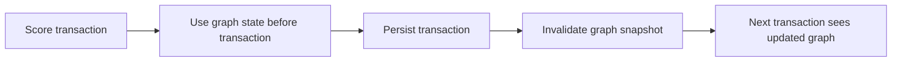

This avoids a subtle form of self-contamination while still allowing the graph to evolve transaction by transaction.

---

## Why the architecture is stronger than a single fraud model

The project deliberately separates four concerns:

| Layer | Responsibility |
|---|---|
| **Tabular ML** | Transaction-level behavioral patterns |
| **GNN** | Relational/community context |
| **Stacker** | Learned combination of model evidence |
| **Policy + guardrails** | Operational decision and escalation |
| **HITL** | Human resolution for ambiguous/high-impact cases |
| **Investigation agent** | Evidence gathering and explanation |
| **Audit layer** | Traceability and post-decision review |

This makes the system easier to debug and defend than a single model that directly returns `fraud=true/false`.

---

## Evaluation

RazorRisk uses **two complementary evaluation tracks**.

### Track A — Synthetic system benchmark

The synthetic dataset is intentionally constructed to exercise the complete platform:

- normal users
- benign IP co-location
- shared devices
- fraud rings
- graph communities
- transaction velocity
- proxy/VPN/TOR signals
- HITL escalation
- model disagreement

It is primarily an **architecture and behavior benchmark**, not a claim about production fraud performance.

Current held-out transaction benchmark:

- 2,633 transactions
- 550 users
- 138 fraud-labelled transactions
- shared user-level train/test split
- test set: 762 transactions / 30 fraud
- classification threshold: 0.50

| Model | ROC-AUC | PR-AUC | Accuracy | Balanced Accuracy | Precision | Recall | F1 |
|---|---:|---:|---:|---:|---:|---:|---:|
| Tabular / XGBoost | **0.855892** | **0.637720** | 0.981179 | 0.773541 | 0.944444 | 0.548387 | 0.693878 |
| GraphSAGE / GNN | **0.948412** | **0.696521** | 0.978670 | 0.725806 | 1.000000 | 0.451613 | 0.622222 |
| Learned stacker | **0.938937** | **0.713269** | 0.982434 | 0.774194 | 1.000000 | 0.548387 | **0.708333** |

Confusion matrices for the same held-out transaction comparison:

| Model | TP | FP | FN | TN |
|---|---:|---:|---:|---:|
| Tabular / XGBoost | 17 | 1 | 14 | 765 |
| GraphSAGE / GNN | 14 | 0 | 17 | 766 |
| Learned stacker | 17 | 0 | 14 | 766 |

### What this synthetic benchmark demonstrates

The important result is not that the synthetic benchmark is "perfect". It demonstrates that the components produce different signals:

- the **tabular model** captures transaction-level behavior;
- the **GNN** captures relational information that is not naturally represented as a flat row;
- the **stacker** improves PR-AUC from **0.637720 → 0.713269** over the tabular baseline in this controlled benchmark;
- the stacker also improves F1 from **0.693878 → 0.708333** at the evaluated threshold.

The benchmark is intentionally controlled, so these numbers should be interpreted as evidence that the architecture behaves as designed, not as a production estimate.

### Reproduce the synthetic benchmark

```bash
# Evaluate the checked-in model artifacts
python tests/evaluate_models.py --dataset synthetic

# Retrain the pipeline and regenerate metrics
python tests/evaluate_models.py --dataset synthetic --retrain
```

---

## External benchmark — ULB / Kaggle Credit Card Fraud Detection

The project was also evaluated on the supplied public `creditcard.csv` dataset.

Dataset characteristics:

- **284,807 transactions**
- **492 fraud transactions**
- anonymized `V1`–`V28` features
- `Time`
- `Amount`
- `Class` target

A chronological 80/20 split was used:

- training: **227,845 rows / 417 fraud**
- testing: **56,962 rows / 75 fraud**

The external benchmark evaluates the **tabular XGBoost component only**. The public dataset does not provide stable user/device/IP relationships, so reporting a real-world GNN fraud-ring score from this dataset would be misleading.

### Actual external result

| Metric | XGBoost |
|---|---:|
| **ROC-AUC** | **0.986233** |
| **PR-AUC** | **0.792616** |
| **Accuracy** | **0.999579** |
| **Balanced Accuracy** | **0.873289** |
| **Precision** | **0.918033** |
| **Recall** | **0.746667** |
| **F1** | **0.823529** |
| True Positives | **56** |
| False Positives | **5** |
| False Negatives | **19** |
| True Negatives | **56,882** |

Reproduce it with:

```bash
python tests/evaluate_models.py --dataset kaggle --csv data/creditcard.csv
```

---

## How to interpret the external result

This is the most important evaluation section of the repository.

### 0.986 ROC-AUC — strong ranking performance

The model separates fraudulent and legitimate transactions very well across classification thresholds.

However, ROC-AUC alone is not enough for a highly imbalanced fraud problem.

### 0.793 PR-AUC — the more useful headline metric

Only a tiny fraction of transactions are fraudulent. Precision-recall analysis is therefore particularly important because it directly exposes the trade-off between catching fraud and generating false positives. See the [scikit-learn Precision-Recall documentation](https://scikit-learn.org/stable/auto_examples/model_selection/plot_precision_recall.html).

A **0.792616 PR-AUC** is a strong result for this benchmark and is more informative than simply reporting 99.96% accuracy.

### 91.8% precision — very few alerts are false positives at this operating point

**At this operating point: 56 true fraud alerts and 5 false fraud alerts.**

That gives:

**Precision = 56 / (56 + 5) = 91.8%.**

In a risk-management workflow, this matters because unnecessary fraud alerts create investigation workload and can create customer friction.

### 74.7% recall — the model catches roughly three quarters of fraud

**56 fraud transactions were detected and 19 were missed.**

So the evaluated operating point catches **74.67% of the fraud transactions in the test set**.

This is not presented as "solved fraud detection." It is a concrete operating point with a visible precision/recall trade-off. A production system would select its threshold according to the relative cost of false positives, false negatives, customer impact, and investigation capacity.

### 0.824 F1 — useful balance at the selected threshold

The F1 score combines precision and recall into a single threshold-specific measure. Here it is **0.823529**.

The key point is that this is accompanied by the underlying confusion matrix, so the number is not presented without context.

### Why 99.96% accuracy is NOT the headline

The dataset is extremely imbalanced. There are only 492 fraud transactions among 284,807 rows.

A classifier that predicts almost everything as legitimate can achieve very high accuracy without being useful for fraud detection. That is why RazorRisk emphasizes **PR-AUC, precision, recall, F1, balanced accuracy, and the confusion matrix** rather than accuracy alone.

---

## What the evaluation proves — and what it does not

### It demonstrates

- The tabular component performs strongly on an independent public fraud dataset.
- The project evaluates an imbalanced classification problem using appropriate metrics rather than accuracy alone.
- The synthetic benchmark demonstrates graph-aware fraud scenarios that the public dataset cannot represent.
- The stacker provides a learned fusion mechanism rather than arbitrary score averaging.
- The complete application has explicit stateful velocity, policy, HITL, investigation, and audit workflows.
- The project contains regression tests for previously discovered implementation bugs.

### It does not demonstrate

- that RazorRisk has production-level fraud recall;
- that the GNN generalizes to real payment networks;
- that the public ULB/Kaggle dataset is representative of Razorpay's transaction distribution;
- that the selected threshold is optimal for a real business cost function;
- that an LLM investigation report is itself a fraud classifier.

Those distinctions are intentional.

---

## Engineering bugs discovered and fixed

The project was developed through repeated end-to-end testing rather than only happy-path demos. Several bugs materially changed the architecture.

### Bug 1 — Fraud-ring graph explosion

An early heterogeneous traversal allowed a small fraud ring to expand through merchant relationships into a much larger neighborhood. A seven-person ring produced a massively inflated investigation subgraph.

**Resolution:** separate the canonical **User-only risk graph** used for GNN scoring from the richer multi-type graph used for investigation/context.

### Bug 2 — Hourly velocity appeared to behave backwards

Manual testing initially showed a sequence such as:

For the original manual test, the dashboard showed a `100 → CRITICAL → HUMAN_REVIEW` row followed by `0.1 → LOW → APPROVE` rows. Because the dashboard is newest-first, this display order did not represent chronological submission order.

The dashboard displays recent transactions newest-first, so the top row was the latest transaction rather than the first transaction in the sequence. Reusing an already-seen user/device also mixed historical graph state into the test.

**Resolution:** test backend velocity independently and add regression coverage proving that repeated transactions produce an increasing trailing-hour count. The UI now records the velocity source explicitly.

### Bug 3 — Client velocity and backend velocity were ambiguous

The original interface did not clearly distinguish a client-supplied velocity value from a backend-calculated value.

**Resolution:** add an explicit frontend toggle:

The toggle selects the velocity source: **ON → trust client velocity**; **OFF → calculate velocity from backend history**.

The selected source is persisted and audited.

### Bug 4 — HUMAN_REVIEW was initially only a decision label

A transaction could display `HUMAN_REVIEW` without reliably creating a corresponding review task.

**Resolution:** commit the transaction/risk record first, create an idempotent pending review, return a `review_id`, expose it in the queue, and allow the reviewer to resolve the case.

### Bug 5 — GNN state could become stale

The transaction features could be current while a cached graph snapshot was stale.

**Resolution:** score against the graph state before the current transaction, persist the transaction, invalidate the graph snapshot, and let the next transaction see the updated graph.

### Bug 6 — Test suite depended on API startup side effects

Direct tests could hit SQLite tables before the application startup path initialized them.

**Resolution:** initialize the test database schema explicitly in `tests/conftest.py`.

Current regression suite (after Bugs 18–27 below added their own coverage):

**69 tests passed.**

### Bugs 7–13 — Earlier architecture and deployment fixes

Before the six bugs above, an earlier phase of the project fixed seven more foundational issues: a graph-traversal bug that turned a 7-person fraud ring into a 692-node subgraph, a Groq provider that appeared configured but silently fell back, a new-user GNN path that used a cached lookup instead of a real inductive forward pass, hand-picked `0.35/0.45/0.20` fusion weights, a train/test split that could leak the same user across both sets, an untraceable transaction across log channels, and a decorative SQLAlchemy/Postgres path that a deployment auto-detector mistook for a real dependency. Full descriptions, plus three more deployment-specific fixes (#11–13): **[PROJECT_WORKFLOW.md § 4](PROJECT_WORKFLOW.md#4-deployment--ops)**.

### Bugs 18–27 — Found after the architecture looked "done"

More bugs surfaced from actually running scenarios end-to-end rather than trusting the design, spanning several phases: closing a false-positive gap in scoring, discovering the *same* gap re-appearing in a different file, disclosing that a scenario and a test file were themselves subtly wrong, and — most recently — noticing that the HITL policy sent every ambiguous-tier transaction to a human regardless of how confident the model actually was.

| # | Bug | One line |
|---|---|---|
| 18 | Connectivity alone was scored as fraud | A rule fired on `shared_ip >= 5` alone, with no behavioral anomaly required — flagged a 40-person carrier-NAT IP and a 7-person hostel |
| 19 | The same false positive resurfaced in the investigator | Fixing the *scorer* didn't fix `deterministic_agent.py`, which had its own independent, unfixed copy of the same connectivity-only rule |
| 20 | A performance shortcut reopened a client-trust gap | A "fast path" skipped graph/GNN evaluation based partly on a still-client-suppliable `velocity_1h` |
| 21 | Velocity was trusted from the client in three places | `decision_policy.py`, `FraudModelTool`, and `graph_agent.py` each read velocity from the payload independently instead of one server-computed value |
| 22 | Real-data ingestion deleted the golden test matrix | `ingest_real_kaggle_dataset.py` opened with `DELETE FROM users` before loading Kaggle data, wiping every named fraud-ring/benign scenario |
| 23 | The investigation endpoint had no necessity guard | Any transaction ID could trigger a full (billable) LLM investigation — the risk-threshold check only ever existed in the frontend |
| 24 | A "legitimate but unusual" scenario was statistically identical to fraud | Empirically scored HIGH — a real, disclosed limitation of amount-deviation-only reasoning, not a hidden bug |
| 25 | A test class after `if __name__ == "__main__"` never ran directly | `unittest discover` caught all tests; running the file directly silently dropped the last class with no error |
| 26 | A backend validation error leaked its raw error body into the UI | `velocity_1h`'s validation failure (the only field with backend constraints) crashed `updateRiskDisplay` and dumped FastAPI's raw error shape into a user-facing `alert()` |
| 27 | Every ambiguous-tier transaction was routed to a human, even maximally-confident fraud | `hitl_required` fired on any policy reason once the tier hit MEDIUM+, so a 0.97-confidence score with only a velocity flag queued for a human exactly like a genuinely uncertain 0.36 score did — see the [confidence auto-block diagram](#5-security-guardrails) above |

Full write-ups, each with what broke it, how it was verified, and why the fix is the right one — not just what the fix was — are in **[PROJECT_WORKFLOW.md § 4.5, Bugs #18–27](PROJECT_WORKFLOW.md#45-bugs--regression-history)**.

---

## Testing

The test suite covers:

- synthetic fraud scenarios
- benign look-alikes
- graph behavior
- velocity calculation
- client/backend velocity modes
- proxy/VPN/TOR signals
- model-score decomposition
- decision policy
- HITL queue creation
- HITL idempotency
- reviewer resolution
- regression bugs
- evaluation contracts
- API behavior

Run:

```bash
pytest -q
```

Expected current result:

**69 tests passed** (verify locally with `pytest -q` — the exact count moves whenever a bug fix adds its own regression test, as Bugs 18–27 did).

---

## Tech Stack

| Layer | Technology | Purpose |
|---|---|---|
| API | FastAPI, Uvicorn, Pydantic | Typed REST gateway and OpenAPI docs |
| Database | SQLite (raw `sqlite3`), single file | Zero-setup local persistence — no server process, no ORM (see Bug 12) |
| Tabular ML | XGBoost; scikit-learn fallback | Transaction-level behavioral risk |
| Graph ML | NumPy GraphSAGE (from scratch) | User-level relational risk |
| Graph | NetworkX + Louvain | User risk communities and dashboard topology |
| Score fusion | scikit-learn Logistic Regression | Learned tabular + GNN + graph-evidence combination |
| Security | `security/guardrails.py`, `security/evidence_api.py` | Explicit, deterministic risk overlays separate from learned scores |
| Agent | LangChain / LangGraph | Investigation orchestration |
| LLMs | Anthropic / Groq / OpenAI (optional) | Evidence interpretation and report writing |
| Fallback | Plain Python rules (`agent/deterministic_agent.py`) | Complete offline investigation path |
| Frontend | Vanilla HTML/CSS/JS | No frontend build step |
| Visualization | vis-network, marked.js | Interactive entity graph + Markdown report rendering |
| Logging | Rotating-file logger, 8 channels | Correlation-ID-traceable audit trail |
| Deployment | Render, Antideploy, Hugging Face Spaces, Vercel, Docker | Backend/container/static deployment options |

---

## Deployment

Two platforms, split deliberately — a size constraint, not a preference. The backend's dependency stack (XGBoost, SciPy, scikit-learn, LangChain provider packages) installs to roughly 2GB; Vercel's serverless Python functions cap out around 250MB unzipped, so the backend cannot run there as a function regardless of configuration.

| Platform | Hosts | Card / paid tier required? | Notes |
|---|---|---|---|
| **Render** | Full backend | Sometimes, for web services (free tier increasingly prompts for a payment method) | `render.yaml` drives the full build: install deps, generate synthetic data, train tabular + GNN + stacker, so the first request after deploy is already warm |
| **Antideploy** | Full backend | Not confirmed either way | Auto-detects FastAPI + port 8000 from `requirements.txt`, no Dockerfile/YAML needed. Runs on Google Cloud Run |
| **Hugging Face Spaces** | Full backend (Docker) | Yes, as of mid-2026 — Docker SDK Spaces require HF PRO for personal accounts | Repo includes `Dockerfile` and `SPACE_README.md` (rename to `README.md` inside the Space's own repo) |
| **Vercel** *(optional)* | Static dashboard only | No | `vercel.json` deploys `static/` as a plain static site; set `window.RAZORRISK_API_BASE` to the deployed backend's URL |

The app detects which of these it's running on automatically — `config.py`'s `IS_RESTRICTED_FS` checks for `VERCEL`, `SPACE_ID`, or `K_SERVICE` (set by Cloud Run on every service, which is what Antideploy runs on — see Bug 13) — and redirects the SQLite database and log files to `/tmp` accordingly, since all three ephemeral-filesystem platforms wipe or restrict writes to the main filesystem between deploys.

Full deployment write-up, including what had to change in the code to make each platform work and the three bugs (#11–13) it surfaced: **[PROJECT_WORKFLOW.md § 4](PROJECT_WORKFLOW.md#4-deployment--ops)**.

```bash
docker compose up --build
```

---

## Quick Start

### 1. Clone

```bash
git clone https://github.com/Dikshu015/RazorRisk-Agentic-AI-Payment-Fraud-Risk-Investigation-Platform.git
cd RazorRisk-Agentic-AI-Payment-Fraud-Risk-Investigation-Platform
```

### 2. Create environment

```bash
python -m venv .venv
```

Windows:

```powershell
.\.venv\Scripts\Activate.ps1
```

Linux/macOS:

```bash
source .venv/bin/activate
```

### 3. Install dependencies

```bash
pip install -r requirements.txt
```

### 4. Configure environment

```bash
copy .env.example .env
```

Set only the provider/API keys required for the investigation mode you want to use.

### 5. Generate synthetic data

```bash
python data/generate_synthetic_data.py
```

### 6. Train models

```bash
python ml/train_tabular_model.py
python ml/train_gnn.py
```

### 7. Start the API

```bash
python run.py
```

Then open:

- Dashboard: `http://localhost:8000/dashboard/`
- API docs: `http://localhost:8000/docs`

---

## Suggested Demo Flow

For a short technical demo:

1. Submit a normal transaction → show low risk and automatic approval.
2. Submit a high-value transaction → show policy/HITL escalation.
3. Submit a fraud-ring transaction → show GNN contribution and graph topology.
4. Open transaction history → show Tabular ML, GNN, stacker, velocity, and final score.
5. Open the HITL queue → resolve a pending case.
6. Run investigation → show structured evidence and investigation mode.
7. Open audit logs → trace the transaction using the correlation ID.
8. Run `pytest -q` → show the regression suite.

---

## Repository Structure

- `agent/` — investigation agent and deterministic fallback
- `api/` — FastAPI routes
- `data/` — synthetic generator and external-dataset tooling
- `db/` — SQLite schema and database access
- `ml/` — tabular model, GNN, stacker, policy, and graph logic
- `security/` — evidence APIs and guardrails
- `static/` — frontend dashboard
- `tests/` — unit, integration, regression, and evaluation tests
- `logs/` — runtime audit/system logs
- `README.md`
- `PROJECT_WORKFLOW.md`
- `requirements.txt`

---

## API Reference

| Endpoint | Method | Purpose |
|---|---|---|
| `/` | GET | Redirects to `/dashboard/` |
| `/health` | GET | Health check |
| `/api/v1/stats` | GET | Dashboard summary counts (transactions, high-risk, investigations, pending reviews) |
| `/api/v1/transactions/score` | POST | Score a transaction (tabular + GNN + stacker + overlays) |
| `/api/v1/transactions/recent` | GET | Recent transaction feed for the dashboard |
| `/api/v1/graph/topology/{user_id}` | GET | Bounded User/Device/IP/Merchant graph view for the topology explorer |
| `/api/v1/graph/communities` | GET | Retrieve detected graph communities |
| `/api/v1/investigations/run/{id}` | POST | Run the investigation agent (server-side necessity guard — see Bug 23; pass `?force=true` to override) |
| `/api/v1/investigations/{id}` | GET | Fetch a saved investigation report |
| `/api/v1/investigations/agent-status` | GET | Which provider/mode is actually active right now |
| `/api/v1/investigations/agent-mode` | POST | Force an agent mode override |
| `/api/v1/hitl/queue` | GET | Pending human-review queue |
| `/api/v1/hitl/review/{review_id}` | POST | Resolve a pending review (`APPROVE` / `HOLD` / `BLOCK`) |
| `/api/v1/hitl/transaction/{transaction_id}` | GET | Look up the review record tied to a specific transaction |
| `/api/v1/admin/pipeline/synthetic` | POST | Reseed synthetic data + retrain the full pipeline |
| `/api/v1/admin/pipeline/real` | POST | Ingest the ULB/Kaggle dataset (additively — see Bug 22) + retrain |
| `/api/v1/admin/rebuild-graph` | POST | Rebuild the in-memory visualization graph from current DB state |
| `/api/v1/logs/stream` | GET | Stream the 8 audit/system log channels |
| `/api/v1/logs/client` | POST | Report uncaught frontend errors into the server audit trail |

Full interactive documentation (request/response schemas, try-it-out) is at `/docs` when the backend is running.

### Agent mode control

The dashboard's `/api/v1/investigations/agent-status` and `/api/v1/investigations/agent-mode` endpoints support forcing the investigation path to one of:

```text
auto            — try a configured LLM provider, fall back to deterministic on failure
anthropic       — force Claude
groq            — force Groq
openai          — force OpenAI
deterministic   — force the rule-based fallback, regardless of configured keys
```

The override is held in memory and resets to `auto` on restart. Every investigation report records the mode that *actually ran* — including `deterministic_fallback` when a configured provider was attempted but failed — so the report never implies an LLM call happened when it didn't.

---

## How RazorRisk Mitigates Those Limitations

The limitations above are not ignored by the architecture. RazorRisk deliberately adds **policy, deterministic evidence gathering, LLM-assisted investigation, and human review** around the predictive models so that model uncertainty does not automatically become an irreversible payment decision.

### 1. Model uncertainty → policy + HITL

The ML/GNN models produce evidence; the policy layer decides whether that evidence is sufficient for an automated action. High-impact, ambiguous, or policy-triggering transactions can be escalated to a real persisted HITL case.

This reduces the operational risk of forcing every transaction through a binary automated classifier. It does **not** eliminate fraud or model error; it creates a controlled escalation path for cases where automation should not be trusted on its own.

### 2. Missing graph context in public data → separate evaluation roles

The ULB/Kaggle dataset cannot validate the graph layer because it does not expose user/device/IP relationships. RazorRisk therefore does not manufacture graph labels or claim a Kaggle GNN score that the dataset cannot support.

Instead:

- **ULB/Kaggle:** validates the tabular fraud component on an independent public dataset.
- **Synthetic graph benchmark:** validates user/device/IP relationships, fraud rings, benign look-alikes, velocity, policy, and end-to-end workflow behavior.
- **Full application:** combines these signals when the richer payment-network context is available.

### 3. Sparse or delayed fraud labels → investigation + human feedback

Real fraud labels can be delayed or incomplete. RazorRisk therefore separates **risk scoring** from **investigation**. A flagged transaction can be investigated using structured evidence such as transaction history, graph neighbors, device/IP relationships, model outputs, and security signals.

A human reviewer can then resolve the case, producing an operational outcome that can be audited and used as future evaluation/training feedback.

### 4. LLM uncertainty → evidence-grounded investigation, not LLM-based scoring

The optional LLM investigation layer is intentionally downstream of the deterministic risk pipeline. The LLM receives structured evidence already collected by RazorRisk and produces an explanation/hypothesis and recommended investigative action. It does **not** calculate the fraud probability, override the model scores, or become the source of ground truth.

The flow is:

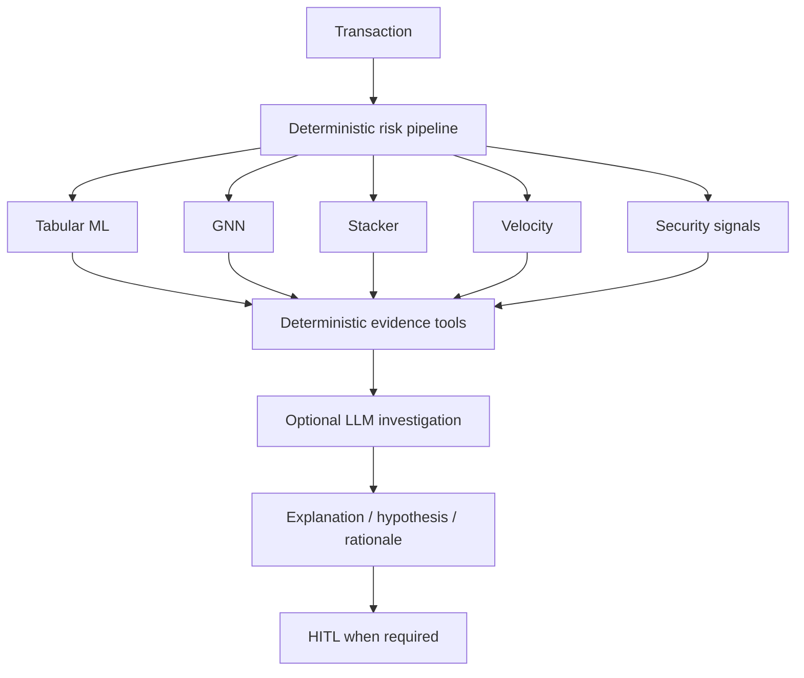

If an LLM provider is unavailable or the call fails, RazorRisk falls back to a **deterministic investigation path** and explicitly records the mode as `deterministic_fallback`. This prevents the system from pretending that an LLM call occurred when it did not.

### 5. High false-positive cost → precision-aware operating point + HITL

The external benchmark shows **91.8% precision** and **74.7% recall** at the evaluated operating point. This reflects a deliberate precision/recall trade-off rather than optimization for raw accuracy.

In an operational system, transactions near a decision boundary or with high financial impact can be escalated instead of automatically blocked. This allows the business to trade investigation capacity against customer friction and fraud loss.

### 6. Dataset shift → monitoring, recalibration, and human feedback

HITL does not magically solve dataset shift. Instead, it provides a controlled feedback mechanism: reviewer outcomes can become labeled operational evidence for future threshold tuning, calibration checks, retraining, and drift analysis. A production deployment would still require formal monitoring and retraining pipelines.

### 7. Untrusted client velocity → backend source of truth

The client-trusted velocity mode exists for controlled simulation and trusted upstream integrations. When the client cannot be trusted, the frontend toggle is switched **OFF**, and the backend calculates trailing one-hour velocity from transaction history. The source is recorded as `CLIENT` or `BACKEND` for auditability.

### Why this layered design matters

RazorRisk is therefore not designed around the assumption that **one model must be correct all the time**. Its safety model is layered:

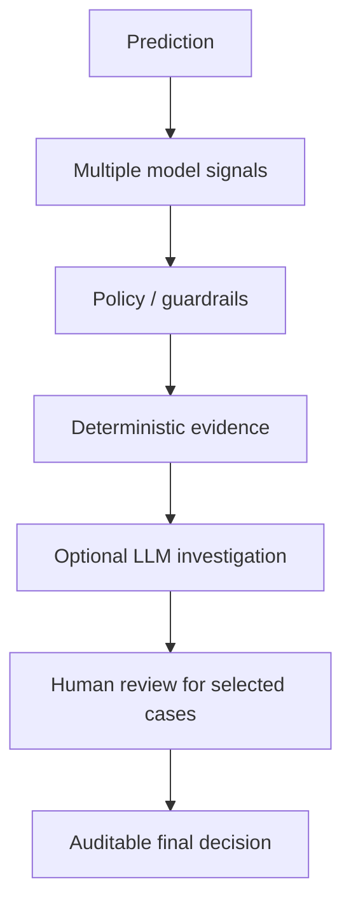

The goal is not to claim that these layers remove every limitation. The goal is to ensure that known limitations become **controlled failure modes** rather than silent automated decisions.

## Limitations and Defensible Scope

RazorRisk is a **production-inspired prototype**, not a deployed payment-fraud system. The following limitations are explicit so that the evaluation is not overstated.

### 1. Synthetic graph data

The graph benchmark uses constructed user/device/IP relationships. These scenarios are valuable for controlled fraud-ring testing but are not evidence of performance on a real payment network.

### 2. Public dataset feature mismatch

The ULB/Kaggle dataset contains anonymized transaction features but does not expose the user/device/IP relationships required for RazorRisk's graph layer. Therefore the external benchmark validates the **tabular component**, not the complete graph-risk system.

### 3. Threshold selection

The reported precision/recall/F1 values use the evaluator's selected classification threshold. A production threshold should be chosen using business costs, fraud losses, customer friction, operational review capacity, and calibrated probabilities.

### 4. Dataset shift

Historical fraud data can differ from future attack patterns. A production implementation would require temporal monitoring, drift detection, retraining, and calibration monitoring.

### 5. Delayed labels

Real fraud labels can arrive after a transaction has already been approved. The current benchmark has immediate ground-truth labels; production evaluation would need time-aware label maturity windows.

### 6. LLM investigation is not the fraud detector

The investigation agent is an evidence interpretation layer. The underlying risk signals are generated by deterministic features, ML, GNN, and policy logic. The LLM should not be treated as a source of ground-truth fraud probability.

### 7. Client velocity mode is not a trusted security boundary

The frontend's client-trusted velocity mode exists for controlled simulation or trusted upstream integration. A malicious client can falsify this value. Backend-calculated velocity should be preferred when the source cannot be trusted.

### 8. Prototype infrastructure

The project uses a compact architecture suitable for demonstration and experimentation. A production deployment would require stronger authentication/authorization, secrets management, distributed storage/queues where appropriate, observability, high availability, rate limiting, and formal data-governance controls.

### 9. Metrics are benchmark-specific

The reported scores should be read as results on the specified datasets and splits, not as universal claims about payment fraud detection.

---

## FAQ

**Why a GNN instead of only XGBoost?**
XGBoost evaluates each transaction row independently. A GNN can pull in information from *connected* users — shared device/IP relationships — so several individually ordinary-looking accounts can still produce a strong network-level signal when they're part of the same fraud ring.

**Why GraphSAGE specifically?**
It uses neighborhood aggregation and supports inductive inference — a brand-new user who wasn't in the training graph can still get a real forward-pass score, not just a lookup. See "Can a new user receive a GNN score?" below.

**Why implement GraphSAGE from scratch instead of using PyTorch Geometric or DGL?**
The project graph is roughly 1,500 nodes. A 2-layer mean-aggregation implementation in NumPy kept the dependency footprint small and made the forward/backward math directly inspectable — useful for a project meant to demonstrate understanding, not just call a library.

**How was the 692-node graph explosion (Bug 1) actually produced?**
The original graph mixed Users, Devices, IPs, and Merchants in one structure. A 2-hop traversal from a fraud-ring user could reach a Merchant used by hundreds of unrelated people, and traversing *from* that Merchant reached all of them. The fraud ring itself was still 7 people — the traversal was following a high-degree shared Merchant edge, not a real fraud relationship. Fixed by splitting the canonical User-only risk graph (used for GNN training and community detection) from the richer visualization graph (Users/Devices/IPs/Merchants, used only for the dashboard topology explorer).

**Can a new user actually receive a GNN score, or does it need to have been in training?**
Yes — `GraphSAGEInference.score_all()` performs a real inductive forward pass using the user's current graph position, not a cached training-time lookup. This was itself a fix (see Bugs #1–13 in `PROJECT_WORKFLOW.md`).

**Why a learned stacker instead of just averaging the tabular and GNN scores?**
A fixed formula assumes you already know the right relative weight for each signal. The logistic-regression stacker learns the combination from held-out data — and, as of Bug 18, also takes normalized shared-device/shared-IP counts as real inputs, rather than using connectivity as a separate hand-picked rule layered on top.

**Does the LLM calculate the risk score?**
No. Risk scoring is entirely the ML/graph/policy pipeline's job, computed before any LLM is invoked. The investigation agent receives deterministic evidence (`GraphTool`, `TransactionHistoryTool`, `DeviceRiskTool`, `FraudModelTool` output) and uses the LLM, when available, to interpret and narrate that evidence — never to compute it.

**Can the LLM invent a metric or override the score?**
No path in the architecture gives it that responsibility. The narrative it produces can still contain language-model errors, which is exactly why the structured evidence — not the prose — remains the source of truth, and why every report is tagged with the `agent_mode` that actually ran.

**Is the agent always using an LLM?**
No. If no provider is configured, a configured provider fails, or the mode is forced to `deterministic`, RazorRisk uses the complete rule-based fallback in `agent/deterministic_agent.py` and records `deterministic_fallback` as the mode — it never silently pretends an LLM call happened.

**Why isn't the risk score waiting for the investigation to finish?**
Different latency requirements: `/api/v1/transactions/score` returns the risk evaluation immediately; the dashboard makes a separate `/api/v1/investigations/run/{id}` request only for transactions that actually need it (see Bug 23's server-side guard).

**Is `HUMAN_REVIEW` just a label, or does it do anything?**
It creates a real, idempotent `human_reviews` queue record with a `review_id` after the transaction and risk score are committed — see Bug 16. A reviewer resolves it through `/api/v1/hitl/review/{review_id}`, and that resolution updates the transaction's final decision.

**Does this use Postgres?**
No — an earlier iteration had a parallel SQLAlchemy engine intended to support Postgres via `DATABASE_URL`, but nothing in the application ever actually queried through it; every real read/write always went through raw `sqlite3`. It was removed rather than left half-wired (Bug 12).

**Is this production fraud detection?**
No. It's a project demonstrating a payment-risk architecture. The graph relationships are synthetic by construction for the graph benchmark, and the public ULB/Kaggle dataset doesn't expose the identity relationships needed to validate a real production fraud graph — see [Limitations and Defensible Scope](#limitations-and-defensible-scope).

**Why is there a velocity/proxy rule overlay if the stacker already exists?**
The stacker combines *learned* tabular and graph signals. Velocity thresholds and proxy/VPN flags are operational business rules RazorRisk treats as an explicit, separately-labeled overlay rather than hiding them inside an opaque model weight — so a risk manager can see and adjust them without retraining anything.

---

## References / Further Reading

- [XGBoost documentation](https://xgboost.readthedocs.io/en/stable/)
- [GraphSAGE paper — Inductive Representation Learning on Large Graphs](https://arxiv.org/abs/1706.02216)
- [scikit-learn Precision-Recall evaluation](https://scikit-learn.org/stable/auto_examples/model_selection/plot_precision_recall.html)
- [scikit-learn precision/recall definitions](https://scikit-learn.org/stable/modules/generated/sklearn.metrics.precision_recall_curve.html)

---

## Status

**Demo-ready / evaluation-ready prototype.**

The project is intentionally frozen around a coherent risk architecture rather than adding features solely to increase its technology count. The strongest parts of the system are the separation of model evidence from policy, graph-aware fraud reasoning, explicit velocity semantics, real HITL workflow, auditability, reproducible evaluation, and the documented debugging history.
