# RazorRisk — Agentic AI Payment Fraud & Risk Investigation Platform

> **A production-inspired AI risk prototype that combines transaction-level machine learning, graph-based fraud-community signals, calibrated score fusion, security guardrails, and human-in-the-loop investigation.**

RazorRisk treats payment fraud as more than a row-level classification problem. A transaction can look normal in isolation while its user is connected to other risky users through shared devices or IP addresses. The platform therefore combines **tabular transaction evidence** with **relational graph evidence**, then passes the result through an explicit risk-policy and investigation workflow.

The project is designed to demonstrate the engineering decisions behind an AI Risk Manager system: model decomposition, stateful features, graph reasoning, calibration, deterministic guardrails, HITL escalation, auditability, reproducible evaluation, and regression testing.

---

## Why RazorRisk?

A conventional fraud classifier looks like:

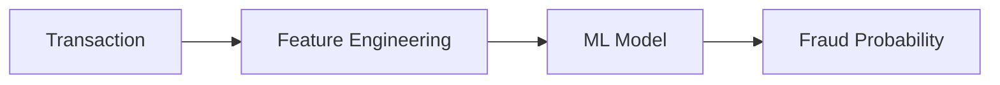

That is useful, but coordinated fraud can be relational:

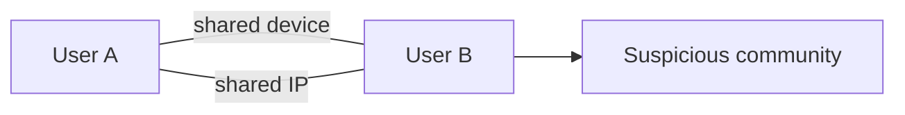

RazorRisk adds graph context without making the graph model the sole decision-maker.

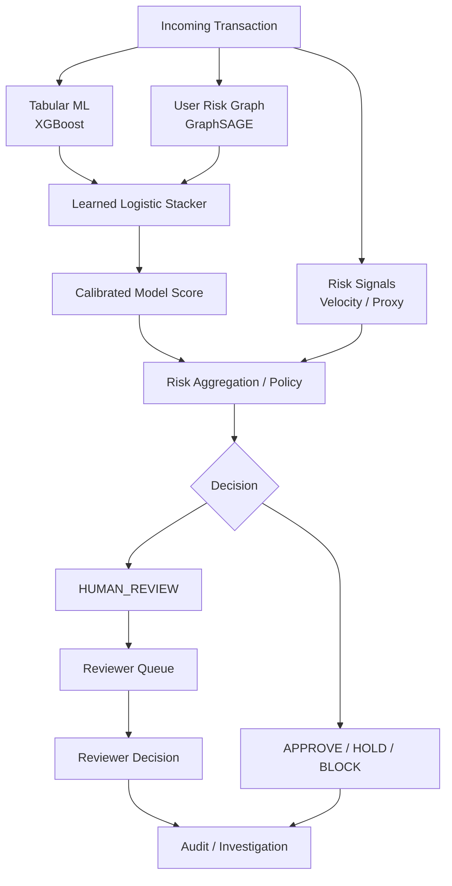

### Core design principle

**Models generate evidence; policy determines the operational action.**

This separation prevents a single model score from becoming an unexplained block/approve decision.

---

## What the project demonstrates

### 1. Transaction-level fraud detection

An XGBoost classifier handles structured transaction and behavioral features. XGBoost is used because gradient-boosted trees are a strong baseline for structured/tabular data and can model nonlinear feature interactions efficiently. See the [official XGBoost documentation](https://xgboost.readthedocs.io/en/stable/).

### 2. Graph-based fraud-community detection

RazorRisk maintains a **User-only risk graph** where users can be connected through shared infrastructure such as devices and IP addresses. A GraphSAGE-style message-passing model produces node embeddings and a graph risk score.

The important design choice is that the graph is kept separate from the richer multi-entity application graph. This prevents investigation-oriented traversal through merchants from accidentally turning a small fraud community into an enormous GNN neighborhood.

Reference: [GraphSAGE — Inductive Representation Learning on Large Graphs](https://arxiv.org/abs/1706.02216).

### 3. Learned score fusion

The system does not simply average model scores or use arbitrary hand-written weights.

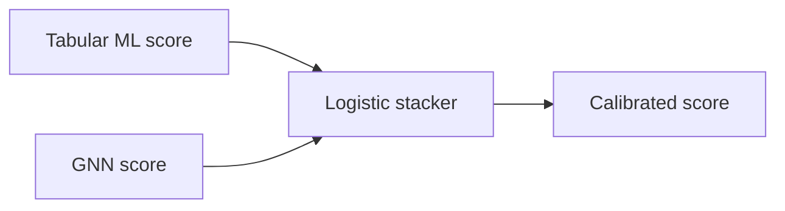

The stacker learns how the two model signals relate on the validation data. The resulting calibrated score remains separate from deterministic risk overlays such as velocity and proxy signals.

### 4. Stateful hourly velocity

Velocity is derived from transaction history when backend mode is selected.

The frontend exposes an explicit source toggle:

| Toggle | Behavior | Intended use |
|---|---|---|
| **ON — Trust client value** | Uses supplied `velocity_1h` | Controlled simulation/testing or trusted upstream integration |
| **OFF — Calculate backend value** | Ignores client value and counts transactions in the trailing hour | Trustworthy production-oriented mode |

The selected source is persisted and audited as `CLIENT` or `BACKEND`.

This distinction matters because a client-controlled velocity field is not a secure fraud signal by itself.

### 5. Security guardrails

Model output is not the only source of risk. Explicit policy rules can escalate high-impact transactions, suspicious infrastructure, or model disagreements.

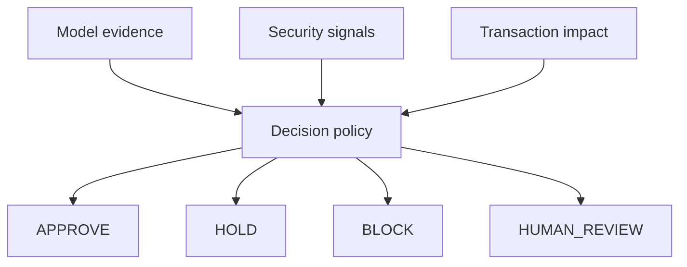

### 6. Real human-in-the-loop workflow

`HUMAN_REVIEW` is an actual persisted workflow, not merely a UI label.

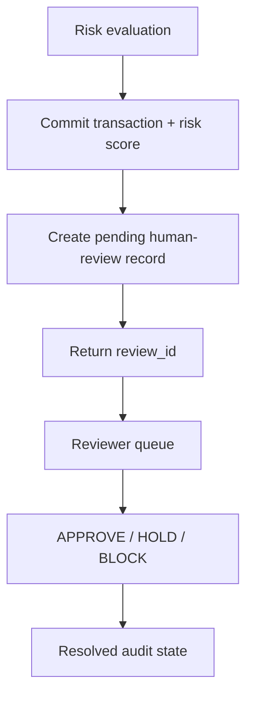

Queue creation is idempotent for already-pending transactions.

### 7. Evidence-grounded investigation

The investigation layer is separate from scoring. Deterministic tools collect structured evidence such as:

- graph relationships
- transaction history
- device risk
- model-score decomposition

An LLM, when configured, interprets this evidence instead of inventing the underlying risk measurements. A deterministic fallback is available when no external model provider is configured.

### 8. Auditable model decomposition

Transaction history and risk-engine logs expose:

- **Tabular ML score**
- **GNN node-embedding score**
- **Stacker calibrated score**
- final risk score
- velocity and its source
- policy decision
- HITL state
- correlation ID

This makes it possible to answer **why** a transaction received its final action rather than exposing only a single opaque number.

---

## End-to-end workflow

```mermaid
flowchart LR
    T1[Receive transaction] --> F[Build transaction features]
    F --> V[Calculate or select hourly velocity]
    V --> G[Query User-only risk graph]
    G --> TM[Generate Tabular ML score]
    TM --> GN[Generate GNN node-embedding score]
    GN --> ST[Learned stacker]
    ST --> O[Apply velocity / proxy / security overlays]
    O --> R[Final 0-100 risk score]
    R --> P[Decision policy]
    P --> D[APPROVE / HOLD / BLOCK / HUMAN_REVIEW]
    D --> A[Persist audit evidence]
    D --> H{HITL required?}
    H -->|Yes| Q[Create HITL review]
    H -->|No| E[Complete automated path]
    Q --> I[Optional investigation agent]
    I --> HR[Human/system action]
    HR --> A
    A --> Z[Audit trail]
```

### Transaction flow — data moving through the system

The transaction path is intentionally shown as parallel signal branches that converge before policy evaluation. Each branch produces evidence; no single branch directly owns the final decision.

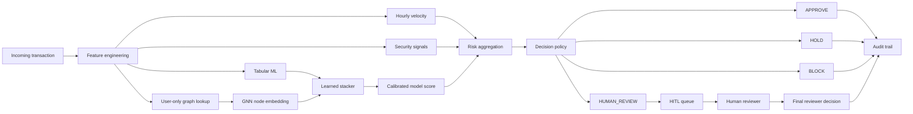

### System structure — how components connect and complement each other

This is the structural view: the frontend/API are the entry points, transaction state feeds stateful features, the graph supplies relational context, the ML models generate complementary evidence, policy combines those signals, and investigation/HITL handle cases that should not be decided by a model alone.

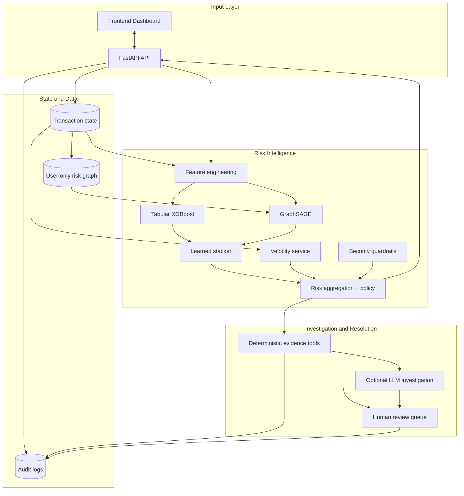

The editable Mermaid source for these diagrams is also stored under `docs/diagrams/`, including `transaction-flow.mmd` and `system-structure.mmd`.

### Causal graph update

The current transaction is deliberately **not allowed to influence its own GNN score**.

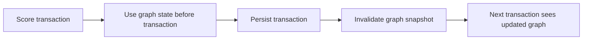

This avoids a subtle form of self-contamination while still allowing the graph to evolve transaction by transaction.

---

## Why the architecture is stronger than a single fraud model

The project deliberately separates four concerns:

| Layer | Responsibility |
|---|---|
| **Tabular ML** | Transaction-level behavioral patterns |
| **GNN** | Relational/community context |
| **Stacker** | Learned combination of model evidence |
| **Policy + guardrails** | Operational decision and escalation |
| **HITL** | Human resolution for ambiguous/high-impact cases |
| **Investigation agent** | Evidence gathering and explanation |
| **Audit layer** | Traceability and post-decision review |

This makes the system easier to debug and defend than a single model that directly returns `fraud=true/false`.

---

## Evaluation

RazorRisk uses **two complementary evaluation tracks**.

### Track A — Synthetic system benchmark

The synthetic dataset is intentionally constructed to exercise the complete platform:

- normal users
- benign IP co-location
- shared devices
- fraud rings
- graph communities
- transaction velocity
- proxy/VPN/TOR signals
- HITL escalation
- model disagreement

It is primarily an **architecture and behavior benchmark**, not a claim about production fraud performance.

Current held-out transaction benchmark:

- 2,633 transactions
- 550 users
- 138 fraud-labelled transactions
- shared user-level train/test split
- test set: 762 transactions / 30 fraud
- classification threshold: 0.50

| Model | ROC-AUC | PR-AUC | Accuracy | Balanced Accuracy | Precision | Recall | F1 |
|---|---:|---:|---:|---:|---:|---:|---:|
| Tabular / XGBoost | **0.855892** | **0.637720** | 0.981179 | 0.773541 | 0.944444 | 0.548387 | 0.693878 |
| GraphSAGE / GNN | **0.948412** | **0.696521** | 0.978670 | 0.725806 | 1.000000 | 0.451613 | 0.622222 |
| Learned stacker | **0.938937** | **0.713269** | 0.982434 | 0.774194 | 1.000000 | 0.548387 | **0.708333** |

Confusion matrices for the same held-out transaction comparison:

| Model | TP | FP | FN | TN |
|---|---:|---:|---:|---:|
| Tabular / XGBoost | 17 | 1 | 14 | 765 |
| GraphSAGE / GNN | 14 | 0 | 17 | 766 |
| Learned stacker | 17 | 0 | 14 | 766 |

### What this synthetic benchmark demonstrates

The important result is not that the synthetic benchmark is "perfect". It demonstrates that the components produce different signals:

- the **tabular model** captures transaction-level behavior;
- the **GNN** captures relational information that is not naturally represented as a flat row;
- the **stacker** improves PR-AUC from **0.637720 → 0.713269** over the tabular baseline in this controlled benchmark;
- the stacker also improves F1 from **0.693878 → 0.708333** at the evaluated threshold.

The benchmark is intentionally controlled, so these numbers should be interpreted as evidence that the architecture behaves as designed, not as a production estimate.

### Reproduce the synthetic benchmark

```bash
# Evaluate the checked-in model artifacts
python tests/evaluate_models.py --dataset synthetic

# Retrain the pipeline and regenerate metrics
python tests/evaluate_models.py --dataset synthetic --retrain
```

---

## External benchmark — ULB / Kaggle Credit Card Fraud Detection

The project was also evaluated on the supplied public `creditcard.csv` dataset.

Dataset characteristics:

- **284,807 transactions**
- **492 fraud transactions**
- anonymized `V1`–`V28` features
- `Time`
- `Amount`
- `Class` target

A chronological 80/20 split was used:

- training: **227,845 rows / 417 fraud**
- testing: **56,962 rows / 75 fraud**

The external benchmark evaluates the **tabular XGBoost component only**. The public dataset does not provide stable user/device/IP relationships, so reporting a real-world GNN fraud-ring score from this dataset would be misleading.

### Actual external result

| Metric | XGBoost |
|---|---:|
| **ROC-AUC** | **0.986233** |
| **PR-AUC** | **0.792616** |
| **Accuracy** | **0.999579** |
| **Balanced Accuracy** | **0.873289** |
| **Precision** | **0.918033** |
| **Recall** | **0.746667** |
| **F1** | **0.823529** |
| True Positives | **56** |
| False Positives | **5** |
| False Negatives | **19** |
| True Negatives | **56,882** |

Reproduce it with:

```bash
python tests/evaluate_models.py --dataset kaggle --csv data/creditcard.csv
```

---

## How to interpret the external result

This is the most important evaluation section of the repository.

### 0.986 ROC-AUC — strong ranking performance

The model separates fraudulent and legitimate transactions very well across classification thresholds.

However, ROC-AUC alone is not enough for a highly imbalanced fraud problem.

### 0.793 PR-AUC — the more useful headline metric

Only a tiny fraction of transactions are fraudulent. Precision-recall analysis is therefore particularly important because it directly exposes the trade-off between catching fraud and generating false positives. See the [scikit-learn Precision-Recall documentation](https://scikit-learn.org/stable/auto_examples/model_selection/plot_precision_recall.html).

A **0.792616 PR-AUC** is a strong result for this benchmark and is more informative than simply reporting 99.96% accuracy.

### 91.8% precision — very few alerts are false positives at this operating point

**At this operating point: 56 true fraud alerts and 5 false fraud alerts.**

That gives:

**Precision = 56 / (56 + 5) = 91.8%.**

In a risk-management workflow, this matters because unnecessary fraud alerts create investigation workload and can create customer friction.

### 74.7% recall — the model catches roughly three quarters of fraud

**56 fraud transactions were detected and 19 were missed.**

So the evaluated operating point catches **74.67% of the fraud transactions in the test set**.

This is not presented as "solved fraud detection." It is a concrete operating point with a visible precision/recall trade-off. A production system would select its threshold according to the relative cost of false positives, false negatives, customer impact, and investigation capacity.

### 0.824 F1 — useful balance at the selected threshold

The F1 score combines precision and recall into a single threshold-specific measure. Here it is **0.823529**.

The key point is that this is accompanied by the underlying confusion matrix, so the number is not presented without context.

### Why 99.96% accuracy is NOT the headline

The dataset is extremely imbalanced. There are only 492 fraud transactions among 284,807 rows.

A classifier that predicts almost everything as legitimate can achieve very high accuracy without being useful for fraud detection. That is why RazorRisk emphasizes **PR-AUC, precision, recall, F1, balanced accuracy, and the confusion matrix** rather than accuracy alone.

---

## What the evaluation proves — and what it does not

### It demonstrates

- The tabular component performs strongly on an independent public fraud dataset.
- The project evaluates an imbalanced classification problem using appropriate metrics rather than accuracy alone.
- The synthetic benchmark demonstrates graph-aware fraud scenarios that the public dataset cannot represent.
- The stacker provides a learned fusion mechanism rather than arbitrary score averaging.
- The complete application has explicit stateful velocity, policy, HITL, investigation, and audit workflows.
- The project contains regression tests for previously discovered implementation bugs.

### It does not demonstrate

- that RazorRisk has production-level fraud recall;
- that the GNN generalizes to real payment networks;
- that the public ULB/Kaggle dataset is representative of Razorpay's transaction distribution;
- that the selected threshold is optimal for a real business cost function;
- that an LLM investigation report is itself a fraud classifier.

Those distinctions are intentional.

---

## Engineering bugs discovered and fixed

The project was developed through repeated end-to-end testing rather than only happy-path demos. Several bugs materially changed the architecture.

### Bug 1 — Fraud-ring graph explosion

An early heterogeneous traversal allowed a small fraud ring to expand through merchant relationships into a much larger neighborhood. A seven-person ring produced a massively inflated investigation subgraph.

**Resolution:** separate the canonical **User-only risk graph** used for GNN scoring from the richer multi-type graph used for investigation/context.

### Bug 2 — Hourly velocity appeared to behave backwards

Manual testing initially showed a sequence such as:

For the original manual test, the dashboard showed a `100 → CRITICAL → HUMAN_REVIEW` row followed by `0.1 → LOW → APPROVE` rows. Because the dashboard is newest-first, this display order did not represent chronological submission order.

The dashboard displays recent transactions newest-first, so the top row was the latest transaction rather than the first transaction in the sequence. Reusing an already-seen user/device also mixed historical graph state into the test.

**Resolution:** test backend velocity independently and add regression coverage proving that repeated transactions produce an increasing trailing-hour count. The UI now records the velocity source explicitly.

### Bug 3 — Client velocity and backend velocity were ambiguous

The original interface did not clearly distinguish a client-supplied velocity value from a backend-calculated value.

**Resolution:** add an explicit frontend toggle:

The toggle selects the velocity source: **ON → trust client velocity**; **OFF → calculate velocity from backend history**.

The selected source is persisted and audited.

### Bug 4 — HUMAN_REVIEW was initially only a decision label

A transaction could display `HUMAN_REVIEW` without reliably creating a corresponding review task.

**Resolution:** commit the transaction/risk record first, create an idempotent pending review, return a `review_id`, expose it in the queue, and allow the reviewer to resolve the case.

### Bug 5 — GNN state could become stale

The transaction features could be current while a cached graph snapshot was stale.

**Resolution:** score against the graph state before the current transaction, persist the transaction, invalidate the graph snapshot, and let the next transaction see the updated graph.

### Bug 6 — Test suite depended on API startup side effects

Direct tests could hit SQLite tables before the application startup path initialized them.

**Resolution:** initialize the test database schema explicitly in `tests/conftest.py`.

Current regression suite:

**63 tests passed.**

---

## Testing

The test suite covers:

- synthetic fraud scenarios
- benign look-alikes
- graph behavior
- velocity calculation
- client/backend velocity modes
- proxy/VPN/TOR signals
- model-score decomposition
- decision policy
- HITL queue creation
- HITL idempotency
- reviewer resolution
- regression bugs
- evaluation contracts
- API behavior

Run:

```bash
pytest -q
```

Expected current result:

**63 tests passed.**

---

## Quick Start

### 1. Clone

```bash
git clone https://github.com/Dikshu015/RazorRisk-Agentic-AI-Payment-Fraud-Risk-Investigation-Platform.git
cd RazorRisk-Agentic-AI-Payment-Fraud-Risk-Investigation-Platform
```

### 2. Create environment

```bash
python -m venv .venv
```

Windows:

```powershell
.\.venv\Scripts\Activate.ps1
```

Linux/macOS:

```bash
source .venv/bin/activate
```

### 3. Install dependencies

```bash
pip install -r requirements.txt
```

### 4. Configure environment

```bash
copy .env.example .env
```

Set only the provider/API keys required for the investigation mode you want to use.

### 5. Generate synthetic data

```bash
python data/generate_synthetic_data.py
```

### 6. Train models

```bash
python ml/train_tabular_model.py
python ml/train_gnn.py
```

### 7. Start the API

```bash
python run.py
```

Then open:

- Dashboard: `http://localhost:8000/dashboard/`
- API docs: `http://localhost:8000/docs`

---

## Suggested Demo Flow

For a short technical demo:

1. Submit a normal transaction → show low risk and automatic approval.
2. Submit a high-value transaction → show policy/HITL escalation.
3. Submit a fraud-ring transaction → show GNN contribution and graph topology.
4. Open transaction history → show Tabular ML, GNN, stacker, velocity, and final score.
5. Open the HITL queue → resolve a pending case.
6. Run investigation → show structured evidence and investigation mode.
7. Open audit logs → trace the transaction using the correlation ID.
8. Run `pytest -q` → show the regression suite.

---

## Repository Structure

- `agent/` — investigation agent and deterministic fallback
- `api/` — FastAPI routes
- `data/` — synthetic generator and external-dataset tooling
- `db/` — SQLite schema and database access
- `ml/` — tabular model, GNN, stacker, policy, and graph logic
- `security/` — evidence APIs and guardrails
- `static/` — frontend dashboard
- `tests/` — unit, integration, regression, and evaluation tests
- `logs/` — runtime audit/system logs
- `README.md`
- `PROJECT_WORKFLOW.md`
- `requirements.txt`

---

## How RazorRisk Mitigates Those Limitations

The limitations above are not ignored by the architecture. RazorRisk deliberately adds **policy, deterministic evidence gathering, LLM-assisted investigation, and human review** around the predictive models so that model uncertainty does not automatically become an irreversible payment decision.

### 1. Model uncertainty → policy + HITL

The ML/GNN models produce evidence; the policy layer decides whether that evidence is sufficient for an automated action. High-impact, ambiguous, or policy-triggering transactions can be escalated to a real persisted HITL case.

This reduces the operational risk of forcing every transaction through a binary automated classifier. It does **not** eliminate fraud or model error; it creates a controlled escalation path for cases where automation should not be trusted on its own.

### 2. Missing graph context in public data → separate evaluation roles

The ULB/Kaggle dataset cannot validate the graph layer because it does not expose user/device/IP relationships. RazorRisk therefore does not manufacture graph labels or claim a Kaggle GNN score that the dataset cannot support.

Instead:

- **ULB/Kaggle:** validates the tabular fraud component on an independent public dataset.
- **Synthetic graph benchmark:** validates user/device/IP relationships, fraud rings, benign look-alikes, velocity, policy, and end-to-end workflow behavior.
- **Full application:** combines these signals when the richer payment-network context is available.

### 3. Sparse or delayed fraud labels → investigation + human feedback

Real fraud labels can be delayed or incomplete. RazorRisk therefore separates **risk scoring** from **investigation**. A flagged transaction can be investigated using structured evidence such as transaction history, graph neighbors, device/IP relationships, model outputs, and security signals.

A human reviewer can then resolve the case, producing an operational outcome that can be audited and used as future evaluation/training feedback.

### 4. LLM uncertainty → evidence-grounded investigation, not LLM-based scoring

The optional LLM investigation layer is intentionally downstream of the deterministic risk pipeline. The LLM receives structured evidence already collected by RazorRisk and produces an explanation/hypothesis and recommended investigative action. It does **not** calculate the fraud probability, override the model scores, or become the source of ground truth.

The flow is:

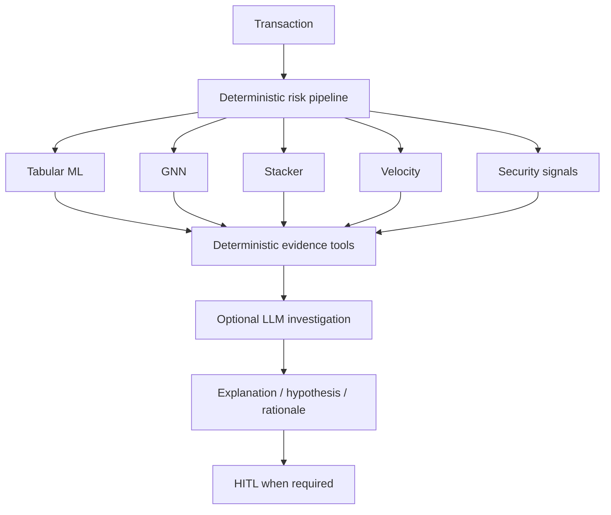

If an LLM provider is unavailable or the call fails, RazorRisk falls back to a **deterministic investigation path** and explicitly records the mode as `deterministic_fallback`. This prevents the system from pretending that an LLM call occurred when it did not.

### 5. High false-positive cost → precision-aware operating point + HITL

The external benchmark shows **91.8% precision** and **74.7% recall** at the evaluated operating point. This reflects a deliberate precision/recall trade-off rather than optimization for raw accuracy.

In an operational system, transactions near a decision boundary or with high financial impact can be escalated instead of automatically blocked. This allows the business to trade investigation capacity against customer friction and fraud loss.

### 6. Dataset shift → monitoring, recalibration, and human feedback

HITL does not magically solve dataset shift. Instead, it provides a controlled feedback mechanism: reviewer outcomes can become labeled operational evidence for future threshold tuning, calibration checks, retraining, and drift analysis. A production deployment would still require formal monitoring and retraining pipelines.

### 7. Untrusted client velocity → backend source of truth

The client-trusted velocity mode exists for controlled simulation and trusted upstream integrations. When the client cannot be trusted, the frontend toggle is switched **OFF**, and the backend calculates trailing one-hour velocity from transaction history. The source is recorded as `CLIENT` or `BACKEND` for auditability.

### Why this layered design matters

RazorRisk is therefore not designed around the assumption that **one model must be correct all the time**. Its safety model is layered:

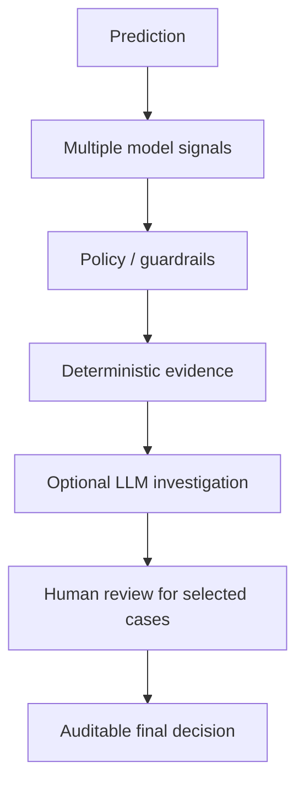

The goal is not to claim that these layers remove every limitation. The goal is to ensure that known limitations become **controlled failure modes** rather than silent automated decisions.

## Limitations and Defensible Scope

RazorRisk is a **production-inspired prototype**, not a deployed payment-fraud system. The following limitations are explicit so that the evaluation is not overstated.

### 1. Synthetic graph data

The graph benchmark uses constructed user/device/IP relationships. These scenarios are valuable for controlled fraud-ring testing but are not evidence of performance on a real payment network.

### 2. Public dataset feature mismatch

The ULB/Kaggle dataset contains anonymized transaction features but does not expose the user/device/IP relationships required for RazorRisk's graph layer. Therefore the external benchmark validates the **tabular component**, not the complete graph-risk system.

### 3. Threshold selection

The reported precision/recall/F1 values use the evaluator's selected classification threshold. A production threshold should be chosen using business costs, fraud losses, customer friction, operational review capacity, and calibrated probabilities.

### 4. Dataset shift

Historical fraud data can differ from future attack patterns. A production implementation would require temporal monitoring, drift detection, retraining, and calibration monitoring.

### 5. Delayed labels

Real fraud labels can arrive after a transaction has already been approved. The current benchmark has immediate ground-truth labels; production evaluation would need time-aware label maturity windows.

### 6. LLM investigation is not the fraud detector

The investigation agent is an evidence interpretation layer. The underlying risk signals are generated by deterministic features, ML, GNN, and policy logic. The LLM should not be treated as a source of ground-truth fraud probability.

### 7. Client velocity mode is not a trusted security boundary

The frontend's client-trusted velocity mode exists for controlled simulation or trusted upstream integration. A malicious client can falsify this value. Backend-calculated velocity should be preferred when the source cannot be trusted.

### 8. Prototype infrastructure

The project uses a compact architecture suitable for demonstration and experimentation. A production deployment would require stronger authentication/authorization, secrets management, distributed storage/queues where appropriate, observability, high availability, rate limiting, and formal data-governance controls.

### 9. Metrics are benchmark-specific

The reported scores should be read as results on the specified datasets and splits, not as universal claims about payment fraud detection.

---

## References / Further Reading

- [XGBoost documentation](https://xgboost.readthedocs.io/en/stable/)
- [GraphSAGE paper — Inductive Representation Learning on Large Graphs](https://arxiv.org/abs/1706.02216)
- [scikit-learn Precision-Recall evaluation](https://scikit-learn.org/stable/auto_examples/model_selection/plot_precision_recall.html)
- [scikit-learn precision/recall definitions](https://scikit-learn.org/stable/modules/generated/sklearn.metrics.precision_recall_curve.html)

---

## Status

**Demo-ready / evaluation-ready prototype.**

The project is intentionally frozen around a coherent risk architecture rather than adding features solely to increase its technology count. The strongest parts of the system are the separation of model evidence from policy, graph-aware fraud reasoning, explicit velocity semantics, real HITL workflow, auditability, reproducible evaluation, and the documented debugging history.
