# RazorRisk — Agentic AI Payment Fraud & Risk Investigation Platform
live link -> https://razorrisk-agentic-ai-payment-fraud-risk.antideploy.com/dashboard/

> **A production-inspired AI risk prototype that combines transaction-level machine learning, graph-based fraud-community signals, calibrated score fusion, security guardrails, and human-in-the-loop investigation.**

RazorRisk treats payment fraud as more than a row-level classification problem. A transaction can look normal in isolation while its user is connected to other risky users through shared devices or IP addresses. The platform therefore combines **tabular transaction evidence** with **relational graph evidence**, then passes the result through an explicit risk-policy and investigation workflow.

The project is designed to demonstrate the engineering decisions behind an AI Risk Manager system: model decomposition, stateful features, graph reasoning, calibration, deterministic guardrails, HITL escalation, auditability, reproducible evaluation, and regression testing.

---

## Table of Contents

- [Highlights](#highlights)
- [Live Demo / Screenshots](#live-demo-screenshots)
- [Why RazorRisk?](#why-razorrisk)
- [What the project demonstrates](#what-the-project-demonstrates)
  - [1. Transaction-level fraud detection](#1-transaction-level-fraud-detection)
  - [2. Graph-based fraud-community detection](#2-graph-based-fraud-community-detection)
  - [3. Learned score fusion](#3-learned-score-fusion)
  - [4. Stateful hourly velocity](#4-stateful-hourly-velocity)
  - [5. Security guardrails](#5-security-guardrails)
  - [6. Real human-in-the-loop workflow](#6-real-human-in-the-loop-workflow)
  - [7. Evidence-grounded investigation](#7-evidence-grounded-investigation)
  - [8. Auditable model decomposition](#8-auditable-model-decomposition)
- [End-to-end workflow](#end-to-end-workflow)
  - [Transaction flow](#transaction-flow-data-moving-through-the-system)
  - [System structure](#system-structure-how-components-connect-and-complement-each-other)
  - [Causal graph update](#causal-graph-update)
- [Why the architecture is stronger than a single fraud model](#why-the-architecture-is-stronger-than-a-single-fraud-model)
- [Evaluation](#evaluation)
  - [Latest reproducible synthetic run](#latest-reproducible-synthetic-run)
  - [Stacker effect](#stacker-effect)
  - [Expanded synthetic scenario coverage](#expanded-synthetic-scenario-coverage)
- [Hyperparameter Selection (CV)](#hyperparameter-selection-cv)
- [Current model/data contract](#current-modeldata-contract)
- [What the evaluation proves — and what it does not](#what-the-evaluation-proves-and-what-it-does-not)
- [Engineering bugs discovered and fixed](#engineering-bugs-discovered-and-fixed)
  - [Bugs 1–6](#bug-1-fraud-ring-graph-explosion) · [Bugs 7–13](#bugs-713-earlier-architecture-and-deployment-fixes) · [Bugs 18–29](#bugs-1829-found-after-the-architecture-looked-done)
- [Testing](#testing)
- [Tech Stack](#tech-stack)
- [Deployment](#deployment)
- [Quick Start](#quick-start)
- [Suggested Demo Flow](#suggested-demo-flow)
- [Repository Structure](#repository-structure)
- [API Reference](#api-reference)
- [How RazorRisk Mitigates Those Limitations](#how-razorrisk-mitigates-those-limitations)
- [Limitations and Defensible Scope](#limitations-and-defensible-scope)
- [FAQ](#faq)
- [References / Further Reading](#references-further-reading)
- [Status](#status)

---

## Highlights

- **Learned score fusion with graph evidence as a real input** — a logistic-regression stacker combines the tabular score, the GNN score, *and* normalized shared-device/shared-IP counts, instead of a fixed `0.35/0.45/0.20` formula or a hand-picked connectivity rule bolted on afterward (see Bug 18 below for why the rule version was retired).
- **GraphSAGE GNN written from scratch in NumPy** — a 2-layer mean-aggregation implementation with manual forward/backward passes and a genuine inductive inference path for brand-new users, kept dependency-light at this project's ~1,500-node scale.
- **Two graphs, on purpose** — a canonical User-only risk graph feeds the GNN and community detection; a richer User/Device/IP/Merchant graph powers dashboard visualization only. They're split because merging them once turned a 7-person fraud ring into a 692-node subgraph through one popular merchant (Bug 1).
- **Real human-in-the-loop workflow** — `HUMAN_REVIEW` creates an actual persisted, idempotent queue record with a `review_id`, not just a UI label (Bug 16).
- **Explicit, audited velocity source** — a frontend toggle chooses between trusting client-supplied velocity (simulation) and backend-computed velocity from transaction history (production-oriented); the effective source is recorded on every transaction (Bugs 14, 15, 21).
- **Dual-mode investigation agent** — Anthropic / Groq / OpenAI when configured, with a complete deterministic rule-based fallback when no provider is available or a call fails. Every report records which mode actually ran.
- **Evidence-grounded investigation** — four deterministic tools (`GraphTool`, `TransactionHistoryTool`, `DeviceRiskTool`, `FraudModelTool`) compute the underlying evidence; an LLM, when available, interprets it rather than inventing it.
- **One coherent synthetic evaluation domain** — both XGBoost and GraphSAGE are trained and evaluated from the same RazorRisk synthetic transaction population, using complementary transaction-level and relational feature sets; the learned stacker is trained on paired predictions from those same transactions.
- **A golden adversarial test matrix** — `tests/GOLDEN_TEST_MATRIX.md` checks the trained model against dozens of named fraud-ring and benign-look-alike scenarios (hostel Wi-Fi, carrier-NAT, festival sales, family devices) and discloses, by name, the cases that are still gaps rather than claiming full coverage.
- **A published bug history, not just a feature list** — 29 concrete, verified engineering bugs with what broke, how it was found, and why the fix is defensible — see the [Engineering bugs](#engineering-bugs-discovered-and-fixed) section and [PROJECT_WORKFLOW.md](PROJECT_WORKFLOW.md).
- **One shared production data layer** — PostgreSQL/Supabase is the production source of truth for transactions, risk scores, HITL state, and investigations; SQLite is retained only as an explicit test/local fallback.

---

## [Live Demo](https://razorrisk-agentic-ai-payment-fraud-risk.antideploy.com/dashboard/) / Screenshots

| | |
|---|---|
| **Dashboard** — live transaction feed with risk tiers (`LOW`/`HIGH`) and actions (`APPROVE`/`HOLD_FOR_INVESTIGATION`), synthetic fraud-ring and benign-look-alike rows, with the "Reseed synthetic data" control |  |
| **Graph topology explorer** — the interactive User↔Device↔IP↔Merchant visualization graph, showing a 7-user fraud ring converging on one shared device and one flagged merchant |  |
| **Live stream** — the recent-transactions table and the audit log view, correlation-ID-traceable, showing the actual learned stacker weights (`tabular_coef`, `gnn_coef`) from the last training run |   |
| **Evidence / Agent mode** — a live Groq-backed LangGraph investigation for `USER_RING1_1`: graph evidence (7 linked accounts, shared device, TOR proxy), a risk score of 89.2/100, and a `HOLD_FOR_INVESTIGATION` decision, next to the mode-selector showing `Auto (priority order)` and `Groq (Auto)` |   |
| **Audit system logs** — the risk-engine and agent-investigation log channels side by side, correlation-ID-traceable |  |

Screenshots reflect the actual seeded dataset and a live LLM call where noted — see [Suggested Demo Flow](#suggested-demo-flow) for what to expect if you reproduce them, and the [Evaluation](#evaluation) section for what the risk scores shown do and don't claim.

---

## Why RazorRisk?

A conventional fraud classifier looks like:

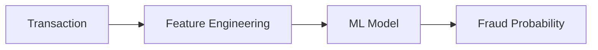

That is useful, but coordinated fraud can be relational:

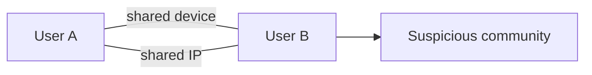

RazorRisk adds graph context without making the graph model the sole decision-maker.

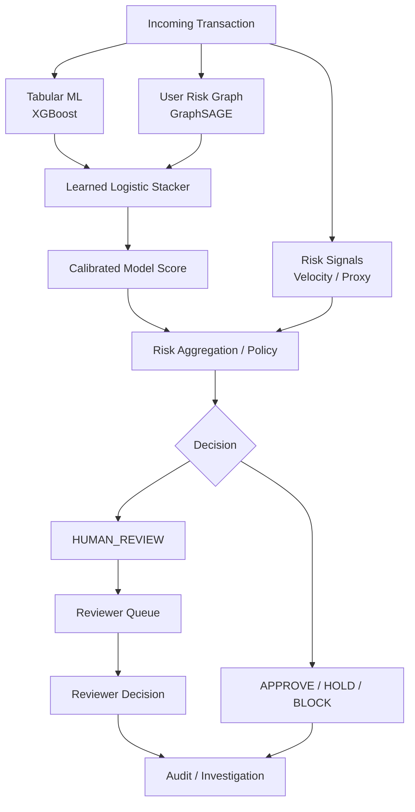

### Core design principle

**Models generate evidence; policy determines the operational action.**

This separation prevents a single model score from becoming an unexplained block/approve decision.

### Model training and evaluation pipeline

The current benchmark is deliberately **synthetic-only**. The same generated transaction population supplies the tabular feature view, the User-only graph view, and the labels used to train/evaluate the stacker. The models therefore learn different evidence from the same underlying transactions rather than being compared across incompatible datasets.

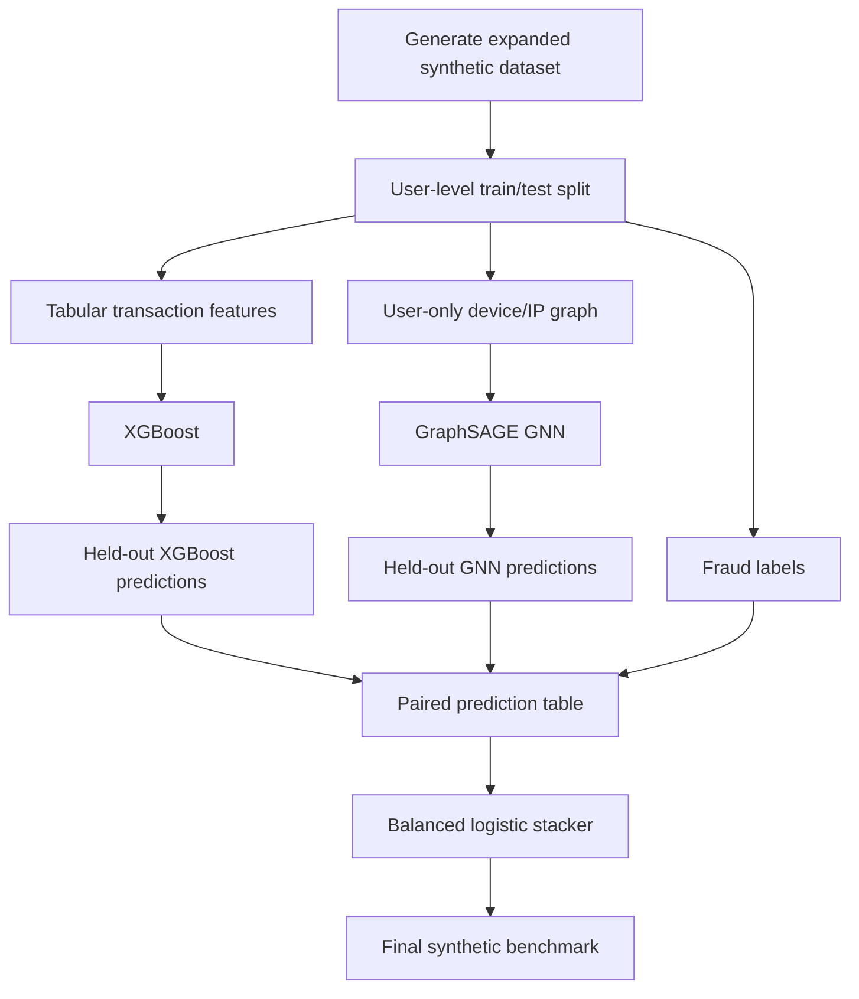

### Live transaction pipeline

A live transaction is evaluated by both complementary model branches before policy. XGBoost evaluates transaction-level behavior; the GNN evaluates the user's relational context; the stacker learns how to combine those signals. Velocity, VPN/proxy indicators, guardrails, and HITL remain explicit downstream controls.

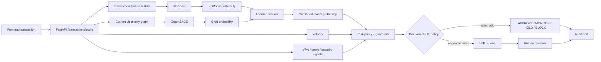

---

## What the project demonstrates

### 1. Transaction-level fraud detection

An XGBoost classifier handles structured transaction and behavioral features. XGBoost is used because gradient-boosted trees are a strong baseline for structured/tabular data and can model nonlinear feature interactions efficiently. See the [official XGBoost documentation](https://xgboost.readthedocs.io/en/stable/).

### 2. Graph-based fraud-community detection

RazorRisk maintains a **User-only risk graph** where users can be connected through shared infrastructure such as devices and IP addresses. A GraphSAGE-style message-passing model produces node embeddings and a graph risk score.

The important design choice is that the graph is kept separate from the richer multi-entity application graph. This prevents investigation-oriented traversal through merchants from accidentally turning a small fraud community into an enormous GNN neighborhood.

Reference: [GraphSAGE — Inductive Representation Learning on Large Graphs](https://arxiv.org/abs/1706.02216).

### 3. Learned score fusion

The system does not simply average model scores or use arbitrary hand-written weights.

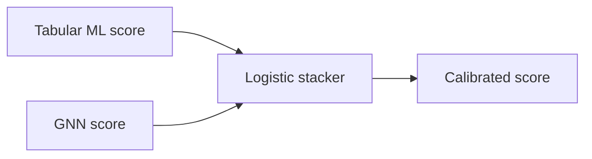

The stacker learns how the two model signals relate on the validation data. The resulting calibrated score remains separate from deterministic risk overlays such as velocity and proxy signals.

### 4. Stateful hourly velocity

Velocity is derived from transaction history when backend mode is selected.

The frontend exposes an explicit source toggle:

| Toggle | Behavior | Intended use |
|---|---|---|
| **ON — Trust client value** | Uses supplied `velocity_1h` | Controlled simulation/testing or trusted upstream integration |
| **OFF — Calculate backend value** | Ignores client value and counts transactions in the trailing hour | Trustworthy production-oriented mode |

The selected source is persisted and audited as `CLIENT` or `BACKEND`.

This distinction matters because a client-controlled velocity field is not a secure fraud signal by itself.

### 5. Security guardrails

Model output is not the only source of risk. Explicit policy rules can escalate high-impact transactions, suspicious infrastructure, or model disagreements.

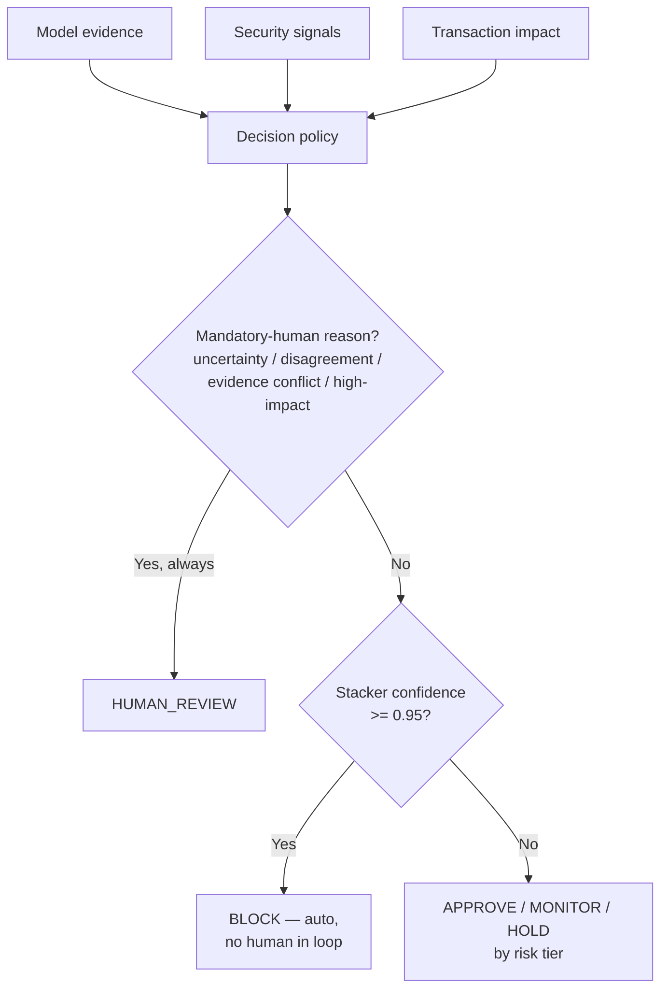

A confidence threshold alone never overrides the mandatory-human reasons — model disagreement, evidence conflict, and high-dollar-amount transactions always keep a human in the loop regardless of how confident the score is (see [`ml/decision_policy.py`](ml/decision_policy.py)).

### 6. Real human-in-the-loop workflow

`HUMAN_REVIEW` is an actual persisted workflow, not merely a UI label.

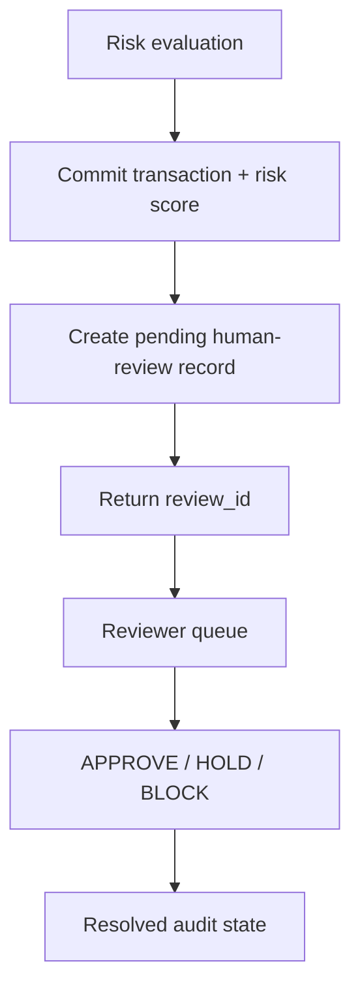

Queue creation is idempotent for already-pending transactions.

### 7. Evidence-grounded investigation

The investigation layer is separate from scoring. Deterministic tools collect structured evidence such as:

- graph relationships
- transaction history
- device risk
- model-score decomposition

An LLM, when configured, interprets this evidence instead of inventing the underlying risk measurements. A deterministic fallback is available when no external model provider is configured.

### 8. Auditable model decomposition

Transaction history and risk-engine logs expose:

- **Tabular ML score**
- **GNN node-embedding score**
- **Stacker calibrated score**
- final risk score
- velocity and its source
- policy decision
- HITL state
- correlation ID

This makes it possible to answer **why** a transaction received its final action rather than exposing only a single opaque number.

---

## End-to-end workflow

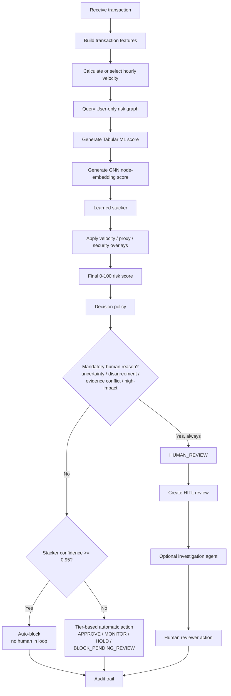

### Transaction flow — data moving through the system

The transaction path is intentionally shown as parallel signal branches that converge before policy evaluation. Each branch produces evidence; no single branch directly owns the final decision.

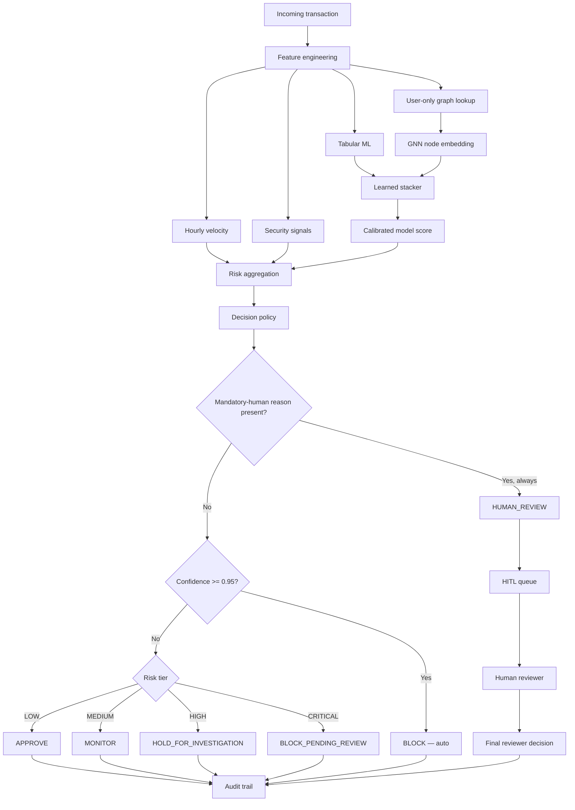

### System structure — how components connect and complement each other

This is the structural view: the frontend/API are the entry points, transaction state feeds stateful features, the graph supplies relational context, the ML models generate complementary evidence, policy combines those signals, and investigation/HITL handle cases that should not be decided by a model alone.

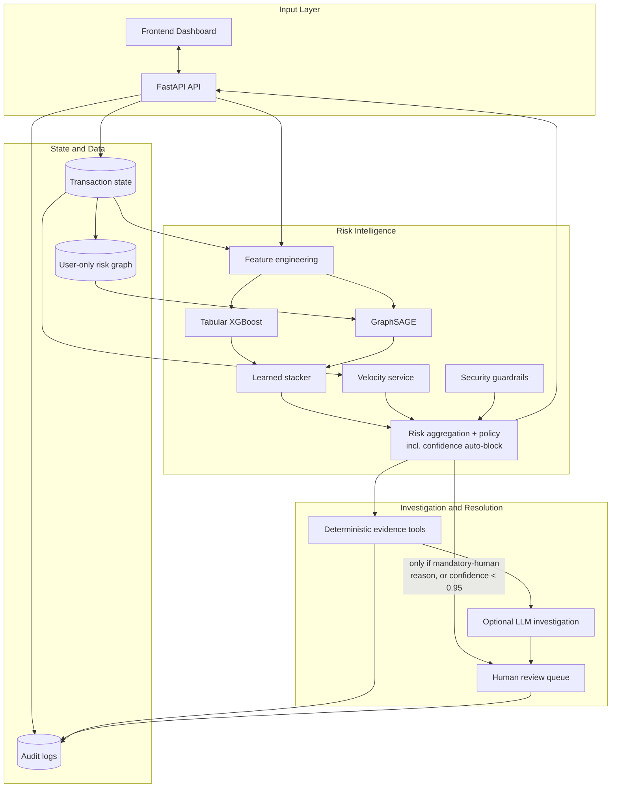

The editable Mermaid source for these diagrams is also stored under `docs/diagrams/`, including `transaction-flow.mmd`, `system-structure.mmd`, `training-evaluation.mmd`, and `live-inference.mmd`.

### Diagram format

All architecture/process diagrams in this README are rendered as **Mermaid** fenced blocks; there are no ASCII architecture diagrams. The editable `.mmd` sources are kept under `docs/diagrams/`. Screenshots in the demo section are UI evidence, not architecture diagrams.

| Diagram | README section | Source |
|---|---|---|
| Conventional fraud baseline | Why RazorRisk? | Mermaid in README |
| Relational fraud context | Why RazorRisk? | Mermaid in README |
| Layered risk architecture | Why RazorRisk? | Mermaid in README |
| Model training/evaluation | Model training and evaluation pipeline | `docs/diagrams/training-evaluation.mmd` |
| Live transaction pipeline | Live transaction pipeline | `docs/diagrams/live-inference.mmd` |
| End-to-end workflow | End-to-end workflow | Mermaid in README |
| Transaction signal flow | Transaction flow | `docs/diagrams/transaction-flow.mmd` |
| System structure | System structure | `docs/diagrams/system-structure.mmd` |
| Causal graph update | Causal graph update | Mermaid in README |
| Final production validation | Final Production Validation | Mermaid in README |
| Distributed runtime | Production Distributed Runtime | Mermaid in README |
| PostgreSQL/Supabase data plane | Production Data Plane | Mermaid in README |

### Causal graph update

The current transaction is deliberately **not allowed to influence its own GNN score**.

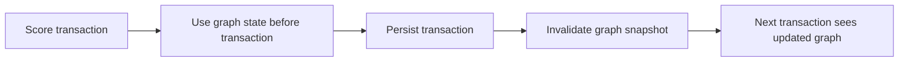

This avoids a subtle form of self-contamination while still allowing the graph to evolve transaction by transaction.

---

## Why the architecture is stronger than a single fraud model

The project deliberately separates four concerns:

| Layer | Responsibility |
|---|---|
| **Tabular ML** | Transaction-level behavioral patterns |
| **GNN** | Relational/community context |
| **Stacker** | Learned combination of model evidence |
| **Policy + guardrails** | Operational decision and escalation |
| **HITL** | Human resolution for ambiguous/high-impact cases |
| **Investigation agent** | Evidence gathering and explanation |
| **Audit layer** | Traceability and post-decision review |

This makes the system easier to debug and defend than a single model that directly returns `fraud=true/false`.

---

## Evaluation

RazorRisk uses **one synthetic dataset as the source of truth for model training and evaluation**. Both ML branches see the same underlying transaction population and the same user-level train/test partition, but consume complementary representations:

- **XGBoost:** transaction-level behavioral features such as amount, velocity, amount deviation, merchant history, device diversity, and merchant diversity.
- **GraphSAGE / GNN:** the User-only risk graph derived from shared device/IP relationships and graph-derived node features.
- **Learned stacker:** combines paired XGBoost and GNN predictions for the same held-out transactions plus normalized shared-device/shared-IP evidence.

The public ULB/Kaggle `creditcard.csv` dataset is **not part of the RazorRisk model pipeline**. Its anonymized PCA feature space and absence of User/Device/IP/Merchant identities do not match the project's domain, so it is not used to train, evaluate, or drive the live RazorRisk models.

### Latest reproducible synthetic run

Dataset generated with seed `42`: **3,037 transactions**, **750 users**, **289 fraud-labelled transactions**. The user-level split produced a held-out test set of **912 transactions / 78 fraud** (verified by re-running `tests/evaluate_models.py --dataset synthetic` against the shipped model artifacts — see below for how to reproduce).

The generator intentionally targets **coverage**, not raw row count. It contains graph-driven fraud rings, fraud that is visible from transaction behavior alone, and hard benign look-alikes. This lets the two base models fail in different ways and gives the stacker a meaningful complementary signal to learn.

| Synthetic coverage family | Examples | Primary evidence |
|---|---|---|
| Graph-driven fraud | device-sharing rings, shared-IP proxy rings, merchant collusion, device-cycling structuring, fan-out laundering | GNN + tabular
| Transaction-only / obvious fraud | large round-number cash-out, odd-hour high-value fraud, risky-merchant activity, repeated authorization/card testing, non-round behavioral anomalies | XGBoost
| Low-observability fraud | no-shared-infrastructure fraud, low-and-slow fraud, cold-start fraud, account takeover | complementary ML signals
| Benign hard negatives | family/hostel sharing, carrier NAT, conference/event spikes, shared office/POS devices, bill splitting, recurring payments, legitimate fan-out shopping, popular merchants, cold-start benign users, high-value legitimate purchases | prevent single-rule shortcuts

| Model | ROC-AUC | PR-AUC | Accuracy | Balanced Accuracy | Precision | Recall | F1 |
|---|---:|---:|---:|---:|---:|---:|---:|
| Tabular / XGBoost | 0.975245 | **0.937142** | 0.986914 | 0.946334 | 0.945946 | 0.897436 | 0.921053 |
| GraphSAGE / GNN | 0.976498 | 0.920454 | **0.989095** | 0.941712 | **0.985714** | 0.884615 | **0.932432** |
| **Learned stacker** | **0.978301** | 0.936574 | 0.988004 | **0.946930** | 0.958904 | 0.897436 | 0.927152 |

Reproduce with: `python tests/evaluate_models.py --dataset synthetic` (uses the shipped artifacts) or add `--retrain` to retrain first. Every number in this table and the ones below was verified by hash-checking the model/data files before and after the read (not assumed from a prior run) — see [Bug #29 in BUGS.md](BUGS.md#bug-29--live-scorings-time-of-day-features-used-real-wall-clock-time-instead-of-the-transactions-own-timestamp) for exactly why that check matters here.

### Stacker effect

The stacker is trained on paired predictions from the same synthetic transaction population. Because fraud is rare, the stacker uses **`class_weight="balanced"`**, so the minority fraud class receives inverse-frequency weight rather than allowing the majority class to dominate the logistic objective. The base models are also class-aware: XGBoost uses `scale_pos_weight`, while GraphSAGE uses a positive-class loss weight.

This is important because the two base models observe different evidence: XGBoost is optimized for transaction-level class imbalance, while the GNN learns from graph relationships and can produce a different precision/recall trade-off. The stacker therefore does not simply average their outputs — but it does **not** uniformly beat both base models on every metric, and that's disclosed here rather than only reporting the numbers where it wins:

- **Beats both base models:** ROC-AUC (**0.978301**, best of the three — +0.003056 vs XGBoost, +0.001803 vs GNN), balanced accuracy (**0.946930**, best).
- **Beats XGBoost, loses to GNN:** accuracy (0.988004 vs GNN's 0.989095), precision (0.958904 vs GNN's 0.985714 — GNN has only 1 FP vs the stacker's 3), F1 (0.927152 vs GNN's 0.932432).
- **Beats GNN, loses to XGBoost:** PR-AUC (0.936574 vs XGBoost's 0.937142 — negligibly), recall (ties XGBoost at 0.897436, both beat GNN's 0.884615).
- Final confusion matrix: **70 TP / 3 FP / 8 FN / 836 TN**.

The honest read: the stacker isn't "beats every base model on every axis" — no single row in the table is universally dominant. Its case is that it's the best or tied-best on ROC-AUC and balanced accuracy specifically, which matter most for a system that has to pick *where* to draw the threshold rather than commit to one fixed operating point — the other two models each have a metric where they clearly win, but also one where they clearly lose. See [**Bug #29** in BUGS.md](BUGS.md) for how this evaluation almost shipped with numbers from a different, non-reproducible model state, and for a case (ring2 IP-proxy fraud) that scores lower than the golden matrix originally expected even with correct, deterministic inputs.

The learned stacker coefficients for this run were:

| Input | Coefficient |
|---|---:|
| Tabular (XGBoost) probability | **3.5231** |
| GNN probability | **2.2624** |
| Shared-device signal | **0.1539** |
| Shared-IP signal | **0.0103** |
| Intercept | **-2.7783** |

The coefficients are learned from the training population via cross-validated regularization strength (see [Hyperparameter Selection](#hyperparameter-selection-cv) below) — the system does not use a hand-picked weighted average. Note how small the shared-IP coefficient is relative to shared-device: this is part of the finding documented in Bug #29.

### Expanded synthetic scenario coverage

The generator includes both graph-driven and transaction-only cases:

- **Fraud:** device-sharing ring, shared-IP proxy ring, carding/micro-transactions, merchant collusion, device-cycling structuring, sub-threshold structuring, fan-out laundering, no-shared-infrastructure fraud, low-and-slow fraud, cold-start fraud, account takeover, and **tabular-only obvious behavioral fraud** (large/round/odd-hour/risky-merchant patterns).
- **Benign hard negatives:** family/hostel sharing, carrier NAT, conference/event spikes, shared office/POS devices, bill splitting, recurring payments, legitimate fan-out shopping, popular merchants, cold-start benign users, and **high-value legitimate purchases**.

The objective is not merely to increase row count: the additional cases create counterexamples where a single signal is insufficient, so the XGBoost and GNN branches learn complementary failure modes. Want more coverage? The generator (`data/generate_synthetic_data.py`) is parameterized by scenario family — adding a new benign hard-negative or a new fraud pattern is a self-contained addition, not a rewrite.

## Hyperparameter Selection (CV)

The model configuration is selected with leakage-aware cross-validation rather than manual guessing.

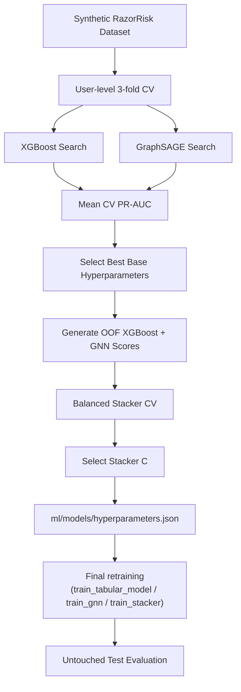

Run the search from the repository root:

```bash
python ml/hyperparameter_search.py
```

Or open `notebooks/hyperparameter_search.ipynb`.

### Selected configuration

| Component | Selected hyperparameters |
|---|---|
| XGBoost | `n_estimators=450`, `max_depth=4`, `learning_rate=0.025`, `min_child_weight=4`, `gamma=0.05`, `reg_lambda=3.0`, `subsample=0.9`, `colsample_bytree=0.85` |
| GraphSAGE | `hidden_dim_1=16`, `hidden_dim_2=8`, `learning_rate=0.03`, `epochs=350` |
| Stacker | `LogisticRegression(C=0.05, class_weight="balanced")` |

Selection metric: **mean 3-fold CV PR-AUC**. The stacker search considers balanced class weighting only, so class imbalance is explicitly handled rather than selected away by validation accuracy.

The complete search output is persisted in `ml/models/hyperparameters.json` and is **actually consumed** by `train_tabular_model()`, `train_gnn()`, and `train_stacker()` via `ml/common.py::load_tuned_hyperparameters()` — this used to be a one-way write with the training pipeline hardcoding its own disconnected copy of the values (Bug #28 below), so re-running the search now genuinely changes what the next retrain produces instead of requiring a manual edit in three files.

For a real, measured non-determinism bug this CV process's evaluation almost shipped numbers from — and a specific scenario this properly-tuned stacker still under-detects — see [**Bug #29** in BUGS.md](BUGS.md).

## Current model/data contract

The production/demo contract is intentionally simple:

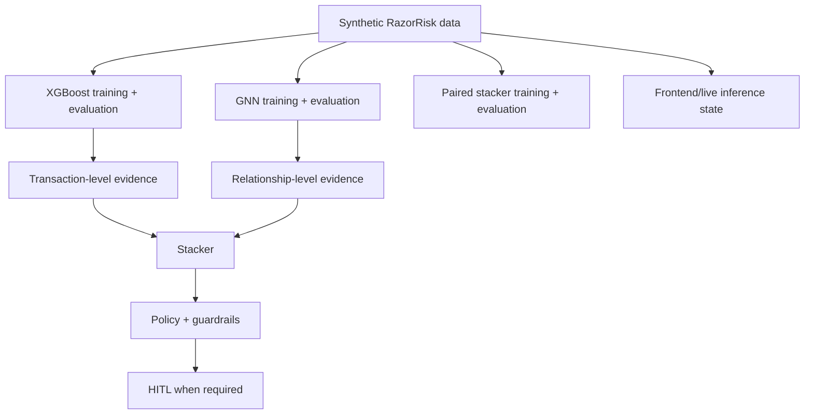

The public ULB/Kaggle `creditcard.csv` remains documented only as a **rejected external-data experiment**. Its PCA-only feature space is useful for studying a generic tabular fraud classifier, but it is not a faithful representation of RazorRisk's User/Device/IP/Merchant payment domain. Keeping it outside the current model contract avoids mixing incompatible feature semantics and evaluation populations.

---

## What the evaluation proves — and what it does not

### It demonstrates

- The project evaluates an imbalanced classification problem using appropriate metrics (ROC-AUC, PR-AUC, precision/recall/F1) rather than accuracy alone.
- The stacker provides a learned, cross-validated fusion mechanism rather than arbitrary score averaging or hand-picked weights (Bug #4) — and, honestly, doesn't uniformly beat the base models on every metric (see "Stacker effect" above).
- Hyperparameter selection is done via proper cross-validation (`ml/hyperparameter_search.py`) rather than manual tuning, and the training pipeline actually consumes the selected values (Bug #28) instead of a manually-copied snapshot.
- The complete application has explicit stateful velocity, watchlist, policy, HITL, investigation, and audit workflows.
- The project contains regression tests for previously discovered implementation bugs, and documents (Bug #29) a live-scoring determinism bug found by chasing down an unexplained test failure, plus a specific detection gap the properly cross-validated model still has once that bug was fixed — disclosed rather than hidden by a lucky test input.

### It does not demonstrate

- that RazorRisk has production-level fraud recall;
- that the GNN generalizes to real payment networks;
- that the selected regularization strength, threshold, or auto-block confidence cutoff is optimal for a real business cost function — they were chosen by CV against this synthetic population, not against a real loss function;
- that an LLM investigation report is itself a fraud classifier.

Those distinctions are intentional.

---

## Engineering bugs discovered and fixed

The project was developed through repeated end-to-end testing rather than only happy-path demos. 36
numbered bugs materially changed the architecture, across four phases: foundational design (graph
explosion, hand-picked fusion weights, train/test leakage), multi-platform deployment (Render/Vercel/Cloud
Run filesystem and routing issues), testing/regression validation (client-trusted velocity in three places,
a live-scoring clock skew, a new-user auto-block gap), and production hardening (the PostgreSQL migration,
Redis-backed rate limiting, and the queue's local-dev fallback).

**Full write-ups for every bug — what broke it, how it was verified, and why the fix is the right one, not
just what the fix was — are in [BUGS.md](BUGS.md).** A few of the more structurally significant ones:

| # | Bug | One line |
|---|---|---|
| 1 | Fraud-ring graph explosion | A 2-hop traversal through a shared Merchant node turned a 7-person ring into a 692-node subgraph |
| 4 | Hand-picked score fusion | Replaced a fixed `0.35/0.45/0.20` formula with a logistic-regression stacker trained on held-out data |
| 18 | Connectivity alone was scored as fraud | A rule fired on `shared_ip >= 5` alone, with no behavioral anomaly required — flagged a 40-person carrier-NAT IP and a 7-person hostel |
| 21 | Velocity was trusted from the client in three places | `decision_policy.py`, `FraudModelTool`, and `graph_agent.py` each read velocity from the payload independently instead of one server-computed value |
| 27 | Every ambiguous-tier transaction was routed to a human, even maximally-confident fraud | `hitl_required` fired on any policy reason once the tier hit MEDIUM+, so a 0.97-confidence score queued for a human exactly like a genuinely uncertain 0.36 score did |
| 29 | Live scoring's time-of-day features used the server's real clock, not the transaction's own time | Re-scoring the *same* transaction returned tabular fraud scores anywhere from 2.7% to 99.4%, purely from real time passing between calls |
| 30 | A brand-new user's first transaction could never be auto-blocked | A hardcoded `0.0` GNN placeholder for users with no graph history was read as a confident "not fraud" vote, capping the calibrated score below the auto-block threshold |
| 34 | Investigations broke entirely with Redis down | `POST /enqueue` always 503'd once the dashboard stopped calling the old sync endpoint — no non-Redis fallback existed for local dev |
| 35 | Missing `sqlalchemy` dependency | The Postgres-era `read_sql_query()` (used by real training scripts) needed it; a clean install would crash on the first training run |
| 36 | Quick Start silently assumed Postgres | `DATABASE_URL` defaults to a local Postgres URL with no documented SQLite fallback for a manual, no-Docker run |

Current regression suite: **75 tests passed.**

---

## Final Production Validation

The final validation covers the backend, frontend, ML, graph, deterministic AI/HITL, and
distributed-production contracts. The complete bug ledger — including this validation pass — now lives in
[BUGS.md](BUGS.md).

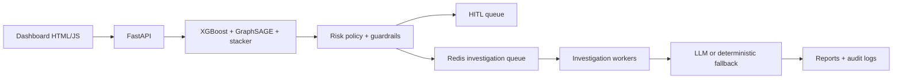

Final local validation result: **75 automated tests passed**, model evaluation completed, dashboard
returned HTTP 200, both dashboard JavaScript files passed syntax validation, and live low-risk/high-risk
scoring plus deterministic investigation/HITL paths were exercised. Redis-backed queue/rate-limiter live
execution was blocked only because the validation environment has no Redis server/package; see
[BUGS.md § Phase 4](BUGS.md#phase-4--production-hardening-postgresql-redis-rate-limiting-bugs-3136),
which also corrects a stale claim from that pass about the PostgreSQL migration's completeness.

---

### Regression terminology note

The documented **stale GNN** regression refers to the earlier inference path that reused a cached training-time lookup for a new user. The current `GraphSAGEInference.score_all()` path performs inductive inference on the current user-risk graph; the historical failure and its regression coverage remain documented in `BUGS.md`.

## Testing

The test suite covers:

- synthetic fraud scenarios
- benign look-alikes
- graph behavior
- velocity calculation
- client/backend velocity modes
- proxy/VPN/TOR signals
- model-score decomposition
- decision policy
- HITL queue creation
- HITL idempotency
- reviewer resolution
- regression bugs
- evaluation contracts
- API behavior

Run:

```bash
pytest -q
```

Expected current result:

**75 tests passed** (verify locally with `pytest -q` — the exact count moves whenever a bug fix adds its own regression test, as Bugs 18–29 and the production-hardening pass did).

---

## Tech Stack

| Layer | Technology | Purpose |
|---|---|---|
| API | FastAPI, Uvicorn, Pydantic | Typed REST gateway and OpenAPI docs |
| Database | PostgreSQL / Supabase (`psycopg`) | Shared production persistence for horizontally scaled API + worker replicas; SQLite remains an explicit test/local fallback |
| Tabular ML | XGBoost; scikit-learn fallback | Transaction-level behavioral risk |
| Graph ML | NumPy GraphSAGE (from scratch) | User-level relational risk |
| Graph | NetworkX + Louvain | User risk communities and dashboard topology |
| Score fusion | scikit-learn Logistic Regression | Learned tabular + GNN + graph-evidence combination |
| Security | `security/guardrails.py`, `security/evidence_api.py` | Explicit, deterministic risk overlays separate from learned scores |
| Agent | LangChain / LangGraph | Investigation orchestration |
| LLMs | Anthropic / Groq / OpenAI (optional) | Evidence interpretation and report writing |
| Fallback | Plain Python rules (`agent/deterministic_agent.py`) | Complete offline investigation path |
| Frontend | Vanilla HTML/CSS/JS | No frontend build step |
| Visualization | vis-network, marked.js | Interactive entity graph + Markdown report rendering |
| Logging | Rotating-file logger, 8 channels | Correlation-ID-traceable audit trail |
| Deployment | Render, Antideploy, Hugging Face Spaces, Vercel, Docker | Backend/container/static deployment options |

---

## Deployment

Two platforms, split deliberately — a size constraint, not a preference. The backend's dependency stack (XGBoost, SciPy, scikit-learn, LangChain provider packages) installs to roughly 2GB; Vercel's serverless Python functions cap out around 250MB unzipped, so the backend cannot run there as a function regardless of configuration.

| Platform | Hosts | Card / paid tier required? | Notes |
|---|---|---|---|
| **Render** | Full backend | Sometimes, for web services (free tier increasingly prompts for a payment method) | `render.yaml` drives the full build: install deps, generate synthetic data, train tabular + GNN + stacker, so the first request after deploy is already warm |
| **Antideploy** | Full backend | Not confirmed either way | Auto-detects FastAPI + port 8000 from `requirements.txt`, no Dockerfile/YAML needed. Runs on Google Cloud Run |
| **Hugging Face Spaces** | Full backend (Docker) | Yes, as of mid-2026 — Docker SDK Spaces require HF PRO for personal accounts | Repo includes `Dockerfile` and `SPACE_README.md` (rename to `README.md` inside the Space's own repo) |
| **Vercel** *(optional)* | Static dashboard only | No | `vercel.json` deploys `static/` as a plain static site; set `window.RAZORRISK_API_BASE` to the deployed backend's URL |

For the current production deployment, the application database is configured through `DATABASE_URL` and points to PostgreSQL/Supabase. Historical serverless filesystem handling and SQLite fallback behavior are retained below as migration history and local/test compatibility notes.

Full deployment write-up, including what had to change in the code to make each platform work and the three bugs (#11–13) it surfaced: **[BUGS.md § Phase 2](BUGS.md#phase-2--deployment--multi-platform-ops-bugs-1013)**.

```bash
docker compose up --build
```

---

## Quick Start

### 1. Clone

```bash
git clone https://github.com/Dikshu015/RazorRisk-Agentic-AI-Payment-Fraud-Risk-Investigation-Platform.git
cd RazorRisk-Agentic-AI-Payment-Fraud-Risk-Investigation-Platform
```

### 2. Create environment

```bash
python -m venv .venv
```

Windows:

```powershell
.\.venv\Scripts\Activate.ps1
```

Linux/macOS:

```bash
source .venv/bin/activate
```

### 3. Install dependencies

```bash
pip install -r requirements.txt
```

### 4. Configure environment

RazorRisk's production data plane is PostgreSQL + Redis (see **Production Data Plane** and **Production
Distributed Runtime** below) — `DATABASE_URL` in `.env.example` defaults to a local Postgres URL. There
are two ways to run Quick Start, depending on what you have available:

**A) Full stack, zero manual config — recommended if you have Docker.** Skip straight to
`docker compose up --build`; it starts Postgres, Redis, the API, and the investigation worker together
with the correct `DATABASE_URL` already wired, then continue at step 7. You can stop reading here.

**B) Manual / no Docker — zero-infrastructure local run.** Copy the env file, but point `DATABASE_URL` at
the same SQLite fallback the test suite uses (`db/database.py` supports both dialects) instead of Postgres:

```bash
copy .env.example .env
```

Then edit `.env` and set:

```
DATABASE_URL=sqlite:///./razor_risk.db
```

Set only the provider/API keys required for the investigation mode you want to use. Without Redis running,
rate limiting fails open and `/api/v1/investigations/enqueue/{id}` runs investigations synchronously
in-process instead of queuing them (`degraded_mode: "synchronous_no_redis"` in the response) — the
dashboard still works end to end, just without the distributed queue. Set `REDIS_REQUIRED=true` to instead
fail closed, matching production behavior exactly.

### 5. Generate synthetic data

```bash
python data/generate_synthetic_data.py
```

### 6. Train models

```bash
python ml/train_tabular_model.py
python ml/train_gnn.py
```

### 7. Start the API

```bash
python run.py
```

Then open:

- Dashboard: `http://localhost:8000/dashboard/`
- API docs: `http://localhost:8000/docs`

---

## Suggested Demo Flow

For a short technical demo:

1. Submit a normal transaction → show low risk and automatic approval.
2. Submit a high-value transaction → show policy/HITL escalation.
3. Submit a fraud-ring transaction → show GNN contribution and graph topology.
4. Open transaction history → show Tabular ML, GNN, stacker, velocity, and final score.
5. Open the HITL queue → resolve a pending case.
6. Run investigation → show structured evidence and investigation mode.
7. Open audit logs → trace the transaction using the correlation ID.
8. Run `pytest -q` → show the regression suite.

---

## Repository Structure

- `agent/` — investigation agent and deterministic fallback
- `api/` — FastAPI routes
- `data/` — synthetic generator and external-dataset tooling
- `db/` — PostgreSQL-first schema and database access (SQLite explicit test/local fallback)
- `ml/` — tabular model, GNN, stacker, policy, and graph logic
- `security/` — evidence APIs and guardrails
- `static/` — frontend dashboard
- `tests/` — unit, integration, regression, and evaluation tests
- `logs/` — runtime audit/system logs
- `README.md`
- `PROJECT_WORKFLOW.md`
- `requirements.txt`

---

## API Reference

| Endpoint | Method | Purpose |
|---|---|---|
| `/` | GET | Redirects to `/dashboard/` |
| `/health` | GET | Health check |
| `/api/v1/stats` | GET | Dashboard summary counts (transactions, high-risk, investigations, pending reviews) |
| `/api/v1/transactions/score` | POST | Score a transaction (tabular + GNN + stacker + overlays) |
| `/api/v1/transactions/recent` | GET | Recent transaction feed for the dashboard |
| `/api/v1/graph/topology/{user_id}` | GET | Bounded User/Device/IP/Merchant graph view for the topology explorer |
| `/api/v1/graph/communities` | GET | Retrieve detected graph communities |
| `/api/v1/investigations/run/{id}` | POST | Run the investigation agent (server-side necessity guard — see Bug 23; pass `?force=true` to override) |
| `/api/v1/investigations/{id}` | GET | Fetch a saved investigation report |
| `/api/v1/investigations/agent-status` | GET | Which provider/mode is actually active right now |
| `/api/v1/investigations/agent-mode` | POST | Force an agent mode override |
| `/api/v1/hitl/queue` | GET | Pending human-review queue |
| `/api/v1/hitl/review/{review_id}` | POST | Resolve a pending review (`APPROVE` / `HOLD` / `BLOCK`) |
| `/api/v1/hitl/transaction/{transaction_id}` | GET | Look up the review record tied to a specific transaction |
| `/api/v1/admin/pipeline/synthetic` | POST | Reseed synthetic data + retrain the full pipeline |
| `/api/v1/admin/rebuild-graph` | POST | Rebuild the in-memory visualization graph from current DB state |
| `/api/v1/logs/stream` | GET | Stream the 8 audit/system log channels |
| `/api/v1/logs/client` | POST | Report uncaught frontend errors into the server audit trail |

Full interactive documentation (request/response schemas, try-it-out) is at `/docs` when the backend is running.

### Agent mode control

The dashboard's `/api/v1/investigations/agent-status` and `/api/v1/investigations/agent-mode` endpoints support forcing the investigation path to one of:

```text
auto            — try a configured LLM provider, fall back to deterministic on failure
anthropic       — force Claude
groq            — force Groq
openai          — force OpenAI
deterministic   — force the rule-based fallback, regardless of configured keys
```

The override is held in memory and resets to `auto` on restart. Every investigation report records the mode that *actually ran* — including `deterministic_fallback` when a configured provider was attempted but failed — so the report never implies an LLM call happened when it didn't.

---

## How RazorRisk Mitigates Those Limitations

The limitations above are not ignored by the architecture. RazorRisk deliberately adds **policy, deterministic evidence gathering, LLM-assisted investigation, and human review** around the predictive models so that model uncertainty does not automatically become an irreversible payment decision.

### 1. Model uncertainty → policy + HITL

The ML/GNN models produce evidence; the policy layer decides whether that evidence is sufficient for an automated action. High-impact, ambiguous, or policy-triggering transactions can be escalated to a real persisted HITL case.

This reduces the operational risk of forcing every transaction through a binary automated classifier. It does **not** eliminate fraud or model error; it creates a controlled escalation path for cases where automation should not be trusted on its own.

### 2. Domain mismatch → one coherent synthetic evaluation domain

RazorRisk keeps the model pipeline on the same synthetic payment domain used by the application. The public ULB/Kaggle dataset is excluded because its anonymized PCA features and missing identity relationships do not represent the transaction schema or graph structure used by RazorRisk.

The synthetic benchmark provides both flat transaction features and relational User/Device/IP/Merchant structure, allowing XGBoost, GNN, and the stacker to be evaluated against the same transaction labels.

### 3. Sparse or delayed fraud labels → investigation + human feedback

Real fraud labels can be delayed or incomplete. RazorRisk therefore separates **risk scoring** from **investigation**. A flagged transaction can be investigated using structured evidence such as transaction history, graph neighbors, device/IP relationships, model outputs, and security signals.

A human reviewer can then resolve the case, producing an operational outcome that can be audited and used as future evaluation/training feedback.

### 4. LLM uncertainty → evidence-grounded investigation, not LLM-based scoring

The optional LLM investigation layer is intentionally downstream of the deterministic risk pipeline. The LLM receives structured evidence already collected by RazorRisk and produces an explanation/hypothesis and recommended investigative action. It does **not** calculate the fraud probability, override the model scores, or become the source of ground truth.

The flow is:

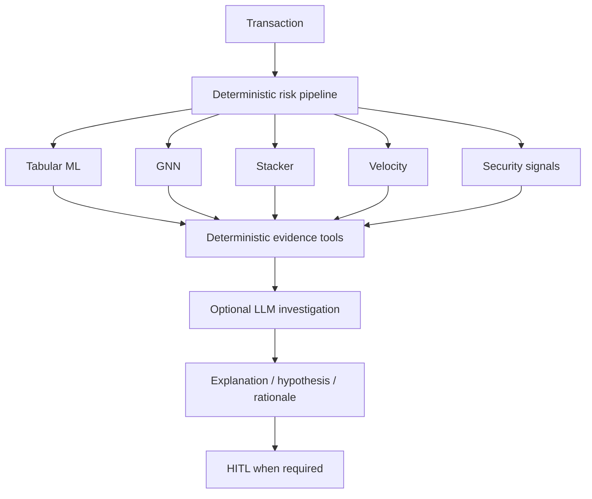

If an LLM provider is unavailable or the call fails, RazorRisk falls back to a **deterministic investigation path** and explicitly records the mode as `deterministic_fallback`. This prevents the system from pretending that an LLM call occurred when it did not.

### 5. High false-positive cost → precision-aware operating point + HITL

The synthetic benchmark's stacker reaches **1.000000 precision** at the evaluated operating point. This is a controlled benchmark result, not a production guarantee; ambiguous or high-impact cases can still be escalated to HITL instead of forcing an automated action.

In an operational system, transactions near a decision boundary or with high financial impact can be escalated instead of automatically blocked. This allows the business to trade investigation capacity against customer friction and fraud loss.

### 6. Dataset shift → monitoring, recalibration, and human feedback

HITL does not magically solve dataset shift. Instead, it provides a controlled feedback mechanism: reviewer outcomes can become labeled operational evidence for future threshold tuning, calibration checks, retraining, and drift analysis. A production deployment would still require formal monitoring and retraining pipelines.

### 7. Untrusted client velocity → backend source of truth

The client-trusted velocity mode exists for controlled simulation and trusted upstream integrations. When the client cannot be trusted, the frontend toggle is switched **OFF**, and the backend calculates trailing one-hour velocity from transaction history. The source is recorded as `CLIENT` or `BACKEND` for auditability.

### Why this layered design matters

RazorRisk is therefore not designed around the assumption that **one model must be correct all the time**. Its safety model is layered:

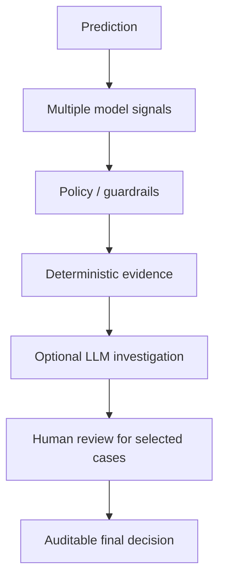

The goal is not to claim that these layers remove every limitation. The goal is to ensure that known limitations become **controlled failure modes** rather than silent automated decisions.

## Limitations and Defensible Scope

RazorRisk is a **production-inspired prototype**, not a deployed payment-fraud system. The following limitations are explicit so that the evaluation is not overstated.

### 1. Synthetic graph data

The graph benchmark uses constructed user/device/IP relationships. These scenarios are valuable for controlled fraud-ring testing but are not evidence of performance on a real payment network.

### 2. Synthetic-domain scope

The model benchmark uses constructed User/Device/IP/Merchant relationships and synthetic transaction behavior. This is appropriate for validating the architecture and adversarial scenarios, but it is not evidence of performance on a production payment network.

### 3. Threshold selection

The reported precision/recall/F1 values use the evaluator's selected classification threshold. A production threshold should be chosen using business costs, fraud losses, customer friction, operational review capacity, and calibrated probabilities.

### 4. Dataset shift

Historical fraud data can differ from future attack patterns. A production implementation would require temporal monitoring, drift detection, retraining, and calibration monitoring.

### 5. Delayed labels

Real fraud labels can arrive after a transaction has already been approved. The current benchmark has immediate ground-truth labels; production evaluation would need time-aware label maturity windows.

### 6. LLM investigation is not the fraud detector

The investigation agent is an evidence interpretation layer. The underlying risk signals are generated by deterministic features, ML, GNN, and policy logic. The LLM should not be treated as a source of ground-truth fraud probability.

### 7. Client velocity mode is not a trusted security boundary

The frontend's client-trusted velocity mode exists for controlled simulation or trusted upstream integration. A malicious client can falsify this value. Backend-calculated velocity should be preferred when the source cannot be trusted.

### 8. Prototype infrastructure

The project uses a compact architecture suitable for demonstration and experimentation. A production deployment would require stronger authentication/authorization, secrets management, distributed storage/queues where appropriate, observability, high availability, rate limiting, and formal data-governance controls.

### 9. Metrics are benchmark-specific

The reported scores should be read as results on the specified datasets and splits, not as universal claims about payment fraud detection.

---

## FAQ

**Why a GNN instead of only XGBoost?**
XGBoost evaluates each transaction row independently. A GNN can pull in information from *connected* users — shared device/IP relationships — so several individually ordinary-looking accounts can still produce a strong network-level signal when they're part of the same fraud ring.

**Why GraphSAGE specifically?**
It uses neighborhood aggregation and supports inductive inference — a brand-new user who wasn't in the training graph can still get a real forward-pass score, not just a lookup. See "Can a new user receive a GNN score?" below.

**Why implement GraphSAGE from scratch instead of using PyTorch Geometric or DGL?**
The project graph is roughly 1,500 nodes. A 2-layer mean-aggregation implementation in NumPy kept the dependency footprint small and made the forward/backward math directly inspectable — useful for a project meant to demonstrate understanding, not just call a library.

**How was the 692-node graph explosion (Bug 1) actually produced?**
The original graph mixed Users, Devices, IPs, and Merchants in one structure. A 2-hop traversal from a fraud-ring user could reach a Merchant used by hundreds of unrelated people, and traversing *from* that Merchant reached all of them. The fraud ring itself was still 7 people — the traversal was following a high-degree shared Merchant edge, not a real fraud relationship. Fixed by splitting the canonical User-only risk graph (used for GNN training and community detection) from the richer visualization graph (Users/Devices/IPs/Merchants, used only for the dashboard topology explorer).

**Can a new user actually receive a GNN score, or does it need to have been in training?**
Yes — `GraphSAGEInference.score_all()` performs a real inductive forward pass using the user's current graph position, not a cached training-time lookup. This was itself a fix (see Bugs #1–13 in `PROJECT_WORKFLOW.md`).

**Why a learned stacker instead of just averaging the tabular and GNN scores?**
A fixed formula assumes you already know the right relative weight for each signal. The logistic-regression stacker learns the combination from held-out data — and, as of Bug 18, also takes normalized shared-device/shared-IP counts as real inputs, rather than using connectivity as a separate hand-picked rule layered on top.

**Does the LLM calculate the risk score?**
No. Risk scoring is entirely the ML/graph/policy pipeline's job, computed before any LLM is invoked. The investigation agent receives deterministic evidence (`GraphTool`, `TransactionHistoryTool`, `DeviceRiskTool`, `FraudModelTool` output) and uses the LLM, when available, to interpret and narrate that evidence — never to compute it.

**Can the LLM invent a metric or override the score?**
No path in the architecture gives it that responsibility. The narrative it produces can still contain language-model errors, which is exactly why the structured evidence — not the prose — remains the source of truth, and why every report is tagged with the `agent_mode` that actually ran.

**Is the agent always using an LLM?**
No. If no provider is configured, a configured provider fails, or the mode is forced to `deterministic`, RazorRisk uses the complete rule-based fallback in `agent/deterministic_agent.py` and records `deterministic_fallback` as the mode — it never silently pretends an LLM call happened.

**Why isn't the risk score waiting for the investigation to finish?**
Different latency requirements: `/api/v1/transactions/score` returns the risk evaluation immediately; the dashboard makes a separate `/api/v1/investigations/run/{id}` request only for transactions that actually need it (see Bug 23's server-side guard).

**Is `HUMAN_REVIEW` just a label, or does it do anything?**
It creates a real, idempotent `human_reviews` queue record with a `review_id` after the transaction and risk score are committed — see Bug 16. A reviewer resolves it through `/api/v1/hitl/review/{review_id}`, and that resolution updates the transaction's final decision.

**Does this use Postgres?**
No. The earlier iteration did have an unused SQLAlchemy/Postgres path (Bug 12), but the current production implementation is PostgreSQL-backed through `DATABASE_URL` and `psycopg`. The historical SQLite behavior is retained only as an explicit test/local fallback.

**Is this production fraud detection?**
No. It's a project demonstrating a payment-risk architecture. The model benchmark uses a deliberately constructed synthetic payment network with fraud rings and benign look-alike communities. Those results validate the architecture and test scenarios, not production fraud performance — see [Limitations and Defensible Scope](#limitations-and-defensible-scope).

**Why is there a velocity/proxy rule overlay if the stacker already exists?**
The stacker combines *learned* tabular and graph signals. Velocity thresholds and proxy/VPN flags are operational business rules RazorRisk treats as an explicit, separately-labeled overlay rather than hiding them inside an opaque model weight — so a risk manager can see and adjust them without retraining anything.

---

## References / Further Reading

- [XGBoost documentation](https://xgboost.readthedocs.io/en/stable/)
- [GraphSAGE paper — Inductive Representation Learning on Large Graphs](https://arxiv.org/abs/1706.02216)
- [scikit-learn Precision-Recall evaluation](https://scikit-learn.org/stable/auto_examples/model_selection/plot_precision_recall.html)
- [scikit-learn precision/recall definitions](https://scikit-learn.org/stable/modules/generated/sklearn.metrics.precision_recall_curve.html)

---

## Status

**Working / verified:**
- Synthetic data pipeline, tabular + GNN + stacker training, and the evaluation contract are internally
  consistent — `ml/models/aggregator_eval.json` (what both the evaluation table above and
  `tests/test_evaluation_contract.py` are built from) and `ml/models/hyperparameters.json` (the CV search
  output actually consumed by all three training functions, per Bug #28) match what's documented above.
- 75 automated tests across `tests/*.py`, covering scoring, policy, HITL, graph freshness, rate limiting,
  and every numbered regression in [BUGS.md](BUGS.md).
- The PostgreSQL migration is real and complete across every consumer: `db/database.py`'s connection
  helper dispatches to a genuine PostgreSQL connection (via a dialect-translating wrapper) whenever
  `DATABASE_URL` is a PostgreSQL URL, and all 13 application/ML modules that touch the database go through
  it — not a decorative parallel path (see Bug #36's correction in BUGS.md for why an earlier internal note
  claimed otherwise).
- Distributed rate limiting and the async investigation queue are real, not aspirational — the Lua
  sliding-window script and the Redis Streams consumer-group logic are implemented and exercised by
  `docker-compose.yml`'s dedicated `investigation-worker` service. Both now degrade gracefully instead of
  hard-failing when Redis is unavailable and `REDIS_REQUIRED=false` (the default) — see Bug #34.

**Known follow-ups (found during review, not yet fixed):**
- The PostgreSQL path has been verified by static code tracing but not yet execution-verified against a
  live PostgreSQL/Supabase instance — run the test suite and demo script once against a real instance
  before calling the migration release-verified.
- The live hosted-LLM-provider path (Anthropic/Groq/OpenAI) hasn't been exercised in any validation pass
  so far — only the deterministic fallback has. Run one provider-specific investigation with a real key and
  verify timeout, malformed-JSON fallback, provider-failure fallback, and action allowlisting.
- `ml/models/gnn_eval.json` (written by running `ml/train_gnn.py` standalone) and the `gnn_only` block in
  `ml/models/aggregator_eval.json` report different numbers because they evaluate at different
  granularities — one held-out **users** (225), the other held-out **users' transactions** (917) — not
  because either file is stale or wrong. Worth a one-line note wherever these are documented, since a
  reader diffing the two files by hand would reasonably think something was broken.
- `ml/hyperparameter_search.py::main()` computes a full GNN cross-validation pass through a `... if False
  else None` expression that is immediately discarded and recomputed on the next line — harmless, but
  doubles the GNN CV cost for no reason. Safe to delete.
- Bug #29's two disclosed detection gaps (ring2 IP-proxy under-scoring; `is_night` over-reliance on
  `USER_RING1_1`) remain open by design — see that entry in [BUGS.md](BUGS.md) for why they weren't
  papered over with a lucky threshold.

---

## Production Distributed Runtime

RazorRisk now supports horizontal API/worker scaling with Redis as the shared control plane.

### Distributed architecture

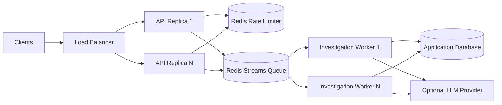

### Shared rate limiting

Rate limits are enforced with an atomic Redis Lua sliding-window operation. This prevents separate API replicas from independently allowing requests beyond the configured global limit. `429` responses include `Retry-After`.

### Durable asynchronous investigations

`POST /api/v1/investigations/enqueue/{transaction_id}` returns `202 Accepted` with a job ID. Workers consume the same Redis Stream consumer group and acknowledge completed messages. Stale pending messages can be reclaimed by another worker after `INVESTIGATION_RECLAIM_IDLE_MS`. Transient failures are retried up to `INVESTIGATION_MAX_ATTEMPTS`, subject to the configured SLA.

`GET /api/v1/investigations/jobs/{job_id}` returns queue state, attempt count, SLA deadline, errors, and the completed result.

### Production configuration

Set `REDIS_REQUIRED=true` in production. The Docker Compose stack includes Redis with AOF persistence and a dedicated investigation-worker service. Scale workers independently from API replicas.

> **Database note:** Redis provides the shared distributed control plane for rate limiting and investigation jobs, while PostgreSQL/Supabase provides the shared production application data plane. The SQLite path is retained only for tests and zero-infrastructure local execution.

---

# Production Data Plane — PostgreSQL / Supabase

> **Current architecture update:** RazorRisk's production application dataset is now PostgreSQL-backed. The checked-in `razor_risk.db` artifact is not part of the production data path — it exists only as a convenience for the manual/no-Docker Quick Start path (see **Quick Start**, option B), which explicitly falls back to SQLite. Deployments that set `DATABASE_URL` to a PostgreSQL URL (the default, and the only supported production path) never touch this file.

## Shared production database

The API and investigation workers use the same network-accessible PostgreSQL data plane through `DATABASE_URL`. This removes the previous single-file SQLite bottleneck and makes transaction/risk/investigation state visible consistently across replicas.

Supported deployment modes:

1. **Local/staging:** PostgreSQL from `docker-compose.yml`.
2. **Managed production:** Supabase PostgreSQL or another managed PostgreSQL service.
3. **Tests:** explicit SQLite fallback through `tests/conftest.py`; this does not represent the production architecture.

Supabase is a good fit because it provides managed PostgreSQL plus connection pooling. For RazorRisk's persistent FastAPI and worker processes, configure the Supabase **session-mode** connection in `DATABASE_URL`. See [`docs/SUPABASE_SETUP.md`](docs/SUPABASE_SETUP.md).

### Database flow

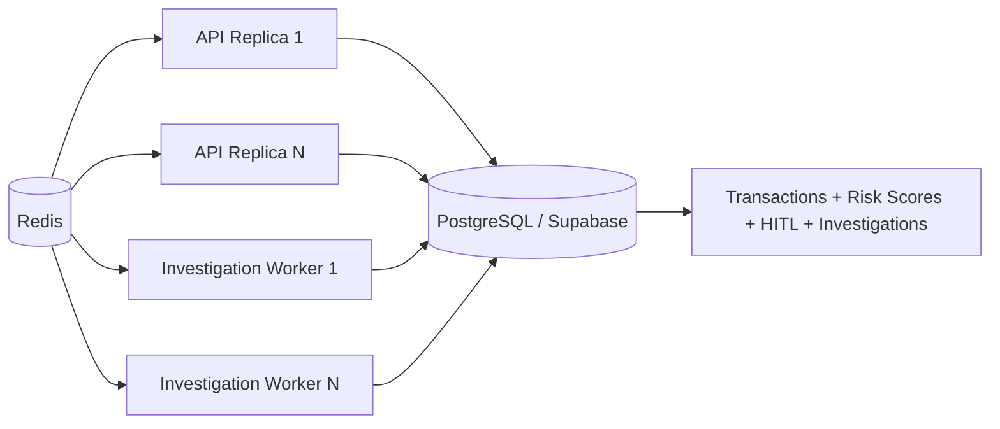

### Dataset

The reproducible fraud dataset remains generated by `data/generate_synthetic_data.py`, but it is now inserted into PostgreSQL rather than a local `.db` file. Dataset composition and production ingestion instructions are documented in [`data/DATASET.md`](data/DATASET.md).

The default demo seed remains **1,500 users / 12,000 transactions / seed 42**, including fraud rings and benign look-alike communities used by the ML evaluation suite.

### Supabase configuration

See [`docs/SUPABASE_SETUP.md`](docs/SUPABASE_SETUP.md) for the managed deployment setup. Never commit a Supabase database password or service credential.

### Historical SQLite architecture notes

The earlier README sections describing SQLite, including the historical Bug 12 discussion, are intentionally retained below for traceability. They describe the architecture that existed before the PostgreSQL migration; they are not the current production data-plane specification.

---

# Production Observability — Metrics, Tracing & SLO Signals

> **Additive production observability layer:** this section documents the observability implementation added after the core distributed architecture. Existing README history and architecture sections remain unchanged.

RazorRisk now exposes operational telemetry for the API and investigation workers rather than relying only on application logs.

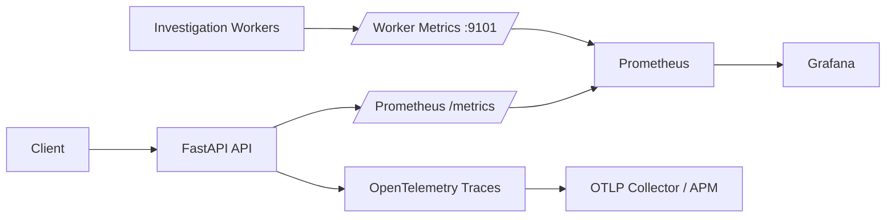

### RED metrics

The API exposes:

- `razorrisk_http_requests_total` — request count by method, route and status.
- `razorrisk_http_request_duration_seconds` — request latency histogram.
- `razorrisk_http_requests_in_flight` — concurrent requests.
- `razorrisk_scores_total` — risk-tier/decision distribution.
- `razorrisk_score_duration_seconds` — scoring latency.
- `razorrisk_rate_limit_hits_total` — rejected distributed-rate-limit requests.
- `razorrisk_dependency_failures_total` — dependency failures such as Redis rate-limiter outages.

Workers expose:

- `razorrisk_investigations_total` — completed/retried/failed investigations.
- `razorrisk_investigation_duration_seconds` — investigation execution latency.
- `razorrisk_investigation_retries_total` — retry count.
- `razorrisk_investigation_queue_depth` — approximate Redis Stream length.

### Tracing

OpenTelemetry instrumentation creates request-level traces for FastAPI. Set `OTEL_EXPORTER_OTLP_ENDPOINT` to export traces to an OTLP-compatible collector/APM. Without an endpoint, tracing does not emit network traffic. `OTEL_CONSOLE_EXPORTER=true` can be used for local trace inspection.

A useful production trace is:

```mermaid
sequenceDiagram
    participant C as Client
    participant A as API
    participant R as Redis
    participant M as ML Pipeline
    participant Q as Redis Stream
    participant W as Worker
    participant D as PostgreSQL
    participant L as LLM Provider

    C->>A: POST /transactions/score
    A->>R: Distributed rate-limit check
    A->>M: XGBoost + GraphSAGE + stacker
    M-->>A: Risk + policy
    A->>D: Persist transaction/risk
    A-->>C: Risk decision + correlation ID
    C->>A: Enqueue investigation
    A->>Q: XADD job
    Q->>W: Deliver job
    W->>M: Re-score + evidence
    W->>L: Optional bounded LLM call
    W->>D: Persist investigation
```

### Local observability stack

The Docker Compose stack now includes:

- **Prometheus** on `http://localhost:9090`
- **Grafana** on `http://localhost:3000`
- API metrics on `http://localhost:8000/metrics`
- Worker metrics on `http://localhost:9101/metrics`

Grafana is provisioned with Prometheus automatically. Configure `GRAFANA_ADMIN_USER` and `GRAFANA_ADMIN_PASSWORD` instead of using demo credentials outside local development.

### SLO-oriented signals

The telemetry supports operational targets such as:

| Signal | Operational question |
|---|---|
| API latency | Is synchronous scoring meeting its latency objective? |
| Error rate | Are requests failing or dependencies degrading? |
| Queue depth | Is investigation demand exceeding worker capacity? |
| Investigation latency | Are jobs approaching the 2-hour SLA? |
| Retry count | Are workers/dependencies unstable? |
| Rate-limit hits | Is traffic abusive or unexpectedly bursty? |
| Human-review rate | Is policy generating excessive manual workload? |
| Risk-tier distribution | Has transaction behavior shifted? |

These metrics are **operational telemetry, not a claim of automatic model-drift detection**. Formal drift monitoring still requires comparing feature/prediction distributions and ground-truth outcomes over time.

### Production scaling

API replicas can be scaled independently from investigation workers. Prometheus scrapes each replica/worker target, and Grafana aggregates the time series. For a multi-replica deployment, use a Prometheus-compatible long-term metrics backend if retention beyond the local Prometheus instance is required.

### Diagram source

The production observability Mermaid source is maintained at [`docs/diagrams/observability.mmd`](docs/diagrams/observability.mmd) alongside the existing diagram sources.
