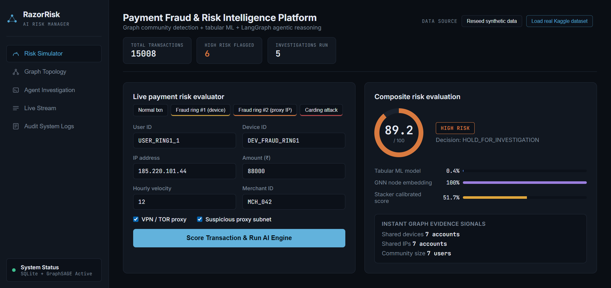
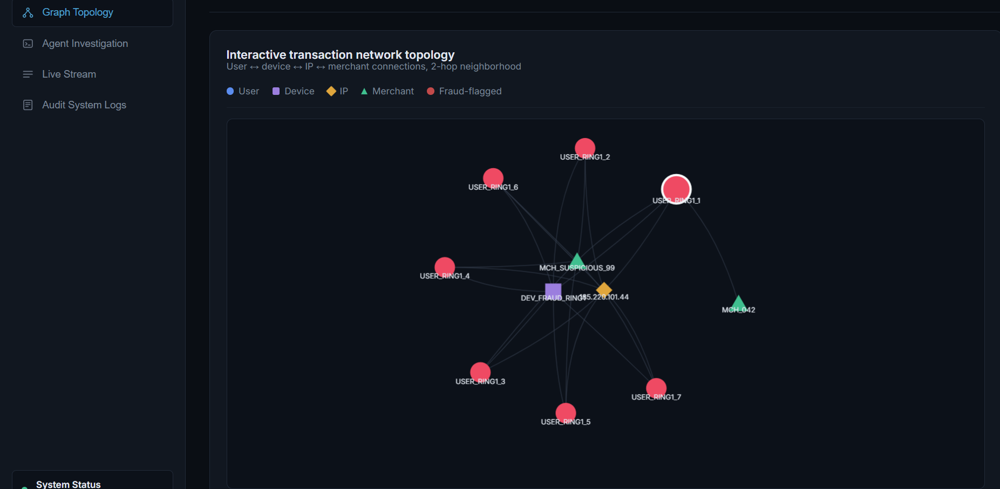
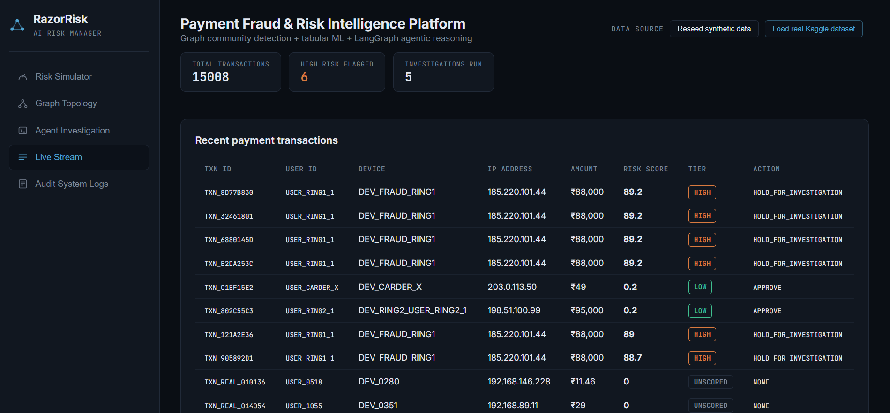
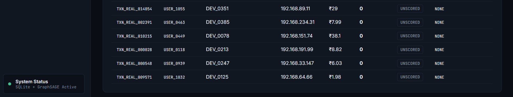
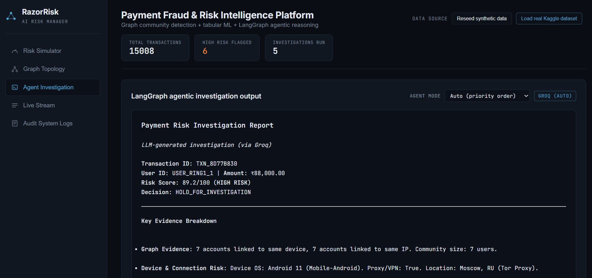
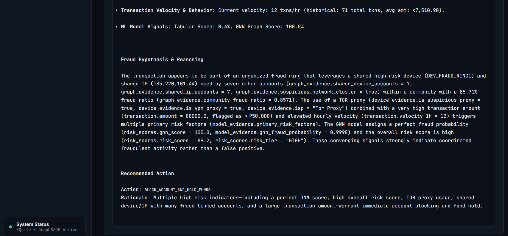
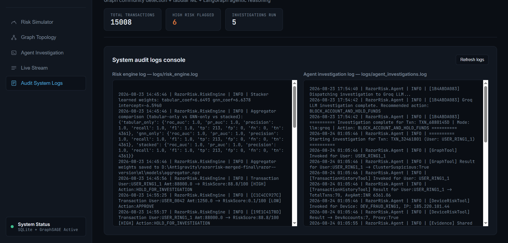
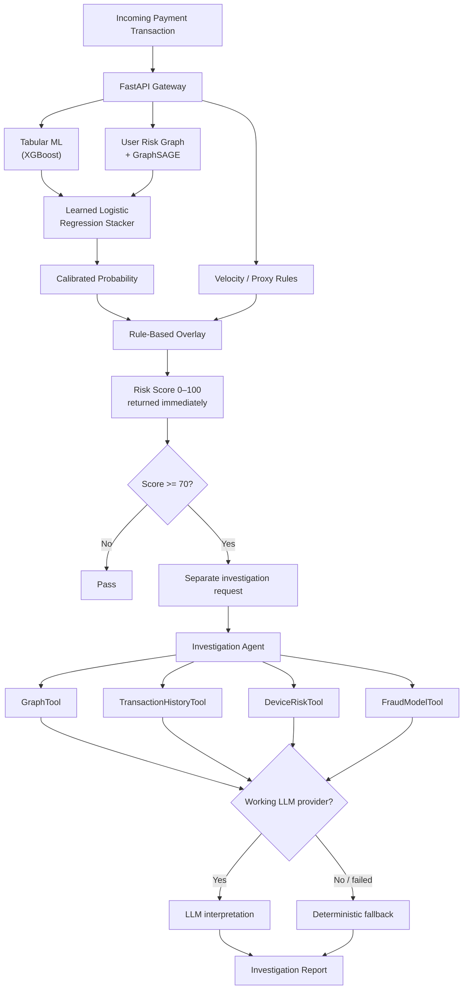

# RazorRisk

**Agentic AI payment fraud & risk investigation platform** — Graph Neural Network + tabular ML + evidence-grounded investigation agent, combined by a learned stacker rather than hand-picked model weights.

RazorRisk is designed around a specific limitation of transaction-level fraud scoring: multiple transactions can look individually normal while being connected through shared infrastructure. RazorRisk combines transaction-level behavioral signals with a User-only risk graph, then uses a separate investigation layer to gather evidence and produce an investigator-facing report.

> **Important evaluation note:** the public ULB/Kaggle fraud dataset used by this project does not expose identity, device, or IP relationships. The graph relationships are therefore synthetic when that dataset is used. Synthetic fraud-ring scenarios are used to evaluate graph behavior and controlled attack patterns; they are not presented as production fraud performance.

## Live Demo / Video / Screenshots

- [**Live Dashboard**](https://razorrisk-agentic-ai-payment-f-686b5806-26sovuzgtq-as.a.run.app/dashboard/)
- [**API / Swagger**](https://razorrisk-agentic-ai-payment-f-686b5806-26sovuzgtq-as.a.run.app/docs)
- **Demo Video:** `currently not available`

### Dashboard



### Graph Topology



### Live Stream




### Evidence / Agent Mode




### Audit System Logs



---

## Why Risk Managers Need This

A transaction-level model evaluates rows independently:

```text
Transaction → Features → Tabular ML → Fraud Probability
```

That can miss coordinated activity:

```text
User A ─┐
User B ─┼── shared device / IP ──> coordinated activity
User C ─┤
User D ─┘
```

RazorRisk adds a graph signal:

```text
Transaction
    │
    ├── XGBoost → behavioral risk
    │
    └── User Risk Graph → GraphSAGE → network risk
                              │
                              ↓
                       learned stacker
                              │
                              ↓
                       calibrated score
                              │
                       velocity/proxy overlay
                              │
                              ↓
                         risk score
                              │
                    high-risk → investigation
```

The goal is not to claim that a GNN automatically solves fraud. The goal is to demonstrate how transaction-level and relationship-level evidence can be combined in a complete, auditable risk workflow.

---

## Highlights

- **GraphSAGE GNN written from scratch in NumPy** — a 2-layer mean-aggregation implementation with manual training/backpropagation and a separate inductive forward-pass inference path. The project graph is ~1,500 nodes, so a heavyweight graph-learning dependency was not necessary for this implementation.
- **Dual-mode investigation agent** — Anthropic / Groq / OpenAI when configured, with a deterministic rule-based fallback when no working provider is available. Every report records the mode that actually ran.
- **Learned score fusion** — a logistic-regression stacker combines tabular and GNN scores instead of using fixed weights such as `0.35/0.45/0.20`.
- **Leak-aware evaluation** — both models use the same user-level train/test split so transactions from the same user/fraud-ring member are not arbitrarily distributed across train and test.
- **Evidence-grounded investigation** — four deterministic tools provide graph, transaction-history, device-risk, and model-score evidence. The LLM interprets that evidence rather than being responsible for computing the underlying metrics.
- **Correlation-ID logging** — eight subsystem log channels can be traced using one transaction/request correlation ID.
- **Fast risk response** — `/score` returns the risk evaluation without waiting for the separate investigation request.
- **One honest data layer** — a single raw-`sqlite3` path, not a real SQLite path plus a decorative, never-queried SQLAlchemy/Postgres path left over from an earlier iteration.

---

## Evaluation & Limitations

RazorRisk uses two data modes:

| Data mode | Used for | Important limitation |
|---|---|---|
| Synthetic fraud scenarios | Graph relationships, fraud-ring behavior, controlled demos | Relationships and attack patterns are constructed |
| ULB/Kaggle fraud data | Real transaction amounts and fraud labels | Identity/device/IP relationships are anonymized/unavailable, so the graph relationships cannot be treated as observed real fraud rings |

The synthetic generator includes normal users with dedicated devices/IPs, benign IP co-location noise, and several explicit fraud scenarios. This makes it useful for testing the architecture and failure modes, but strong separation on synthetic data should **not** be interpreted as production fraud-detection performance.

### Model comparison

> **ADD THE ACTUAL HELD-OUT METRICS FROM YOUR RETRAIN OUTPUT HERE. Do not invent or round them for presentation.**

| Model | ROC-AUC | PR-AUC | Precision | Recall | F1 |
|---|---:|---:|---:|---:|---:|
| XGBoost / Tabular | `ADD` | `ADD` | `ADD` | `ADD` | `ADD` |
| GraphSAGE / GNN | `ADD` | `ADD` | `ADD` | `ADD` | `ADD` |
| Learned stacker | `ADD` | `ADD` | `ADD` | `ADD` | `ADD` |

The comparison is intended to answer whether the graph signal adds information beyond the tabular model, rather than treating a high score from any single model as sufficient evidence.

---

## 2-Minute Demo

1. **Normal Purchase** → low-risk score → no investigation.
2. **Fraud Ring #1** → high-risk score → inspect the User-only graph and shared infrastructure.
3. **Run investigation** → four deterministic evidence tools collect structured evidence.
4. **Inspect the report** → see the evidence, hypothesis, recommended action, and the actual `agent_mode`.
5. **Switch agent mode** → deterministic / Anthropic / Groq / OpenAI when configured.
6. **Inspect logs** → use the correlation ID to trace the transaction across the system.

---

## System Architecture



### Two graphs, on purpose

`ml/risk_graph.py` and `ml/graph_builder.py` serve different purposes.

**Canonical risk graph**

```text
User ── shared device ── User
User ── shared IP ────── User
```

- User nodes only
- shared device weight = 2
- shared IP weight = 1
- used for GNN training and Louvain community detection

**Visualization graph**

```text
User ── Device
User ── IP
User ── Merchant
```

- richer entity graph
- used by the dashboard topology explorer
- not fed into GNN training

This separation came from an actual bug: a 2-hop traversal through a high-degree Merchant node turned a 7-person fraud ring into a 692-node subgraph. The merchant was connected to hundreds of unrelated users, so reachability through that node was not useful fraud evidence. The model graph was therefore restricted to User↔User relationships, while the visualization graph retained richer entities with traversal limits.

---

## Tech Stack

| Layer | Technology | Purpose |
|---|---|---|
| API | FastAPI, Uvicorn, Pydantic | Typed REST gateway and OpenAPI docs |
| Database | SQLite (raw `sqlite3`), single file | Zero-setup local persistence — no server process, no ORM layer |
| Tabular ML | XGBoost; sklearn fallback | Transaction-level behavioral risk |
| Graph ML | NumPy GraphSAGE | User-level relational risk |
| Graph | NetworkX + Louvain | User risk communities and dashboard graph |
| Score Fusion | sklearn Logistic Regression | Learned tabular + GNN combination |
| Agent | LangChain / LangGraph | Investigation orchestration |
| LLMs | Anthropic / Groq / OpenAI | Optional evidence interpretation |
| Fallback | Plain Python rules | Complete offline investigation path |
| Frontend | Vanilla HTML/CSS/JS | No frontend build step |
| Visualization | vis-network, marked.js | Interactive entity graph + Markdown report rendering |
| Logging | Rotating-file logger | Eight channels + correlation IDs |
| Deployment | Docker, Antideploy, Render, Hugging Face Spaces, Vercel | Backend/container/static deployment options |

---

## Quickstart

```bash
pip install -r requirements.txt

# Optional: enable a real LLM investigation provider.
cp .env.example .env
# Set one of:
# ANTHROPIC_API_KEY=...
# GROQ_API_KEY=...
# OPENAI_API_KEY=...

# Seed data — choose one:
python -m data.generate_synthetic_data
# or:
python -m data.ingest_real_kaggle_dataset

# Train tabular model + GNN + learned stacker
python -m ml.risk_aggregator

# Start the API/dashboard
python run.py
```

Open:

```text
http://localhost:8000/dashboard/
```

(The bare root `http://localhost:8000/` redirects here automatically.)

API documentation:

```text
http://localhost:8000/docs
```

Offline sanity check:

```bash
python -m unittest tests/test_risk_engine.py -v
```

Docker:

```bash
docker compose up --build
```

---

## Deployment

The full backend contains XGBoost, SciPy, scikit-learn and LangChain/provider dependencies (~2GB installed), so it is deployed as a persistent/containerized backend rather than a Vercel Python serverless function (Vercel's function size limit is ~250MB).

Recommended layout:

```text
Antideploy / Render / Hugging Face Spaces
        │
        └── FastAPI backend
              ├── ML
              ├── GNN
              ├── Agent
              └── SQLite database

Vercel (optional)
        │
        └── static dashboard
              │
              └── calls backend over CORS
```

| Platform | Hosts | Card / paid tier required? | Notes |
|---|---|---|---|
| **Antideploy** | Full backend | Not confirmed either way — check their signup screen | Auto-detects FastAPI + port 8000 from `requirements.txt`, no Dockerfile/YAML needed. Runs on Google Cloud Run. |
| **Render** | Full backend | Sometimes, for web services (free tier increasingly prompts for a payment method, but doesn't charge without explicit upgrade) | `render.yaml` provides the full build/start configuration — connect the repo as a Blueprint |
| **Hugging Face Spaces** | Full backend (Docker) | **Yes, as of July 2026** — Docker/Gradio SDK Spaces now require HF PRO for personal accounts; only Static Spaces stay free | The repo includes `Dockerfile` and `SPACE_README.md` for this |
| **Vercel** *(optional)* | Static dashboard only | No | Set `window.RAZORRISK_API_BASE` to the deployed backend's URL, `vercel.json` deploys `static/` as-is |

The app detects which of these it's running on automatically — `config.py`'s `IS_RESTRICTED_FS` checks for `VERCEL`, `SPACE_ID`, or `K_SERVICE` (the last one is set by Google Cloud Run on every service, which is what Antideploy runs on) — and redirects the SQLite database and log files to `/tmp` accordingly, since all three platforms wipe or restrict writes to the main filesystem between deploys.

### Antideploy
Connect the repo — it reads `requirements.txt`, detects FastAPI on port 8000, and deploys with no Dockerfile or YAML required. Set `ANTHROPIC_API_KEY` / `GROQ_API_KEY` / `OPENAI_API_KEY` under credentials if you want live LLM investigations.

### Hugging Face Spaces
Requires HF PRO for the Docker SDK. Create a Docker Space, then push this repo with `SPACE_README.md` renamed to `README.md` inside the Space's own repo (kept separate so this file stays intact on GitHub).

### Render
Connect repo → **New → Blueprint** → reads `render.yaml` automatically → deploy.

### Vercel
Import the repo — `vercel.json` deploys only `static/` as a plain static site. Point it at your backend's URL via `window.RAZORRISK_API_BASE` in `static/index.html`.

---

## Engineering Decisions & Bugs Fixed

These are real implementation problems encountered while building the project.

| # | Problem | Fix |
|---|---|---|
| 1 | Merchant traversal turned a 7-person ring into a 692-node graph | Split the canonical User-only risk graph from the richer visualization graph |
| 2 | Groq appeared configured but investigations silently fell back | Added provider-specific LangChain packages, updated the model configuration, and exposed live agent status |
| 3 | New-user GNN inference used a cached lookup/heuristic path | `GraphSAGEInference.score_all()` performs an actual inductive forward pass |
| 4 | Tabular + GNN scores used hand-picked weights | Replaced the fixed formula with a logistic-regression stacker |
| 5 | Random transaction splitting could leak users across train/test | Both models share a user-level split |
| 6 | ULB/Kaggle data lacks identity fields | Kept real transaction amounts/labels while using synthetic entity relationships for graph experiments |
| 7 | One transaction was difficult to trace across logs | Added correlation IDs across eight subsystem channels |
| 8 | Risk display waited for investigation | `/score` returns first; investigation is a separate follow-up request |
| 9 | Investigation Markdown rendered as literal `###` / `**` | Added Markdown parsing with `marked.js` |
| 10 | Raw SQLite helper used a hardcoded path, ignoring `DATABASE_URL` | Unified SQLite path configuration so deployment/runtime settings have one source of truth |
| 11 | Bare domain root returned FastAPI's default `{"detail":"Not Found"}` on hosts that serve the app directly at the domain root | Added a `GET /` → `/dashboard/` redirect |
| 12 | A parallel SQLAlchemy/Postgres code path (`db/models.py`, a `DATABASE_URL`-based engine) had existed since early on but was never actually queried — every real read/write already went through raw `sqlite3`. A deployment platform that infers infrastructure from dependencies saw `psycopg2-binary`/`asyncpg` and offered to provision a Postgres database the app would never write a row to | Removed `db/models.py` and the SQLAlchemy engine code entirely, along with the `sqlalchemy`/`asyncpg`/`psycopg2-binary` dependencies — one real data layer instead of one real and one decorative |
| 13 | The `/tmp` filesystem redirect (fix for #10) only recognized Vercel and Hugging Face Spaces, not Cloud Run-based hosts | `IS_RESTRICTED_FS` now also checks `K_SERVICE`, set automatically on every Google Cloud Run service |

See `PROJECT_WORKFLOW.md` for the component-by-component explanation and interview walkthrough.

---

## Agent Mode Control

The dashboard exposes:

```text
GET  /api/v1/investigations/agent-status
POST /api/v1/investigations/agent-mode
```

Supported modes:

```text
auto
anthropic
groq
openai
deterministic
```

The mode override is held in memory and resets to `auto` when the application restarts.

Every investigation report records the mode that actually ran.

---

## Evidence and Investigation Model

The investigation agent uses four deterministic tools:

1. `GraphTool`
2. `TransactionHistoryTool`
3. `DeviceRiskTool`
4. `FraudModelTool`

The evidence collection path is shared between deterministic and LLM-backed modes.

The LLM is used for **interpretation and report writing**, not for calculating the underlying evidence values.

The deterministic fallback produces a complete rule-based hypothesis/action report when no working LLM provider is available.

This means the system can demonstrate its investigation workflow offline and does not represent an unavailable LLM provider as if it had executed.

---

## API Reference

| Endpoint | Method | Purpose |
|---|---|---|
| `/` | GET | Redirects to `/dashboard/` |
| `/health` | GET | Health check |
| `/api/v1/stats` | GET | Dashboard summary counts (transactions, high-risk, investigations) |
| `/api/v1/transactions/score` | POST | Score a transaction |
| `/api/v1/transactions/recent` | GET | Recent transaction feed for the dashboard |
| `/api/v1/investigations/run/{id}` | POST | Run the investigation |
| `/api/v1/investigations/{id}` | GET | Fetch an investigation report |
| `/api/v1/investigations/agent-status` | GET | Provider/mode status |
| `/api/v1/investigations/agent-mode` | POST | Force an agent mode |
| `/api/v1/graph/topology/{user_id}` | GET | Retrieve a bounded graph view |
| `/api/v1/graph/communities` | GET | Retrieve communities |
| `/api/v1/admin/pipeline/synthetic` | POST | Reseed + retrain synthetic pipeline |
| `/api/v1/admin/pipeline/real` | POST | Ingest + retrain real-data pipeline |
| `/api/v1/admin/rebuild-graph` | POST | Rebuild the in-memory entity graph from current DB state |
| `/api/v1/logs/stream` | GET | Stream log channels |
| `/api/v1/logs/client` | POST | Report uncaught frontend errors into the server audit trail |

Full interactive API documentation is available at `/docs` when the backend is running.

---

## Demonstration Scenarios

| Preset | Example Score | Main Signal |
|---|---:|---|
| Normal Purchase | 12.5 | Single device, normal velocity |
| Fraud Ring #1 | 94.5 | Shared device + shared proxy IP |
| Fraud Ring #2 | 88.2 | IP botnet / TOR scenario |
| Carding Attack | 91.0 | High transaction velocity |

> Demo scores are scenario outputs from the current seeded dataset, not claims of generalization to production payment traffic.

---

## Project Structure

```text
razor--version/
├── api/              FastAPI routes
├── agent/            Investigation tools, LLM client, fallback, mode state
├── ml/                Tabular model, GraphSAGE, risk graph, stacker
├── data/              Synthetic generator + real-data ingestion
├── db/                Database connection (raw sqlite3) + schema.sql
├── utils/             Correlation-ID-aware logger
├── static/            Dashboard
├── tests/             End-to-end integration test
├── config.py          Environment-driven configuration
├── run.py             Entrypoint
├── Dockerfile         Container build (Docker Compose, Hugging Face Spaces)
├── render.yaml        Render Blueprint deployment config
├── vercel.json        Static-dashboard-only Vercel config
└── SPACE_README.md    Hugging Face Spaces metadata (rename to README.md in the Space's own repo)
```

---

## FAQ

### Why a GNN instead of only XGBoost?

XGBoost evaluates transaction-level features independently. A GNN can incorporate information from connected users, such as shared device/IP relationships. In a controlled fraud-ring scenario, several individually ordinary accounts can therefore produce a stronger network-level signal.

### Why GraphSAGE?

GraphSAGE uses neighborhood aggregation and supports inductive inference. RazorRisk uses a 2-layer mean-aggregation implementation: each layer combines a node's own features with the mean of its neighbors' features.

### Why implement GraphSAGE from scratch?

The project graph is approximately 1,500 nodes. Implementing the two-layer mean-aggregation model in NumPy kept the dependency footprint small and made the forward/backward mathematics directly inspectable for this project.

### How was the 692-node graph produced?

The original visualization/model graph contained Users, Devices, IPs and Merchants. A 2-hop traversal from a fraud-ring user could reach a Merchant used by hundreds of unrelated users; traversing from that Merchant reached many more Users. A 7-person ring therefore became a much larger connected neighborhood.

The problem was not that the fraud ring contained 692 people. The traversal was following a high-degree shared Merchant relationship.

The fix was to use a separate User-only graph for model training and a bounded richer graph for visualization.

### Can a new user receive a GNN score?

Yes. `GraphSAGEInference` performs a forward pass rather than relying on a cached training-user lookup. This is the inductive inference path.

### Why a learned stacker?

A fixed formula assumes the relative importance of the models in advance. The logistic-regression stacker learns the combination from held-out model outputs and lets the project compare tabular-only, GNN-only and stacked performance.

### Does the LLM calculate the risk score?

No. Risk scoring is performed by the ML/rule pipeline. The investigation agent receives deterministic evidence and uses the LLM, when available, to interpret that evidence and produce the narrative report.

### Can the LLM invent a metric?

The architecture does not give the LLM responsibility for computing the underlying evidence values. The four deterministic tools provide those values. The generated narrative can still contain language-model errors, so the structured evidence remains the source of truth.

### Is the agent always using an LLM?

No. If a configured provider is unavailable, forced off, or fails, the system uses the deterministic fallback. The resulting report identifies the mode that actually ran.

### Why isn't the risk score waiting for the investigation?

Risk scoring and investigation have different latency requirements. `/score` returns the risk evaluation first; the dashboard then makes a separate investigation request for high-risk transactions.

### Does this use Postgres?

No, not anymore. An earlier iteration had a parallel SQLAlchemy engine and ORM models intended to support Postgres via `DATABASE_URL`, but nothing in the application ever actually queried through it — every real read/write always went through a raw `sqlite3` connection. It was removed rather than left half-wired; see bug #12 above.

### Is this production fraud detection?

No. It is a project demonstrating a payment-risk architecture. The synthetic graph relationships are controlled, and the public ULB/Kaggle dataset does not expose the identity relationships needed to validate a real production fraud graph.

### Why is there a velocity/proxy rule layer if the stacker already exists?

The stacker combines the learned tabular and graph signals. Velocity/proxy rules remain an explicit risk overlay for operational signals that the project treats separately from the learned model. This keeps those business/operational constraints visible rather than hiding them inside an opaque model weight.

---

## Deep Dive

For the complete codebase walkthrough, execution sequence, model mathematics, data-generation logic, leakage prevention, graph construction, agent behavior, deployment decisions, bugs, and interview questions:

**See `PROJECT_WORKFLOW.md`.**
