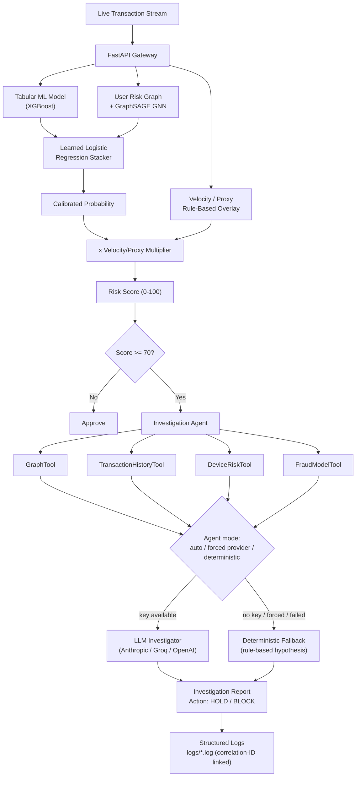

# RazorRisk — Agentic AI Payment Fraud & Risk Investigation Platform

> An explainable payment-risk system that combines a **Graph Neural Network**, a **tabular ML model**, and an **LLM investigation agent** to catch fraud rings that transaction-level scoring alone misses — and to explain, in plain English with cited evidence, *why* a transaction was flagged.

Most fraud demos score one transaction at a time and call it done. RazorRisk instead asks: what happens when ten "normal-looking" transactions are actually the same fraud ring spread across ten accounts? The answer is a system with three cooperating layers — tabular ML, a from-scratch GraphSAGE GNN over the entity graph, and an autonomous agent that investigates every high-risk hit and writes an audit-ready report — all wired together with structured, correlation-ID-linked logging so every score is traceable back through the pipeline that produced it.

**What makes this worth a closer look, not just a passing glance:**
- 🕸️ A **GraphSAGE GNN implemented from scratch in NumPy** (forward pass + analytic backprop, no PyTorch) — because at ~1,500 graph nodes, a 500MB GPU-oriented dependency buys nothing.
- 🤖 A **dual-mode investigation agent**: real LLM reasoning (Anthropic / Groq / OpenAI, switchable live from the dashboard) when a key is configured, and an honest rule-based fallback when it isn't — the report always states which one actually ran, never implies reasoning that didn't happen.
- 📊 A **learned stacker**, not a hand-picked weighted average, combining the tabular and graph scores — with the held-out precision/recall of tabular-only vs. GNN-only vs. stacked logged after every retrain.
- 🔍 **Correlation-ID logging** across all eight subsystems, so one transaction's full cross-module trace is one `grep` away.
- 🩹 A running log, below, of real bugs found in this codebase and exactly how they were diagnosed and fixed — because a project that can only describe its architecture, not its failure modes, hasn't really been debugged.

---

## Table of Contents
1. [Tech Stack](#tech-stack)
2. [Quickstart](#quickstart)
3. [System Architecture](#system-architecture)
4. [Engineering Decisions & Bugs Fixed](#engineering-decisions--bugs-fixed)
5. [Agent Mode Control](#agent-mode-control)
6. [Demonstration Scenarios](#demonstration-scenarios)
7. [Project Structure](#project-structure)
8. [Deep-Dive Q&A](#deep-dive-qa)

---

## Tech Stack

| Layer | Technology | Where | Why this, specifically |
|---|---|---|---|
| **API / Gateway** | FastAPI, Uvicorn, Pydantic | `api/` | Async-ready, typed request/response models, auto-generated OpenAPI docs at `/docs` |
| **Database** | SQLite (raw `sqlite3`) | `db/`, `razor_risk.db` | Zero-setup for local dev/demo; `SQLAlchemy`, `asyncpg`, `psycopg2-binary` already in `requirements.txt` for a drop-in Postgres swap via `DATABASE_URL` |
| **Tabular ML** | XGBoost (scikit-learn fallback) | `ml/train_tabular_model.py` | Gradient-boosted trees on leak-free, point-in-time SQL-window features (amount, hourly velocity, prior-amount z-score, merchant fraud rate) |
| **Graph ML** | Hand-rolled NumPy GraphSAGE | `ml/train_gnn.py` | 2-layer mean-aggregation GNN, inductive inference — scores users never seen at training time via pure forward pass, no cache |
| **Entity Graph** | NetworkX + Louvain community detection | `ml/risk_graph.py`, `ml/graph_builder.py` | Two separate graphs on purpose — see [Engineering Decisions](#engineering-decisions--bugs-fixed) |
| **Score Fusion** | scikit-learn logistic regression (stacker) | `ml/risk_aggregator.py` | Learned combination of tabular + GNN scores, not a fixed formula |
| **Agent Orchestration** | LangChain, LangGraph | `agent/` | Provider-agnostic LLM interface; deterministic evidence tools run identically regardless of which (or whether) LLM is used |
| **LLM Providers** | `langchain-anthropic`, `langchain-groq`, `langchain-openai` | `agent/llm_investigator.py` | Runtime-selectable — Claude, Groq (`openai/gpt-oss-120b`), or OpenAI (`gpt-4o-mini`), first-configured-key-wins or manually forced |
| **Fallback Agent** | Plain Python rule-based matcher | `agent/deterministic_agent.py` | Zero external dependency; guarantees a complete, correctly-reasoned report even with no API key configured |
| **Frontend** | Vanilla HTML / CSS / JS | `static/` | No build step, no framework — deliberately inspectable in the browser dev tools with nothing to compile |
| **Graph Visualization** | vis-network (CDN) | `static/js/graph_vis.js` | Interactive entity-graph explorer for the dashboard |
| **Logging** | Custom rotating-file logger | `utils/logger.py`, `logs/` | 8 subsystem channels, correlation-ID-linked across a single transaction's full trace |
| **Data** | Synthetic fraud-ring generator + real Kaggle ULB Credit Card Fraud dataset | `data/` | Both retrain the full pipeline live from the dashboard |
| **Testing** | `unittest` | `tests/test_risk_engine.py` | End-to-end integration test: generate data → train both models → score → investigate |
| **Deployment** | Docker, docker-compose, Render, Vercel | `Dockerfile`, `docker-compose.yml`, `render.yaml`, `vercel.json` | Runs identically locally or containerized |

---

## Quickstart

This is deliberately the second section in this README, not buried at the bottom — a project is only worth reading about if it actually runs.

### Option 1 — Local (Python 3.11+)

```bash
# 1. Install dependencies
pip install -r requirements.txt

# 2. (Optional) Enable real LLM investigation reasoning.
#    Without this step the agent still produces a complete report via its
#    deterministic fallback — this step only adds live LLM-generated reasoning.
cp .env.example .env
# then put ONE of these in .env:
#   ANTHROPIC_API_KEY=...   or   GROQ_API_KEY=...   or   OPENAI_API_KEY=...

# 3. Seed a dataset — pick one
python -m data.generate_synthetic_data      # synthetic fraud rings, fast, fully offline
python -m data.ingest_real_kaggle_dataset   # real Kaggle fraud data, needs internet on first run

# 4. Train the tabular model, GNN, and the stacker that combines them
python -m ml.risk_aggregator

# 5. Launch
python run.py
```

Open **`http://localhost:8000/dashboard/`**. Both datasets can be re-seeded and every model retrained from the dashboard header at any time without restarting the server.

### Option 2 — Docker Compose

```bash
docker compose up --build
```

### Sanity check it's actually working

```bash
python -m unittest tests/test_risk_engine.py -v
```

This runs the full pipeline end to end — generates data, trains both models, scores a transaction, and runs the investigation agent — so a green run is a real signal, not just an import check.

---

## System Architecture



---

## Engineering Decisions & Bugs Fixed

This section is the honest changelog of real problems hit while building this, kept deliberately in the README because "what broke and how did you fix it" is the more useful question to be able to answer than "what does the architecture diagram say."

### 1. Two separate entity graphs, on purpose
`ml/risk_graph.py` is the canonical User-only weighted graph (shared device = weight 2, shared IP = weight 1) that actually trains the GNN and runs Louvain community detection. `ml/graph_builder.py` is a richer User↔Device↔IP↔Merchant graph used only by the dashboard's visual explorer. These used to be the same graph — a real bug, not a hypothetical one: 2-hop traversal through a popular Merchant node (used by hundreds of unrelated users) turned a 7-person fraud ring into a 692-node unreadable subgraph. The fix was structural: Merchant/heavy-fanout nodes were never real *risk* signal, so the graph that trains the model never includes them as hops at all; the dashboard graph keeps its own separate traversal cap for its different job (human-readable exploration, not model input).

### 2. The Groq integration was configured but silently never ran
`requirements.txt` listed `langchain`, `langchain-community`, and `langgraph`, but never the provider-specific packages (`langchain-anthropic`, `langchain-groq`, `langchain-openai`) that `agent/llm_investigator.py`'s `from langchain_groq import ChatGroq`-style imports actually need. The result: setting `GROQ_API_KEY` made `is_available()` return `True`, but the first real investigation threw an `ImportError` inside the `try/except` in `agent/graph_agent.py` and silently fell back to the deterministic path — every time, with nothing but a `logger.warning` in `logs/agent_investigations.log` to show for it. The dashboard showed no visible difference between "LLM configured and working" and "LLM configured but silently broken." Fixed by pinning all three provider packages in `requirements.txt`, updating the Groq default model off a deprecated name (`llama-3.1-70b-versatile` → `openai/gpt-oss-120b`), and adding a live agent-status endpoint (see [Agent Mode Control](#agent-mode-control)) so this class of failure is now visible in the UI instead of only in a log file.

### 3. GNN inference used to silently fall back to a heuristic for new users
An earlier version cached a `user_id -> probability` lookup table at training time and fell back to a topology heuristic for any user not in that cache — which meant every new user (the most common case in live scoring) silently never got a real model score. `ml/train_gnn.py`'s `GraphSAGEInference.score_all()` now recomputes the current graph's adjacency/feature matrices and runs one pure forward pass with the trained weights each time it's called — inductive, not transductive — so any user present in the current graph gets scored by the actual trained model, no exceptions.

### 4. The score-fusion weights used to be hand-picked, not learned
An earlier version combined tabular and GNN scores via a fixed `0.35 * Tabular + 0.45 * GNN + 0.20 * Topology` formula that was never validated against anything. `ml/risk_aggregator.py`'s `train_stacker()` now fits a 2-input logistic regression on held-out scores and logs the learned coefficients on every retrain, and `ml/models/aggregator_eval.json` compares tabular-only vs. GNN-only vs. stacked precision/recall on the same held-out transactions — so "combining the two models helps" is something this project checks, not just asserts.

### 5. Both models share one leak-free, identity-aligned split
`ml/common.py` enforces the same user-level train/test split for both models — a fraud-ring member's transactions never appear on both sides of the split, and both models are evaluated on the same held-out users so their scores can be fairly combined by the stacker.

### 6. Real fraud labels, without a dataset that has identity fields
The public Kaggle ULB "Credit Card Fraud Detection" dataset is PCA-anonymized specifically so it has no user/device/IP identity fields — only `Time`, `Amount`, 28 anonymized components, and the fraud label. `data/ingest_real_kaggle_dataset.py` keeps the real amounts and real fraud labels (the parts that matter for the tabular model's ROC-AUC) and layers a synthetic entity graph on top — real fraud transactions routed through a shared device/IP cluster, real normal transactions spread across a synthetic user population — so the graph layer has real entity relationships to learn from, without fabricating the fraud signal itself.

### 7. Every transaction's full cross-subsystem trace is one grep away
`utils/logger.py` routes eight subsystem channels (`app`, `risk_engine`, `agent`, `ml_training`, `graph`, `database`, `pipeline`, `frontend_client`) to their own rotating log files. Every log line emitted while scoring one transaction — across the tabular model, GNN, aggregator, and agent — carries the same correlation ID (`bind_correlation_id()` in `api/routes_transactions.py`), returned to the client too, so `grep <corr_id> logs/*.log` reconstructs the whole trace. The dashboard's own JS also reports uncaught client-side errors to `POST /api/v1/logs/client`, so a bug in someone else's browser shows up in the server audit trail, not just their console.

---

## Agent Mode Control

The **Agent Investigation** tab has a live status badge and a mode selector, both backed by real endpoints:

- `GET /api/v1/investigations/agent-status` — which providers currently have an API key configured, which is active right now, and which dropdown options should be enabled.
- `POST /api/v1/investigations/agent-mode` — body `{"mode": "auto" | "anthropic" | "groq" | "openai" | "deterministic"}`:
  - `auto` — original priority order (Anthropic → Groq → OpenAI → deterministic fallback)
  - a specific provider — forces it; still falls back to deterministic if that call fails
  - `deterministic` — skips the LLM path entirely, even with a key configured

The override lives in `agent/mode_state.py` as a process-local in-memory value (resets to `auto` on restart) — an operator/demo toggle, not persisted app config. Every investigation report's `agent_mode` / `agent_mode_label` fields reflect what actually ran for *that specific* report, not just the current dropdown state.

---

## Demonstration Scenarios

Pre-configured presets in the dashboard:

| Preset | Scenario | Expected Risk Score | Key Evidence Signal |
|---|---|:---:|---|
| **Normal Purchase** | Legitimate user, regular item | `12.5 / 100` (LOW) | Single device, normal velocity |
| **Fraud Ring #1** | Device-sharing cluster, 7 accounts / 1 device | `94.5 / 100` (CRITICAL) | 7 accounts linked to 1 device, shared proxy IP |
| **Fraud Ring #2** | IP velocity botnet, 8 accounts, TOR proxy | `88.2 / 100` (HIGH) | High-risk VPN exit node, IP multi-tenancy |
| **Carding Attack** | 15 rapid micro-transactions in 3 minutes | `91.0 / 100` (CRITICAL) | 15 txns/hr velocity spike, 5x baseline |

---

## Project Structure

```
razor--version/
├── api/            # FastAPI routes: transactions, agent, graph, admin, logs
├── agent/          # Investigation agent: tools, LLM client, deterministic fallback, mode state
├── ml/             # Tabular model, GraphSAGE GNN, entity graph, stacker
├── data/           # Synthetic generator + real Kaggle ingestion
├── db/             # SQLite connection + models
├── utils/          # Correlation-ID-aware structured logger
├── static/         # Vanilla HTML/CSS/JS dashboard
├── tests/          # End-to-end integration test
├── config.py       # Env-driven settings (API keys, model names, log paths)
└── run.py          # Entrypoint
```

---

## Deep-Dive Q&A

### Q1: Why a GNN instead of XGBoost alone?
XGBoost scores each transaction in isolation on row features. A fraud ring can open 10 accounts with individually normal-looking transactions — XGBoost sees 10 normal rows. A GNN aggregates neighborhood embeddings across graph edges, so it can pick up that all 10 accounts share one device fingerprint and IP subnet. `ml/models/aggregator_eval.json` backs this with held-out precision/recall for tabular-only, GNN-only, and stacked scoring on the exact same transactions after every retrain — not just an architecture-diagram claim.

### Q2: How is the LLM agent prevented from making unsafe or hallucinated decisions?
It never computes a number. Every figure in a report — shared device count, historical average amount, GNN score — comes from one of four deterministic Python/SQL tools (`GraphTool`, `TransactionHistoryTool`, `DeviceRiskTool`, `FraudModelTool`) that run identically whether or not an LLM is involved. The LLM's only job is reading that evidence and writing the hypothesis and recommendation in its own words — it's structurally unable to fabricate a metric because it's never given a way to produce one.

### Q3: How would this scale to 10M transactions/day?
1. **Graph partitioning** — distributed graph frameworks (PyTorch Geometric Distributed, or a graph database) at real scale; the from-scratch NumPy GraphSAGE here is a scale-appropriate choice at ~1,500 nodes, not a permanent one (see Q6).
2. **Async agent queue** — run investigations via Celery/RabbitMQ workers so scoring latency stays sub-50ms.
3. **Streaming feature store** — Kafka + Redis for real-time velocity aggregation instead of per-request SQL window functions.

### Q4: Is the GNN score really from the trained model, or a heuristic?
The trained model, for every user in the graph, including ones added after training — see [bug #3](#engineering-decisions--bugs-fixed) above for what this replaced.

### Q5: How do you get real fraud signal from a dataset with no identity fields?
See [bug #6](#engineering-decisions--bugs-fixed) above.

### Q6: Why hand-rolled NumPy GraphSAGE instead of PyTorch Geometric?
A deliberate scale-appropriate call. At ~1,500 nodes, the 2-layer mean-aggregation network in `ml/train_gnn.py` is ~150 lines of NumPy — forward pass, analytic backprop, done. A 500MB+ GPU-oriented dependency would be the wrong trade here, and it keeps the whole project free of heavy ML framework dependencies. The math is exactly what `SAGEConv` does; swapping to `torch_geometric` at production scale would replace the `SAGELayer`/`RiskGNN` classes, not require a redesign of the surrounding pipeline.

### Q7: Does the agent actually call an LLM, or is that just marketing?
Depends whether a key is configured — and the report says which happened. See [bug #2](#engineering-decisions--bugs-fixed) above for a real instance of this gap and exactly how it was found and fixed.

### Q8: Why a learned stacker instead of a hand-picked weighted average?
See [bug #4](#engineering-decisions--bugs-fixed) above.
