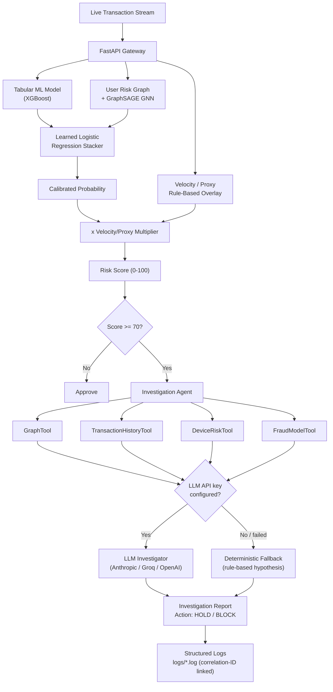

# RazorRisk — Agentic AI Payment Fraud & Risk Investigation Platform

> **Tailored for Razorpay AI Internship — AI Risk Manager Track**  
> An enterprise-grade, explainable payment risk intelligence system combining **Graph Neural Networks (GraphSAGE)**, **Tabular Behavioral ML (XGBoost)**, and **LangGraph Agentic Reasoning** to detect, investigate, and explain digital payment fraud rings.

---

## 📌 Problem Statement

Digital payment platforms process millions of transactions per second. Traditional fraud detection systems evaluate each transaction independently (`transaction → ML → fraud/not fraud`). However, modern fraud syndicates operate in **coordinated networks**:
- Multiple fraud accounts sharing a single physical device or MAC address.
- Botnets routing attacks through common VPN/TOR proxy exit subnets.
- Rapid high-velocity micro-transactions ("carding") across multiple merchants.

**RazorRisk** solves this by constructing an entity transaction graph, detecting suspicious network topologies using GNNs, and deploying an autonomous **LangGraph Investigation Agent** to reason over deterministic evidence tools and produce audit-ready fraud reports.

---

## 🏗️ System Architecture



---

## 🚀 Key Engineering Innovations

### 1. Two separate graphs, on purpose
- **`ml/risk_graph.py`** — the canonical User-only weighted risk graph (shared device = weight 2, shared IP =
  weight 1) that actually drives the GNN and Louvain community detection. Only ever contains User nodes.
- **`ml/graph_builder.py`** — a richer User↔Device↔IP↔Merchant graph used *only* by the dashboard's visual
  explorer. These used to be the same graph, which caused a real bug: 2-hop traversal through a popular
  Merchant node (used by hundreds of unrelated users) made a 7-person fraud ring balloon into a 692-node
  unreadable subgraph. The fix was structural — Merchant/heavy-fanout nodes were never real *risk* signal, so
  the graph that trains the model never included them as hops in the first place; the dashboard graph keeps a
  separate traversal cap for its own different job (human-readable exploration, not model input).

### 2. Tabular ML + GraphSAGE GNN, trained leak-free, combined by a learned stacker
- **Tabular model** (`ml/train_tabular_model.py`) — XGBoost, with a functionally-equivalent scikit-learn
  fallback if the `xgboost` wheel can't be installed in a given environment. Features (amount, hourly velocity,
  prior-amount z-score, merchant fraud rate) are computed with SQL window functions using **only transactions
  at or before the one being scored** — no future information leaks into a feature.
- **GNN** (`ml/train_gnn.py`) — a 2-layer GraphSAGE-style mean-aggregation network implemented from scratch in
  NumPy (forward pass + analytic backprop), not PyTorch. At ~1,500 graph nodes, a 500MB+ GPU-oriented dependency
  bought nothing; the from-scratch version is exactly the same math (`torch_geometric.SAGEConv` would be a
  drop-in swap at real scale, not a redesign) and means this whole project has zero heavy ML framework
  dependencies. Inference is **inductive** — any user present in the current graph gets scored via a pure
  forward pass with the trained weights, including users that didn't exist at training time. No cache, no
  per-user fallback heuristic needed.
- **Both models share the exact same user-level train/test split** (`ml/common.py`) — a fraud-ring member's
  transactions never appear on both sides, and the two models are evaluated on the same held-out users so
  their scores can be fairly combined.
- **Risk Aggregator** (`ml/risk_aggregator.py`) — combines `tabular_score` and `gnn_score` via a **learned
  logistic-regression stacker** fit on held-out validation scores, not a hand-picked weighted average. An
  earlier version of this project used a fixed `0.35 * Tabular + 0.45 * GNN + 0.20 * Topology` formula that was
  never validated against anything; the stacker's two coefficients are printed and logged every retrain so they
  can be inspected and defended. The velocity/VPN-proxy multiplier is applied **after** the calibrated
  probability as an explicit, separately-labeled rule-based overlay — those flags aren't inputs to either
  trained model, so folding them into the "learned" score would misrepresent what actually happened.

### 3. Dual-mode investigation agent — real LLM when configured, honest fallback when not
- For high-risk transactions (`Score >= 70`), the agent (`agent/graph_agent.py`) gathers evidence via four
  **deterministic Python/SQL tools** (`GraphTool`, `TransactionHistoryTool`, `DeviceRiskTool`, `FraudModelTool`)
  — identical regardless of mode. This is the actual "zero hallucination" guarantee: neither mode can produce
  a number that didn't come from one of these tools.
- If `ANTHROPIC_API_KEY`, `GROQ_API_KEY`, or `OPENAI_API_KEY` is set, `agent/llm_investigator.py` sends that
  evidence to a real hosted LLM, which writes the fraud hypothesis and recommended action.
- If no key is configured (or the call fails for any reason), `agent/deterministic_agent.py` — plain rule-based
  pattern matching over the same evidence — produces the report instead. Every report states plainly which mode
  produced it (`agent_mode: "llm:<provider>"` or `"deterministic_fallback"`) rather than implying LLM reasoning
  happened when it didn't. A demo with zero API keys configured still produces a complete, correctly-reasoned
  report end to end.

### 4. Structured Audit Trail, Correlation IDs & Live Logs
- Eight subsystem log channels (`utils/logger.py`) — `app`, `risk_engine`, `agent`, `ml_training`, `graph`,
  `database`, `pipeline`, `frontend_client` — each its own rotating file under `logs/`, routed automatically by
  module name via `get_logger(__name__)`.
- **Correlation IDs**: every log line emitted while scoring one transaction — across the tabular model, GNN,
  aggregator, and agent — carries the same ID (`bind_correlation_id()` in `api/routes_transactions.py`), so
  `grep <corr_id> logs/*.log` reconstructs that transaction's full cross-subsystem trace. Returned to the
  client in the scoring response too.
- The dashboard's own JS reports uncaught errors to `POST /api/v1/logs/client` (`logs/frontend_client.log`) —
  a bug on someone else's browser is visible in the server audit trail, not just their console.

### 5. Real-Data Ingestion Pipeline (Real Fraud Labels, Real Amounts)
- In addition to the synthetic fraud-ring generator, `data/ingest_real_kaggle_dataset.py` ingests the real
  **ULB "Credit Card Fraud Detection"** dataset (284,807 anonymized European transactions, 492 confirmed frauds)
  and maps its real `Amount`/`Time`/`Class` fields onto RazorRisk's User → Device → IP → Merchant schema.
  The dataset itself has no user/device/IP identity fields (it's PCA-anonymized for privacy), so real fraud
  transactions are deliberately routed through a shared device/IP cluster and real normal transactions through a
  synthetic population of accounts — this keeps the fraud *amounts and labels* real while giving the graph layer
  the entity relationships it needs to detect rings. Both models retrain on whichever dataset is currently loaded.
- Trigger it from the CLI (`python data/ingest_real_kaggle_dataset.py`) or live from the dashboard's
  **"Load Real Kaggle Dataset"** button, which calls `POST /api/v1/admin/pipeline/real` — this downloads the
  dataset (cached locally after the first run), re-ingests it, rebuilds the entity graph, and retrains the
  tabular model, GNN, and stacker in sequence. If the environment has no outbound internet access, it fails with
  an actionable message telling you where to manually place `data/creditcard.csv`, and the app keeps working
  fine on synthetic data in the meantime. The matching synthetic-data endpoint is
  `POST /api/v1/admin/pipeline/synthetic`. Both return the held-out evaluation metrics from the retrain.

---

## 🛠️ Quickstart Guide

### Option 1: Local Execution (Python 3.13)
```bash
# 1. Install Dependencies
pip install -r requirements.txt

# 2. (Optional) Enable the real LLM investigation agent — skip this and the
#    agent still works via its deterministic fallback, just without live LLM
#    reasoning. Put ONE of these in a .env file at the project root:
#    ANTHROPIC_API_KEY=...   or   GROQ_API_KEY=...   or   OPENAI_API_KEY=...

# 3. Seed a dataset — pick one:
python data/generate_synthetic_data.py       # synthetic fraud rings (fast, offline)
python data/ingest_real_kaggle_dataset.py     # real Kaggle fraud data (needs internet on first run)

# 4. Train the tabular model, GNN, and the stacker that combines them
python -m ml.risk_aggregator

# 5. Launch Application Server
python run.py
```
Open **`http://localhost:8000/dashboard/`** in your browser. Once it's running, you can re-seed and retrain on
either dataset at any time from the dashboard header, without restarting the server — both buttons re-run the
full tabular → GNN → stacker sequence and report the held-out evaluation metrics.

---

### Option 2: One-Command Docker Compose
```bash
docker compose up --build
```

---

## 🎯 Demonstration Scenarios

In the Web Dashboard, test the following pre-configured scenarios:

| Preset | Scenario Description | Expected Risk Score | Key Evidence Signal |
| :--- | :--- | :---: | :--- |
| **Normal Purchase** | Legitimate user buying regular item | `12.5 / 100 (LOW)` | Single device, normal velocity |
| **Fraud Ring #1** | Device-sharing fraud cluster (7 accounts, 1 device) | `94.5 / 100 (CRITICAL)` | **7 accounts linked to 1 device**, shared proxy IP |
| **Fraud Ring #2** | IP velocity botnet cluster (8 accounts, TOR proxy) | `88.2 / 100 (HIGH)` | **High risk VPN exit node**, IP multi-tenancy |
| **Carding Attack** | Rapid micro-transactions (15 txns in 3 mins) | `91.0 / 100 (CRITICAL)` | **15 txns/hr velocity spike**, 5x baseline |

---

## 🔬 Interview Q&A Reference (Deep-Dive Engineering)

### Q1: Why use Graph Neural Networks (GNN) instead of XGBoost alone?
*Answer:* XGBoost treats each transaction in isolation based on row features. A sophisticated fraud ring can create 10 new accounts with normal transaction amounts. XGBoost sees 10 "normal" transactions. A GNN aggregates neighborhood embeddings across graph edges, recognizing that all 10 accounts share the exact same device fingerprint and IP subnet. The held-out evaluation numbers back this up directly: `ml/models/aggregator_eval.json` compares tabular-only, GNN-only, and stacked precision/recall on the exact same held-out transactions after every retrain, so this isn't just an architecture-diagram claim.

### Q2: How do you prevent the LLM agent from making unsafe financial decisions?
*Answer:* The LLM (when one is configured — see Q6) never computes a number. Every number in an investigation report — shared device count, historical average amount, GNN score — comes from one of four deterministic Python/SQL tools (`GraphTool`, `TransactionHistoryTool`, `DeviceRiskTool`, `FraudModelTool`) that run identically whether or not an LLM is involved. The LLM's only job is to read that evidence and write the fraud hypothesis and recommended action in its own words; it's structurally unable to fabricate a metric because it's never given the ability to produce one.

### Q3: How would this architecture scale to 10 Million transactions/day?
*Answer:*
1. **Graph Partitioning**: Partition the transaction graph using distributed graph frameworks (e.g., PyTorch Geometric Distributed or GraphSQL/Neo4j) — the from-scratch NumPy GraphSAGE here is a scale-appropriate choice at ~1,500 nodes, not a permanent one; see Q7.
2. **Asynchronous Agent Queue**: Run the investigation agent asynchronously via Celery/RabbitMQ workers so API scoring latency remains `< 50ms`.
3. **Streaming Feature Store**: Stream transaction events into Apache Kafka and Redis for real-time velocity feature aggregation.

### Q4: Is the GNN score actually coming from the trained model, or a heuristic?
*Answer:* The trained model, for every user present in the graph — including ones added after training, with
no retraining and no cache. `ml/train_gnn.py`'s `GraphSAGEInference.score_all()` recomputes the current graph's
adjacency/feature matrices and runs one pure forward pass with the already-trained weights each time it's
called — inductive, not transductive. An earlier version of this project cached a `user_id -> probability`
lookup table at training time and fell back to a topology heuristic for any user not in that cache (i.e. every
new user), which meant the "trained model" score was silently unavailable for the most common live-scoring
case. Inductive inference removes the need for that fallback path entirely.

### Q5: How do you get *real* fraud signal without a dataset that has user/device/IP identities?
*Answer:* The public Kaggle "Credit Card Fraud Detection" dataset is PCA-anonymized specifically so it contains
no identity fields — only `Time`, `Amount`, 28 anonymized components, and the fraud label. `data/ingest_real_kaggle_dataset.py`
keeps the real amounts and real fraud labels (the parts that matter for the tabular model's ROC-AUC), and layers
a synthetic entity graph on top so the GNN and graph-community layer still have something to learn from — real
fraud transactions are routed through a shared device/IP cluster the way an actual fraud ring would look on a
payments platform, while real normal transactions spread across a synthetic user population. This is a common,
honest pattern for demonstrating graph-based fraud detection when the only public labeled dataset available
strips out the exact identity fields a production system would key on.

### Q6: Does the investigation agent actually call an LLM, or is "LangGraph agentic reasoning" just marketing?
*Answer:* Depends whether an API key is configured — and the report says which happened. `agent/graph_agent.py`
always gathers evidence via four deterministic tools first, then tries `agent/llm_investigator.py` (a real
Anthropic/Groq/OpenAI call) if a key is set; on any failure, or if no key is set at all, it falls back to
`agent/deterministic_agent.py` — plain rule-based pattern matching, honestly labeled as exactly that in every
report's `agent_mode` field. An earlier version of this project's README claimed "LangGraph Agentic System"
while the only code that ever ran was the rule-based path — this project would rather a demo say "deterministic
fallback, no LLM key configured" than imply reasoning that didn't happen.

### Q7: Why a hand-rolled NumPy GraphSAGE instead of PyTorch Geometric?
*Answer:* A deliberate scale-appropriate call, not a limitation being glossed over. At ~1,500 graph nodes, the
2-layer mean-aggregation network in `ml/train_gnn.py` is maybe 150 lines of NumPy — forward pass, analytic
backprop, done. Pulling in a 500MB+ GPU-oriented dependency for that would be the wrong trade at this scale, and
it means the whole project has zero heavy ML framework dependencies. The math is exactly what `SAGEConv` does;
swapping to `torch_geometric` at real production scale (millions of nodes, GPU batch training) would replace the
`SAGELayer`/`RiskGNN` classes, not require a redesign of the surrounding pipeline.

### Q8: Why a learned stacker instead of a hand-picked weighted average?
*Answer:* An earlier version combined the two models via a fixed `0.35 * Tabular + 0.45 * GNN + 0.20 * Topology`
formula that was never validated against anything — numbers that looked reasonable, not numbers that were
checked. `ml/risk_aggregator.py`'s `train_stacker()` instead fits a 2-input logistic regression on held-out
scores and logs the learned coefficients every retrain (`Stacker learned weights: tabular_coef=... gnn_coef=...
intercept=...`), and `ml/models/aggregator_eval.json` compares tabular-only vs GNN-only vs stacked precision/
recall on the same held-out transactions — so the claim that combining the two models actually helps is
something this project checks, not just asserts.
